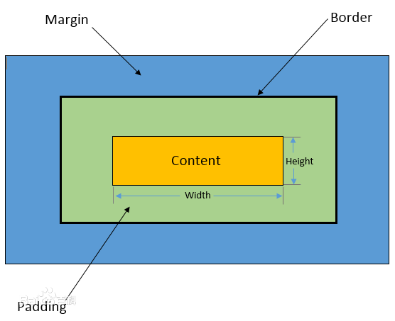

# HTML&CSS笔记

[TOC]

## 1.html语言概述/html5

### 1.1 概述

1. **HTML（Hypertext Markup Language）**是一门超文本标记语言：
   * "超文本"指页面可以包含链接、图片等非文字内容
   * "标记"指使用标签将需要的内容括起来，例如`<head>`内容`</head>`
2. HTML**不是编程语言**；
3. HTML5是HTML最新规范。

### 1.2 html语法和规范

1. 所有html文件后缀名都是.html或.htm，建议使用**.html**；

2. 整个html文件由**头部分**`<head></head>`和**体部分**`<body></body>`组成；

3. html标签都是由**开始标签**和**结束标签**组成，例外如：`<br />`

4. html标签**忽略大小写**，建议使用小写。

    

## 2.常用

- 空格：`&nbsp;`


## 3.常用标签

### 3.1 注释

- 使用`<!-- 注释内容 -->`

### 3.2 标题标签

- 使用`<hn></hn>`，n从1到6**逐渐变小**
- 标题标签加粗加黑显示，单独占用一行，与其他行有一定行间距
- 该标签应仅用于标题，而不应在需要加粗时使用

### 3.3 水平线标签

- 使用`<hr />`
- 一条水平横线

### 3.4 段落标签

- 使用`<p></p>`定义段落，段落上下有较大行间距
- 使用`<br />`插入单个换行

### 3.5 字体标签

- 使用`<font></font>`

- 可在第一个标签内设置各种属性，常见的有color、size、face(字体)等

- size属性范围是1-7，从1到7**逐渐变大**

  举例：

  ```html
  <font color="FF0000" size="7" face="楷体">红色最大楷体</font>
  ```


### 3.6 格式化标签

- 使用`<b>粗体</b>`定义粗体
- 使用`<i>斜体</i>`定义斜体

### 3.7 `<link>`标签

- 一般放置于**head区域**

- 定义了文档**与外部资源的关系**

- 常用于**链接到样式表**

- 没有内容，**不需要结束标签**

- 实例如下：

  ```html
  <link rel="stylesheet" type="text/css" href="style.css">
  ```

### 3.8 `<meta>`标签

- 一般放置于**head区域**

- 描述了一些基本的**元数据**

- **通常用于指定网页的描述、关键词、修改时间和作者等**

- 实例：

  ```html
  <!-- 定义关键词 -->
  <meta name="keywords" content="HTML, CSS, JavaScript">
  <!-- 定义描述内容 -->
  <meta name="description" content="WEB前端教程">
  <!-- 定义作者 -->
  <meta name="author" content="ZXY">
  <!-- 固定秒数刷新页面 -->
  <meta http-equiv="refresh" content="30">
  ```


## 4.图片标签

- 使用``

- 图片标签的常用属性：

  - src：图片文件的路径
  - width/height：图片显示的尺寸
  - alt：无法显示图片时显示的内容

- 举例：

  ```html
  
  ```


## 5.列表标签

### 5.1 无序列表

重要属性：

- type：项目符号的类型

举例：

```html
<ul type="disc">
    <li>谷歌</li>
    <li>百度</li>
</ul>
```

效果：

> * 谷歌
> * 百度

### 5.2 有序列表

重要属性：

- start：起始项
- reversed：是否逆序
- type：数字、字母、罗马数字

举例：

```html
<ol start="3" reversed="reversed" type="a">
    <li>谷歌</li>
    <li>必应</li>
    <li>百度</li>
</ol>
```

效果：

> c.谷歌
>
> b.必应
>
> a.百度


## 6.超链接标签

1. 使用`<a></a>`

2. 重要属性：

   - href：超链接目标地址
   - target：打开方式（本页打开或新标签页），常见取值：
     - "_self"：本页打开
     - "_blank"：新标签页打开

3. 举例：

   ```html
   <a href="index.html" target="_blank">PornHub</a>
   ```


## 7.表格

1. 表格标签使用`<table></table>`

2. 表格标签内嵌多个行标签`<tr></tr>`，行标签又内嵌多个列标签`<td></td>`

3. table标签重要属性：

   - border：边框宽度
   - width/height：宽度/高度
   - align：对齐方式
   - bgcolor：背景颜色
   - cellspacing：边框之间的间距（空隙）
   - cellpadding：边框与内容的间距

4. 行/列标签重要属性：

   - colspan：跨列数
   - rowspan：跨行数

5. 举例：

   ```html
   <table border="1px" width="300px" height="150px" align="center" bgcolor="red" cellspacing="0px" cellpadding="1px">
       <tr>
           <td>第一行第一列</td>
           <td>第一行第二列</td>
       </tr>
       <tr>
           <td>第二行第一列</td>
           <td>第二行第二列</td>
       </tr>
   </table>
   ```


## 8.框架结构标签

- 框架结构标签使用`<frameset></frameset>`

- 若要使页面呈多列（左右）框架，使用属性cols

- 若要使页面呈多行（上下）框架，使用属性rows

- frameset一般需要取代body标签

  举例：

  ```html
  <!--一个嵌套的框架-->
  <head></head>
  <frameset rows="20%,*">
  	<frame src="top.html"/>
      <frameset cols="20%,*">
          <frame src="left.html"/>
          <frame src="right.html/">
      </frameset>
  </frameset>
  ```


## 9.表单

使用`<form></form>`标签定义html表单，**表单所有内容括在标签内**。

**表单重要属性：**

- **action**：向何处提交表单，可以是一个页面也可以是一个java文件
- **method**：提交表单时所用的HTTP方法，常用GET、POST

### 9.1 表单元素：输入框`<input />` 

1. 文本输入框：`<input type="text"/>` 

   - 常一起用的属性：placeholder（H5），文本框中的灰色提示内容

2. 密码输入框：`<input type="password"/>` 

3. 单选圆点：`<input type="radio" name="sex"/>`男，注意要用name来分组

4. 多选框：`<input type="checkbox" name="hobby"/>`打电动，注意要用name来分组

5. 文件上传：`<input type="file"/>` 

6. 提交按钮：`<input type="submit" value="注册"/>` 

7. 普通按钮：`<input type="button" value="按钮"/>` 

8. 重置按钮：`<input type="reset"/>` 

9. 文本域：`<input type="textarea" cols="20" rows="5">` 

10. 隐藏域：`<input type="hidden">` 

   **注意事项**：大部分表单元素都需要使用属性**name来指定组**，用属性**value来指定值**。

   单选圆点和多选框可以使用属性``checked="checked"``来**指定默认值**。

### 9.2 form两种提交方式的区别：

1. **get**：
   - 请求的参数会在地址栏中显示，会封装到请求行中
   - 请求的参数有大小限制
   - 不安全
2. **post**：
   - 请求的参数不会在地址栏中显示，会封装到请求体中
   - 请求参数不会在地址栏中显示
   - 较为安全

### 9.3表单元素：下拉选择菜单`<select></select>`

- 下拉选择菜单**使用**`<select></select>`**标签**

- select标签内使用多个`<option>选项</option>`标签**设置选项**

  举例：

  ```html
  <select name="province">
      <option>--请选择--</option>
      <option>北京</option>
      <option>上海</option>
      <option>广州</option>
  </select>
  ```

  **注意事项**：option标签可以使用属性selected="selected"来**指定默认值**。


## 10.div标签

- `<div>`是一个块级元素，可定义文档中的分区或节(division)；
- 独自占一行；
- 独自不能实现复杂的效果，必须结合CSS样式进行渲染；
- 可用class或id属性来标记`<div>`。


## 11.CSS概述

### 11.1 概述

CSS(Cascading Style Sheets)，即**层叠样式表**。

- html是整个网站的**框架**，而css是对整个网站骨架**进行的美化**。

- 降低耦合度
- 提高开发效率

### 1.2 CSS语法和规范

```
选择器{
    属性名1:属性值1;
    属性名2:属性值2;
    属性名3:属性值3;
}
```

### 11.3 CSS的三种引入方式

1. 通过标签的style属性来设置元素的样式，举例如下：

   ```html
   <a style="color:green;font-size:50px;">家用电器</a>
   ```

   该方式未做到结构与表现分离，较少使用。

2. 内部样式（内嵌式）：将CSS代码定义在`<head>`标签的`<style>`标签中。举例：

   ```html
   <head>
       <title>标题</title>
       <style>
           .class1{
               font-size:50px;
               background-color:black;
           }
       </style>
   </head>
   ```

3. 外部样式（链入式）：将样式代码放在一个或多个`.css`文件中，通过`<link>`标签将css文件引入html中，举例：

   ```html
   <link rel="stylesheet" type="text/css" href="css/demo1.css"/>
   ```


## 12.CSS选择器

css选择器可以将样式应用于**特定的html元素**。

###12.1 元素选择器

将html中的**标记（标签）**名称作为选择器，该页面中**所有**的这类标签都被设置为这一样式。

举例：

```css
h1{
    color:black;
    font-size:50px;
}
```

### 12.2 ID选择器

使用`#`+`ID名`作为选择器，大多数html元素都可以定义ID属性。

ID选择器的优先级高于类选择器。

举例：

```css
#id01{
    color:black;
}
<div id="id01">示例文本</div>
```

### 12.3 类选择器

使用`.`+`类名`作为选择器，大多数html元素都可以定义class属性。

举例：

```css
.class01{
    font-size:50px;
}
<div class="class01">示例文本</div>
```

### 12.4 属性选择器

"元素选择器"的扩展，对一组标签的进一步过滤（选择带有特定属性的标签）。

使用`标签名[标签属性='属性值']`作为选择器，举例：

```css
input[type='text']{
    background-color=red;		/*将所有文本输入框的背景色设置为红色*/
}
```

### 12.5 包含选择器 

"元素选择器"的扩展，选择夫标签中指定的后代标签。

使用`父标签 后代标签`作为选择器，举例：

```css
body div{
    color:red;
}
```

### 12.6 并集选择器

选择多个。

```css
xxx,xxx{
    ...
}
```

### 12.7 父选择器

选择demo2上的demo1。

```css
demo1 > demo2{
    ...
}
```

### 12.8 伪类选择器

选择具有某状态的元素。

```css
xxx:status{
    ...
}
```

状态有：

- visited
- hover
- link
- active


## 13.CSS盒子模型



CSS盒子模型包含以下几个属性：

- Content（内容）

- Width（宽度）

- Height（ 高度）

- Padding（内边距）

  注意事项：

  - 若设置一个值，则是设置上下左右内边距相等

  - 若设置两个值，则前两个值为上下内边距，后两个值为左右内边距

  - 若设置三/四个值，则依照上、右、下、左的顺序设置内边距

    举例：

    ```css
    div{
        padding:10px 20px 30px 40px;	//依次为上右下左内边距
    }
    ```

  - 可通过下面四个单独属性分别设置上、右、下、左的内边距

    - padding-top
    - padding-right
    - padding-bottom
    - padding-left

- Border（边框）

  注意事项：

  - 可通过下面四个单独属性分别设置上、右、下、左四条边框的样式
    - border-top-style
    - border-right-style
    - border-bottom-style
    - border-left-style

- Margin（外边距）

  注意事项：

  - 可通过下面四个单独属性分别设置上、右、下、左的外边距
    - margin-top
    - margin-right
    - margin-bottom
    - margin-left


## 14.CSS重要样式

### 14.1 边框和尺寸

参考上述盒子模型

- border样式设置举例：

  ```css
  div{
      border:1px solid #f00;	/*1像素 实线 红色*/
      width:200px;
      height:200px;
  }
  ```

- 边框样式可取值有solid（实线），none（无边），double（双线）等。

### 14.2 布局(浮动)

若要将多个元素横向排列，就需要使用浮动。

- float：可取left（元素向左浮动）、right（向右浮动）、none（不浮动）

- clear：可取left（不允许左侧有浮动元素）、right（不允许右侧有浮动元素）、both（同时清除左右两侧浮动的影响）

  举例：

  ```html
  <div style="float:left;">左一</div>
  <div style="float:left;">左二</div>
  <div style="float:left;">左三</div>
  ```

  效果：

  > 左一左二左三

### 14.3 转换（块标签与行内标签）

1. 块元素以区域块方式出现，一般独自占一行或多行，如`<h1>`、`<div>`、`<ul>`等；
2. 行内元素不必以新的一行开始，如`<span>`、`<a>`等。

- display：常用inline（将此选择器显示为行内元素）、block（将此选择器显示为块元素）、inline-block（将此对象呈递为内联对象）、none（隐藏此元素）

  举例：

  ```html
  <span>左上</span>
  <span>右上</span>
  <span style="display:block;">下一</span>
  <span style="display:block;">下二</span>
  ```

  效果：

  > 左上右上
  >
  > 下一
  >
  > 下二

### 14.4 字体

- font-size：字体大小，常用像素值表示
- color：字体颜色，可用英文或#加上RGB值表示

### 14.5 背景色

- background-color：背景色，可用英文或#加上RGB值表示