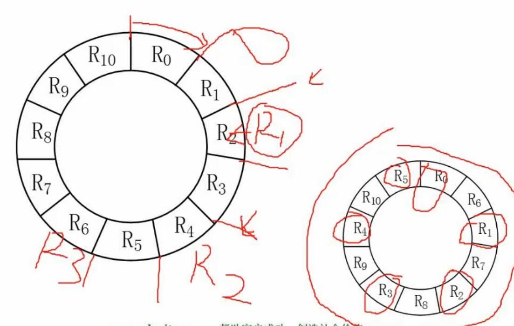

# 一.计算机组成与体系结构

## 1. 进制转换的计算方法

### 1.1 R进制转十进制的方法

- **按权展开法**
  对每一位数字分别进行计算。
  若进制数为R，
  当前位与小数点的距离（小数点左侧向左从0开始，小数点右侧向右从-1开始）为k，
  该位的值为n，
  则该位转换为十进制的值为：$R^k\times n$  
  例如：
  二进制：$101.01 = 2^2\times 1 + 2^0\times 1 + 2^{-2}\times 1 = 5.25$  
  七进制：$604.01 = 7^2\times 6 + 7^0\times 4 + 7^{-2}\times 1 = 298\frac{1}{49}$

### 1.2 十进制转R进制的方法

- 短除法
  将原数值一直除以R，记录每次除之后的余数，直到最后的商小于进制数R。
  使最后的商作为第一位数，后续将之前获得的余数倒排，便得到转换后的R进制数。
  例如：
  31转为二进制：
  ```
  2 | 31 ... 1
  2 | 15 ... 1
  2 | 7  ... 1
  2 | 3  ... 1
      1
  故31转二进制为11111
  ```
	81转为8进制：
  ```
  8 | 81 ... 1
  8 | 10 ... 2
      1
  故81转八进制为121
  ```

### 1.3 二、八、十六进制互相转换的方便方法

- 三个二进制位对应一个八进制位，四个二进制位对应一个十六进制位，因此若要将二进制转为八进制或十六进制，只需每三位或四位进行分组，分别转换后即可得到目标数。
  例：
  二进制10001110转换为八进制：
  ```
  10 | 001 | 110
  =
  2  |  1  |  6
  =
  216
  ```
  二进制10001110转换为十六进制：
  ```
  1000 | 1110
  =
  8    | e
  =
  8e
  ```

## 2. 计算机数据编码


| 数值  |     1     |    -1     |      1-1      |
| :-: | :-------: | :-------: | :-----------: |
| 原码  | 0000 0001 | 1000 0001 | 1000 0010（有误） |
| 反码  | 0000 0001 | 1111 1110 | 1111 1111（-0） |
| 补码  | 0000 0001 | 1111 1111 | 0000 0000（0）  |
| 移码  | 1000 0001 | 0111 1111 | 1000 0000（0）  |

### 2.1 原码

- 原理：
  > 将数转为二进制，存入一个字节（8个bit）中。  
  > 其中最左边一位是符号位，0表示正数，1表示负数。
- 取值范围：  
	> $-(2^{n-1}-1)$ ~ $2^{n-1}-1$  
	> n为比特数，例如一个字节的话n为8。  
	> 一个字节数的范围就是 -127 ~ 127。
- 缺陷：  
	> 没法直接在计算机中运算，例如正数和负数相加没法直接使用与运算。

### 2.2 反码

- 原理：  
	> 正数与原码相同。  
	> 负数在原码的基础上，符号位不变，数值位全部取反。
- 取值范围：  
	> 与原码相同。  
  > $-(2^{n-1}-1)$ ~ $2^{n-1}-1$  
	> n为比特数，例如一个字节的话n为8。  
	> 一个字节数的范围就是 -127 ~ 127。
- 缺陷：  
	> 会存在0和-0的问题。

### 2.3 补码

- 原理：  
	> 正数与原码相同。  
	> 负数在反码的基础上加1。
- 取值范围：  
	> $-2^{n-1}$ ~ $2^{n-1}-1$  
	> n为比特数，例如一个字节的话n为8。  
	> 一个字节数的范围就是 -128 ~ 127。
- 说明：  
	> 现代计算机基本都使用补码进行计算。
- 优点：  
	> 解决了-0的问题，使得正数和负数可以直接使用加法运算。

### 2.4 移码

- 原理：  
	> 在补码的基础上，符号位颠倒。  
	> 使得整个字节的最小值为0000 0000，最大值为1111 1111，零为1000 0000。
- 作用：  
	> 可以方便的比较两个数的大小。  
	> 用于表示浮点数的阶码（指数）。

### 2.5 浮点数

- 浮点数表示方法：  
	> $N=M\times R^e$  
	> M是尾数，e是指数，R是基数。  
	> 类似科学计数法。
- 例：  
	> $1.119\times 10^3$  
	> 1.119是尾数，3是指数，10是基数。
- 运算方法：  
	例如计算 1000 + 119：  
	$1.0\times 10^3+1.19\times 10^2$  
	1. 对阶  
		> 将较小的指数化为较大的指数  
		> $1.0\times 10^3+1.19\times 10^2=$  
		> $1.0\times 10^3+0.119\times 10^3$
	2. 尾数计算
		> $1.0\times 10^3+0.119\times 10^3=$  
		> $1.119\times 10^3$
	3. 结果格式化
		> 若结果的尾数大于10或小于1，则需要格式化，使尾数为1位数。  
		> 例如：若结果为 $0.0199\times 10^4$，则需要格式化为 $1.99\times 10^2$
		
## 3. 计算机结构

### 3.1 计算机结构意义上的主机构成

- 主存储器（内存）
- CPU（中央处理器）

### 3.2 CPU的构成

- 运算器
	- 算数逻辑单元 ALU
		- 与运算相关
	- 累加寄存器 AC
		- 通用寄存器，存储运算中相应的值
	- 数据缓冲寄存器 DR
		- 对内存储器进行读写时用于暂存数据
	- 状态条件寄存器 PSW
		- 存储运算过程中相关的标志位（进位、溢出、中断等）
- 控制器
	- 程序计数器 PC
		- 标识当前运行的指令位置
	- 指令寄存器 IR
	- 指令译码器
	- 时序部件

### 3.3 计算机体系结构分类-flynn分类法

- 单指令流单数据流 SISD
	- 结构
		- 控制部分：一个
		- 处理器：一个
	- 代表
		- 单处理器系统
- 单指令流多数据流 SIMD
	- 结构
		- 控制部分：一个
		- 处理器：多个
	- 特性
		- 各处理器以异步的形式执行同一条指令（只是处理的数据不同）
	- 代表
		- 并行处理机
		- 阵列处理机
		- 超级向量处理机
- 多指令流单数据流 MISD
	- 结构
		- 控制部分：多个
		- 处理器：一个
	- 特性
		- 被证明不可能、不实际
- 多指令流多数据流 MIMD
	- 结构
		- 控制部分：多个
		- 处理器：多个
	- 特性
		- 能够实现作业、任务、指令等各级全面并行
		- 多个计算机、或多个处理器组成集群完成任务
	- 代表
		- 多处理机系统
		- 多计算机
		
### 3.4 计算机指令类型CISC与RISC

- CISC（复杂指令集）
	- 指令特点
		- 指令数量多
		- 指令长度可变
		- 指令使用频率差别大
	- 寻址方式
		- 支持多种
	- 实现方式
		- 微程序控制技术（微码）
	- 特点
		- 研制周期长
- RISC（精简指令集）
	- 指令特点
		- 指令数量少
		- 指令定长
		- 指令使用频率接近
		- 大部分为单周期指令
		- 大量使用寄存器
		- 只有load/store操作内存
	- 寻址方式
		- 支持方式少
	- 实现方式
		- 增加了通用寄存器
		- 硬布线逻辑控制为主
		- 适合采用流水线
	- 特点
		- 优化编译
		- 有效支持高级语言

## 4. 计算机流水线

### 4.1 流水线的概念


- 流水线是指在程序执行时，使多条指令重叠进行操作，是一种时间并行处理 实现技术。
- 可以同时为多条指令的不同部分进行工作，可以提高各部件的利用率，提高指令的平均执行速度。  

### 4.2 流水线周期计算

- 流水线周期就是一个指令中执行时间最长的部分的执行时长。
- 例如：一个指令分为取指1ns，分析2ns，执行3ns，那么周期就是3ns。

### 4.3 流水线执行时间计算


- 原理：  
	> 红线左边部分为执行第一条指令消耗的完整时间（流水线初始化）；  
	> 红线右侧每过一个流水线周期即完成执行一条指令，右侧共有 n-1 个流水线周期。
- 计算公式：
	- 理论公式：
		> 原理：1条指令完整执行时间 + (n-1)*流水线周期  
		> $(t_1+t_2+...+t_k)+(n-1)\times\Delta t$  
		> k=任务段数 n=执行条数
	- 实践公式：
		> 原理：第一条指令每个部分的执行时间都按照流水线周期来计算  
		> $(k+n-1)\times\Delta t$  
		> k=任务段数 n=执行条数
- 举例：
	> 一个指令有三部分，分别需要2ns，1ns，2ns，流水线周期是？100条指令的执行时间是？  
	> 答：周期是2ns；执行时间是5+2*99=203ns 或 (3+99)*2=204ns
	
### 4.4 流水线吞吐率计算

- 概念
	> 流水线吞吐率（TP），指单位时间内流水线所完成的任务数量或输出结果数量。
	
- 吞吐量计算
	> $TP=\frac{指令条数}{流水线执行时间}$  
	> 例如100条指令，执行时间203ns  
	> $TP=\frac{100}{203ns}$
	
- 最大吞吐量计算  
	
	> 例如：流水线周期2ns，则最大吞吐量为
	> $TP=\frac{1}{2ns}$
	
### 4.5 流水线加速比计算

- 概念
	> 指执行同样一批任务，不使用流水线所用的时间，与使用流水线所用时间的比值。
	
- 公式
	> $S=\frac{不使用流水线的执行时间}{使用流水线的执行时间}$  
	> 例如  
	> 上述例子中  
	> $S=\frac{500ns}{203ns}$
	
### 4.6 流水线效率计算

- 概念
	> 流水线效率，是指流水线的设备利用率。  
	> 指n个任务实际占用的时空区，与k个流水段总的时空区之比
	
- 图解
	
- 公式
	> n个任务占用总时空区 = 单个任务占用总单位时间 * n  
	> k个流水段的总时空区 = k * 流水线完整执行所需总单位时间数  
	> $E=\frac{n个任务占用总时空区}{ k个流水段的总时空区}$
	
## 5. 计算机存储

### 5.1 层次化存储结构


### 5.2 cache

- 概念
	- 提高CPU输入输出的速率，突破CPU与存储系统间数据传送带宽限制。
	- 在计算机存储系统中，cache是访问速度最快的层次（除寄存器外）。
	- cache改善系统性能的依据是程序的局部性原理。
- 存储系统访问平均周期计算
	> 若h为cache访问命中率，$t_1$表示cache访问的周期时间，$t_2$表示主存储器访问的周期时间，则该使用cache+主存的系统的平均周期$t_3$为：  
	> $t_3=h\times t_1+(1-h)\times t_2$  
	> 例如：  
	> 	访问命中率h为95%，cache访问周期$t_1$为1ns，主存访问周期$t_2$为1ms，则系统平均周期$t_3$为：  
	> 	$t_3=0.95\times 1ns+0.05\times 1000ns=50.95ns$

### 5.3 程序局部性原理

- 时间局限性
	- 指程序最近访问的地址，在不久的将来还会再次被访问
	- 例如循环体，其中引用的内容短时间内会多次被访问
- 空间局限性
	- 指程序访问某地址后，该地址邻近的地址可能很快也被访问
	- 例如对数组中某元素的访问，可能很快就会访问邻近位置元素
- 工作集理论
	- 工作集是进程运行时被频繁访问的页面集合

### 5.4 内存地址计算

- 计算两个内存地址间有多少地址单元
	> 例如计算 AC000H 到 C7FFFH间有多少地址单元  
	> 将 C7FFF 加一后（C8000）减去 AC000，得到 1C000。  
	> 1C000 即 $1\times 16^4+12\times 16^3=2^{16}+12\times 2^{12}$ 个地址单元。  
	> H表示十六进制。
	
- 计算有多少K个地址单元
	> K个地址单元，K为1024，即$2^{10}$  
	> 如上例，1C000个地址单元，共有  
	$$\frac{2^{16}+12\times 2^{12}}{2^{10}}=2^6+12\times 2^2=64+48=112$$  
	> 即 112K 个地址单元

### 5.5 磁盘相关计算

- 磁盘构成


- 存取时间
	> 存取时间 = 寻道时间 + 等待时间  
	> 寻道时间指磁头移动到目标磁道所需的时间；  
	> 等待时间，也称旋转延迟时间，指等待磁头旋转到等待读写的扇区所需的时间。
	
- 复杂例题
	
	
	> 说明：  
	> 问题1：  
	> 转一块耗时3ms，处理耗时3ms，因此处理完R0后磁头到了R1结束的位置。  
	> 因此处理完R0，并移动到R1开头需要3+33=36ms。  
	> 因此从R0处理到R9并移动到R10开头，共36x10=360ms。  
	> 读取并处理R10需要3+3=6ms。  
	> 因此最长一共需要360+6=366ms。  
	> 问题2：  
	> R0读取完并处理完共耗时3+3=6ms，此时使磁头刚好移动到R1，以此类推。  
	> 因此共11块，每块处理完都刚好可以进行下一块处理的话，共11x6=66ms。
	
## 6. 总线

- 计算机总线的分类
	- 内部总线
		- 微机内部哥哥外围芯片与处理器之间的总线
	- 系统总线
		- 微机中各个插件板和系统板之间的总线
		- 数据总线
			- 32位计算机，说明数据总线宽度为32bit位
		- 地址总线
			- 若地址总线是32位，说明代表的地址空间共有$2^{32}$，即4G
		- 控制总线
			- 发送相应控制信号的总线
	- 外部总线
		- 微机和外部设备的总线