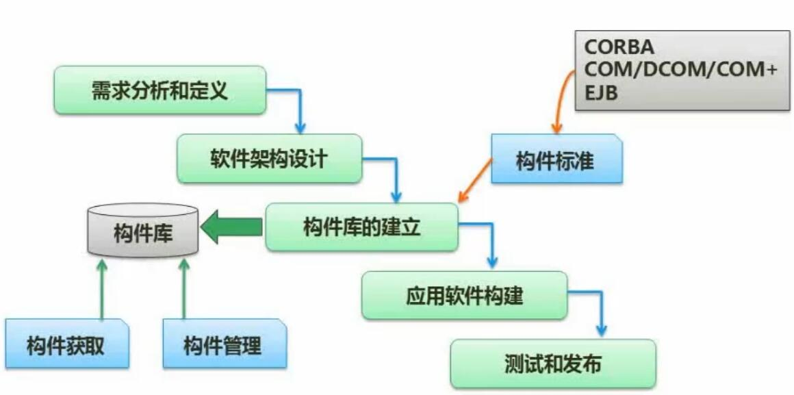

# 十、软件工程基础

## 1. 软件开发模型
### 1.1 瀑布模型

- 要点
	- 结构化开发
	- 适合**需求明确**场合

### 1.2 原型/演化/增量模型

- 原型模型
	- 先做**简易系统**，经过多轮演示与调整，完成最终系统
	- 往往只应用于**需求分析**阶段
- 演化模型
	- 在原型模型的基础上，经过多轮演示、调整与**开发**，完成最终系统
- 增量系统
	- 先做**核心系统**，之后经过演示与调整，最终完成所有内容
	- 核心模块较早地与用户进行了接触，风险较小

### 1.3 螺旋模型

- 要点
	- 引入了**风险分析**
	- 融入了原型、瀑布模型、演化模型等的特征

### 1.4 V模型

- 要点
	- 注重**测试**，强调测试要贯穿开发始终
	- 每个分析与设计步骤，都有各自对应的测试计划

### 1.5 喷泉模型

- 要点
	- 较早的**面向对象**的模型

### 1.6 RAD快速开发模型

- 要点
	- 结合了**瀑布模型**与**构件化开发**

- CBSD构件组装模型
	- 把软件开发中的各个模块做成**标准构件**，将构件进行组装就得到了最终软件
	- 提高了开发中内容的**复用性**
	- 缩短**开发时间**
	- 节省成本
	- 提高软件**可靠性**
- 构件标准
	- CORBA
	- 微软 COM/DCOM/COM+
	- JAVA EJB

### 1.7 统一过程（UP/RUP）

- 核心
	- 用例驱动
	- 以架构为中心
	- 迭代和增量
- 开发过程
	- 初始
		- 需求与评估
	- 细化
		- 详细分析，完成架构
	- 构建
		- 构件开发、组装与测试
	- 交付
		- β测试、预发布、文档定稿、培训调整等

### 1.8 敏捷开发方法（XP）

- 特性
	- 适合中小型项目、需求模糊/多变
	- 轻量、高效、紧密合作
- 4大价值观
	- 沟通
	- 简单
	- 反馈
	- 勇气
- 5大原则
	- 快速反馈
	- 简单性假设
	- 逐步修改
	- 提倡更改
	- 优质工作
## 2. 信息系统开发方法

- 结构化法
	- 严格区分工作阶段，开发过程工程化，文档标准化
	- 很不灵活，流程不容易变化
- 原型法
	- 适合需求不明确的开发
- 面向对象方法
	- 更好的复用性
	- 建立一个全面、合理、统一的模型
	- 分析、设计、实现三个阶段，界限不明确
- 面向服务方法
	- SO方法

## 3. 结构化系统设计

- 要点
	- 自顶向下、逐步求精
	- 信息隐蔽
	- 模块独立、高内聚、低耦合
- 模块设计原则
	- 模块大小适中
	- 减少调用深度
	- 多扇入（被调用），少扇出（调用其他）
	- 单入口，单出口
	- 模块的作用域在模块之内
	- 功能是可预测的
- 内聚与耦合概述

- 系统模块结构概述

## 4. 软件需求（分类与获取）

- 看看就行

## 5. 软件测试*

### 5.1 软件测试原则

- 尽早、不断进行测试（V模型）
- 避免测试自己设计的程序（自我偏袒）
- 测试也要选择无效、不合理的数据
- 修改后应进行回归测试（重新测试已通过的模块）
- 尚未发现的错误数与已发现错误数成正比（重点关注bug更多的模块/程序）

### 5.2 软件测试类型

- 动态测试（利用到计算机的测试）
	- 黑盒测试
	- 白盒测试
	- 灰盒测试
- 静态测试（未利用到计算机的测试）
	- 桌前检查（自行检查代码）
	- 代码走查（人工执行代码）
	- 代码审查（交叉检查）

