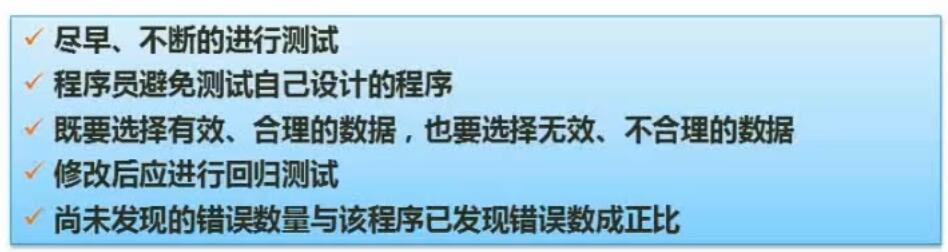

# 十、软件工程基础

## 1. 软件开发模型
### 1.1 瀑布模型

- 要点
	- 结构化开发
	- 适合**需求明确**场合

### 1.2 原型/演化/增量模型

- 原型模型
	- 先做**简易系统**，经过多轮演示与调整，完成最终系统
	- 往往只应用于**需求分析**阶段
- 演化模型
	- 在原型模型的基础上，经过多轮演示、调整与**开发**，完成最终系统
- 增量系统
	- 先做**核心系统**，之后经过演示与调整，最终完成所有内容
	- 核心模块较早地与用户进行了接触，风险较小

### 1.3 螺旋模型

- 要点
	- 引入了**风险分析**
	- 融入了原型、瀑布模型、演化模型等的特征

### 1.4 V模型

- 要点
	- 注重**测试**，强调测试要贯穿开发始终
	- 每个分析与设计步骤，都有各自对应的测试计划

### 1.5 喷泉模型

- 要点
	- 较早的**面向对象**的模型

### 1.6 RAD快速开发模型

- 要点
	- 结合了**瀑布模型**与**构件化开发**

- CBSD构件组装模型
	- 把软件开发中的各个模块做成**标准构件**，将构件进行组装就得到了最终软件
	- 提高了开发中内容的**复用性**
	- 缩短**开发时间**
	- 节省成本
	- 提高软件**可靠性**
- 构件标准
	- CORBA
	- 微软 COM/DCOM/COM+
	- JAVA EJB

### 1.7 统一过程（UP/RUP）

- 核心
	- 用例驱动
	- 以架构为中心
	- 迭代和增量
- 开发过程
	- 初始
		- 需求与评估
	- 细化
		- 详细分析，完成架构
	- 构建
		- 构件开发、组装与测试
	- 交付
		- β测试、预发布、文档定稿、培训调整等

### 1.8 敏捷开发方法（XP）

- 特性
	- 适合中小型项目、需求模糊/多变
	- 轻量、高效、紧密合作
- 4大价值观
	- 沟通
	- 简单
	- 反馈
	- 勇气
- 5大原则
	- 快速反馈
	- 简单性假设
	- 逐步修改
	- 提倡更改
	- 优质工作
## 2. 信息系统开发方法

- 结构化法
	- 严格区分工作阶段，开发过程工程化，文档标准化
	- 很不灵活，流程不容易变化
- 原型法
	- 适合需求不明确的开发
- 面向对象方法
	- 更好的复用性
	- 建立一个全面、合理、统一的模型
	- 分析、设计、实现三个阶段，界限不明确
- 面向服务方法
	- SO方法

## 3. 结构化系统设计

- 要点
	- 自顶向下、逐步求精
	- 信息隐蔽
	- 模块独立、高内聚、低耦合
- 模块设计原则
	- 模块大小适中
	- 减少调用深度
	- 多扇入（被调用），少扇出（调用其他）
	- 单入口，单出口
	- 模块的作用域在模块之内
	- 功能是可预测的
- 内聚与耦合概述

- 系统模块结构概述

## 4. 软件需求（分类与获取）

- 看看就行

## 5. 软件测试*

### 5.1 软件测试原则

- 尽早、不断进行测试（V模型）
- 避免测试自己设计的程序（自我偏袒）
- 测试也要选择无效、不合理的数据
- 修改后应进行回归测试（重新测试已通过的模块）
- 尚未发现的错误数与已发现错误数成正比（重点关注bug更多的模块/程序）

### 5.2 软件测试类型

- 动态测试（利用到计算机的测试）
	- 黑盒测试
	- 白盒测试
	- 灰盒测试
- 静态测试（未利用到计算机的测试）
	- 桌前检查（自行检查代码）
	- 代码走查（人工执行代码）
	- 代码审查（交叉检查）

### 5.3 测试用例设计

- 黑盒测试
	- 概念
		- 不了解内部设计的测试
	- 常见设计原则
		- 等价类划分
		- 边界值分析（寻找边界值，一般区间临界值及其超出范围1个单位的值）
		- 错误推测
		- 因果图（由结果推测原因）
- 白盒测试
	- 概念
		- 了解内部设计的测试
	- 常见设计原则
		- 语句覆盖
		- 判定覆盖
		- 条件覆盖
		- 路径覆盖（覆盖所有可能的路径）

### 5.4 测试阶段

- 单元测试
- 集成测试
	- 一次性组装
	- 增量式组装
- 确认测试
	- 最终alpha或beta测试、验收测试
- 系统测试
	- 主要测试系统性能指标
- 冒烟测试
	- 初步的一次测试，找到问题的发生点

### 5.5 McCabe复杂度*

- 概念
	- 也称循环复杂度，用来衡量软件程序的复杂度
- 总结
	- 复杂度计算公式：$V(G)=m-n+2$
	- m：有向**边**数
	- n：**节点**数
	- 例如右图，3节点2条边，复杂度为2-3+2=1
	- 图中箭头合并处，可以将其抽象为节点，也可以不抽象

## 6. 系统运行与维护*

- 可维护性
	- 易分析性
		- 代码的可读性
	- 易改变性
		- 耦合度
	- 稳定性
	- 易测试性
- 维护类型
	- 改正性维护（25%）
		- 问题易于确定
	- 适应性维护（20%）
		- 软件环境迁移、适应新需求等
	- 完善性维护（50%）
		- 扩充功能、改善性能等
	- 预防性维护（5%）
		- 闲时维护以预防未来可能的问题

## 7. CMMI

- 概念
	- 软件能力成熟度评估标准
	- 用于指导软件开发过程的改进与软件开发能力的评估
- 分级
	- 1级：混乱级（完成级）
		- 未通过评估的
	- 2级：管理级
		- 个人有经验，并可以在项目间传承经验
	- 3级：定义级
		- 组织（公司）的过程经验积累
		- 不同项目经理间可以传承经验
	- 4级：量化管理级
		- 定量的管理
	- 5级：优化级
		- 组织可以自我改革优化

## 8. 项目管理

- 项目管理九大知识领域
	- 范围管理
	- 时间管理
	- 成本管理
	- 质量管理
	- 人力资源管理
	- 沟通管理
	- 风险管理
	- 采购管理
	- 整体管理

- 时间管理
	- PERT图
		- 包含各活动先后次序、时间成本、各任务间的依赖关系
		- **关键路径：从开始节点到结束节点，最长的路径就是关键路径**
	- 甘特图
		- 清晰描述每个任务的开始与结束时间、并行关系
		- 不能清晰反应各任务间的依赖关系

- 时间管理例题总结
	- 甘特图轻依赖关系
	- PERT图要计算某中间任务的最晚开始时间，需要先以正推的方式，计算结束节点的最早开始时间
	- 正推的计算方式为：当前任务的最早开始时间+执行时间=下个任务最早执行时间。**若一个任务有多个入度，取最大的时间为最早执行时间**
	- 从结束节点开始往目标节点，按照最短路径倒推，一路减去执行时间，即得到其最晚执行时间（15-4-1=10）

- 风险管理
	- 风险
		- 损失或伤害的可能性
		- 项目风险
		- 技术风险
		- 商业风险
	- 风险曝光度
		- 风险概率 x 风险损失