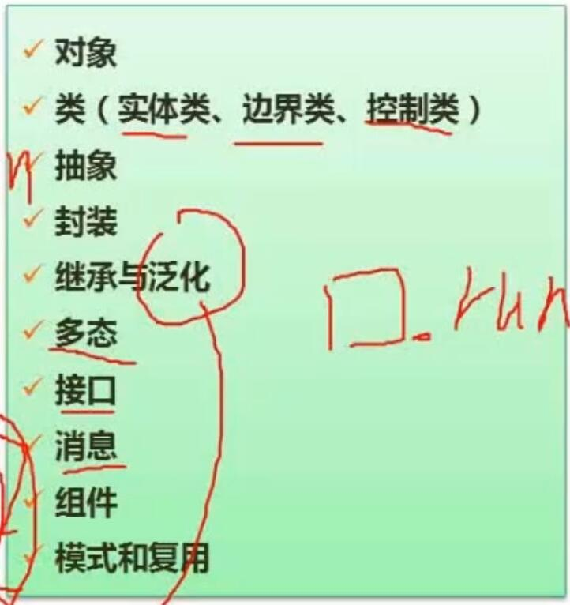
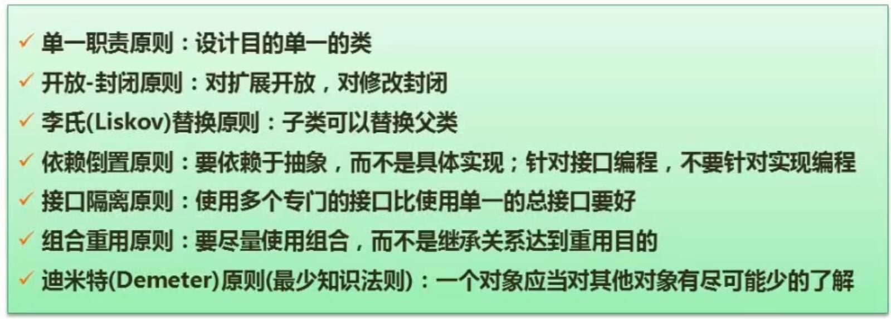
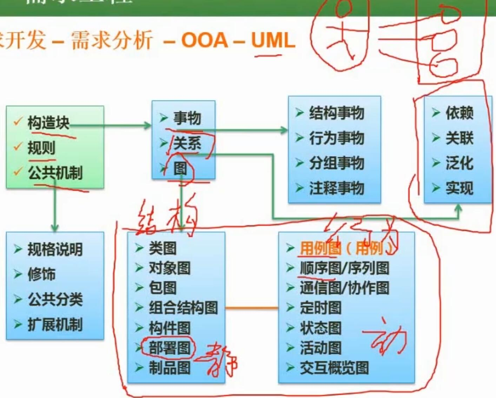
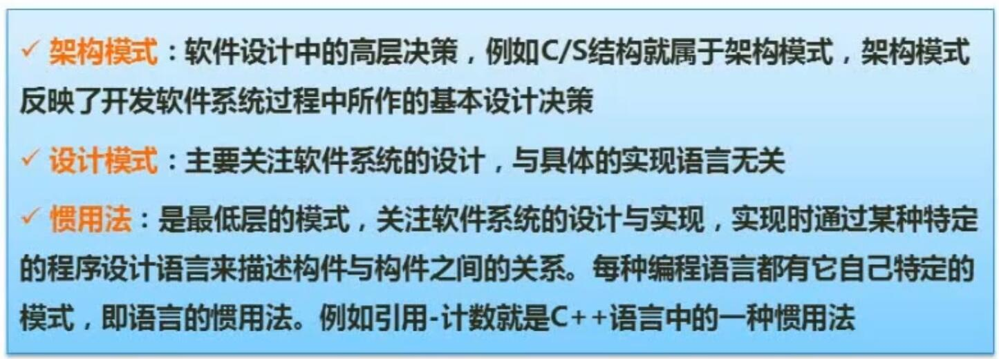
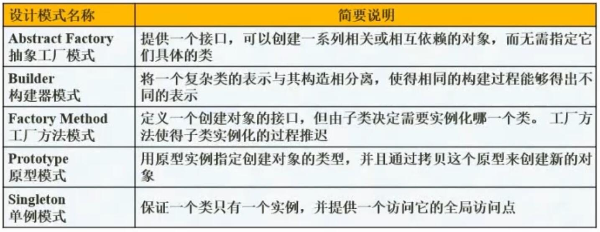
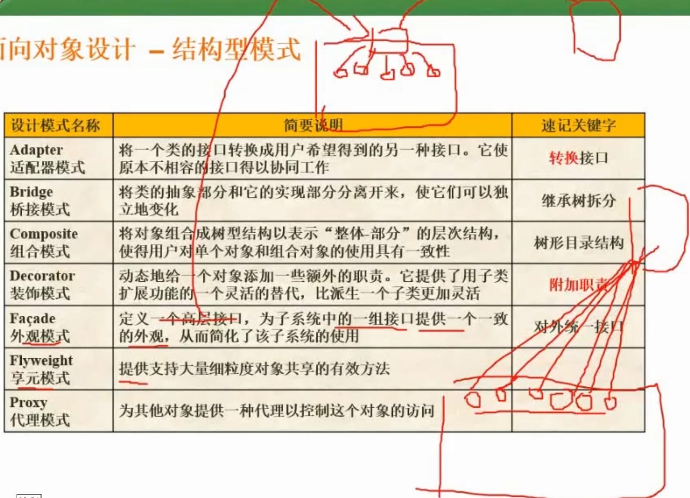
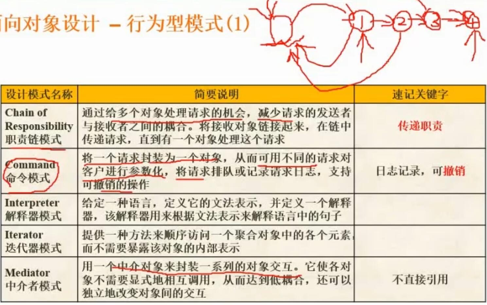
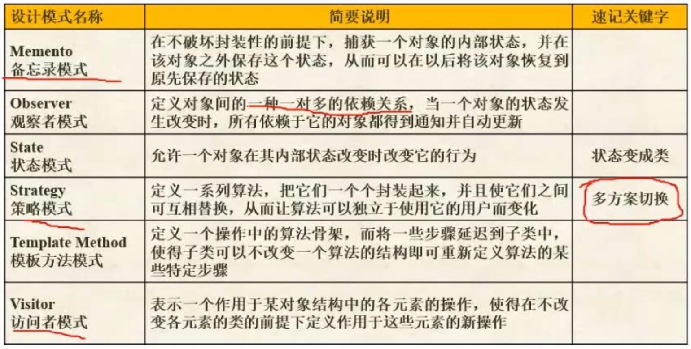

# 十一、面向对象

## 1. 面向对象基本概念

## 2. 面向对象设计原则

- 单一职责原则
- 开放-封闭原则
	- 对扩展开放，对修改封闭
- 里氏代换原则
	- 子类可以替换父类
- 依赖倒置原则
	- 依赖于抽象、针对接口编程
- 接口隔离原则
	- 使用多个专门的接口，而不是使用单一的总接口
- 组合重用原则
	- 尽量使用组合，而不是继承关系来达到重用目的
- 迪米特原则（最少知识法则）
	- 一个对象对其他对象的了解应尽可能少

## 3.UML*

### 3.1 UML分类

- UML图的分类
	- 结构图（静态图）
		- 类图
		- 对象图
		- 包图
		- 组合结构图
		- 构件图
		- 部署图
		- 制品图
	- 行为图（动态图）
		- 用例图
			- 系统和外部的交互关系
		- 顺序图/序列图
			- 强调按时间顺序
		- 通信图/协作图
			- 没有强调时间顺序
		- 定时图
		- 状态图
			- 状态的变迁与转换
		- 活动图
			- 类似流程图
		- 交互概览图

## 4. 设计模式*

### 4.1 设计模式的概念

- 架构模式
	- 软件设计中的高层决策
	- 例如C/S结构
- 设计模式
	- 关注软件系统的设计
	- 与语言无关
- 惯用法
	- 最底层的模式
	- 与语言相关

### 4.2 设计模式的分类

- 创建型模式
	- 定义
		- 关注如何创建对象，将对象的创建和使用分离
	- 常见
		- 抽象工厂模式
			- 提供一个接口，用来创建一系列相关的对象
		- 工厂方法模式
			- 定义一个创建对象的接口
			- 由子类决定需要实例化哪一个类
		- 构建器模式
			- 表示与构造分离
			- 相同构建过程得出不同的表示
		- 原型模式
			- 拷贝
			- 根据原型实例创建指定对象
		- 单例模式
			- 保证一个类只有一个实例
			- 提供一个它的全局访问点

- 结构型模式
	- 定义
		- 关注对象和类之间的结构
	- 常见
		- 适配器模式
			- 转换接口
			- 使原本不相容的接口得以协同工作
		- 桥接模式
			- 继承树拆分
		- 组合模式
			- 树形目录结构
			- 对象可以组成树形结构，例如多级机构
		- 装饰模式
			- 给原有的对象添加职责
			- 比派生子类更灵活
		- 外观模式
			- 对外统一接口
		- 享元模式
			- 提供支持大量细粒度对象共享的有效方法
		- 代理模式
			- 为对象提供一种代理，以控制这个对象的访问

- 行为型模式
	- 概念
		- 描述多个类和对象之间如何相互协作完成任务
	- 常见
		- 责任链模式
			- 传递职责
			- 将接收对象链接起来，传递请求，直到有一个对象处理请求
		- 命令模式
			- 日志记录，可撤销
		- 解释器模式
			- 定义一种语言的文法表示
			- 定义一个解释器用来解释语言中的句子
		- 迭代器模式
			- 提供一种方法用来顺序访问一个聚合对象中的各个元素
			- 不需要暴露该对象的内部表示
		- 中介者模式
			- 两对象互相不直接引用
			- 两对象之间定义一个中介者
		- 备忘录模式
			- 捕获一个对象的内部状态，在对象之外保存
			- 可用来恢复对象
		- 观察者模式
			- 一对多的依赖关系
			- 一个对象变化时，所有依赖的对象都得到通知并自动更新
		- 状态模式
			- 对象内部状态改变时，改变行为
		- 策略模式
			- 多方案切换
			- 定义一系列算法并封装起来，可以相互替换
		- 模板方法模式
		- 访问者模式