# 十二、数据流图*

## 1. 基本概念与常见元素

- 基本概念
	- 数据流图（DFD）是一种用于需求分析的工具
	- 可以表示系统内部与外部实体之间的数据流转换关系
- 常见元素
	- **数据流**
		- 表示数据的流向
		- 一般有一个名字反应含义
		- 用**箭头**表示
	- **加工**
		- 表示对数据的处理
		- 用**圆角矩形**或圆形表示
	- **数据存储**
		- 表示暂时存储的文件
		- 用**缺少边的矩形**表示
	- **外部实体**
		- 表示存在于软件系统外的**人员或组织**
		- 用**矩形**表示

## 2. 数据流图的分层

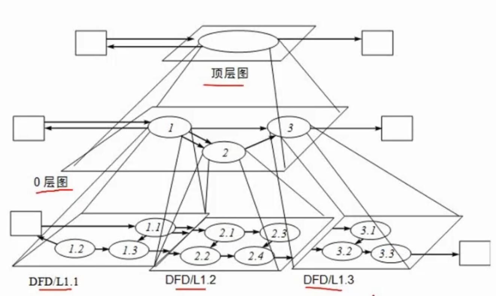
- 顶层图
	- 一般将整个系统浓缩为一整个节点
	- 能表示系统与外部实体的关系
	- 一般不能表示系统内部的数据流关系
- 0层图
	- 顶层图的下一层
	- 能表示系统内部的数据流关系
- ...

## 3. 数据字典

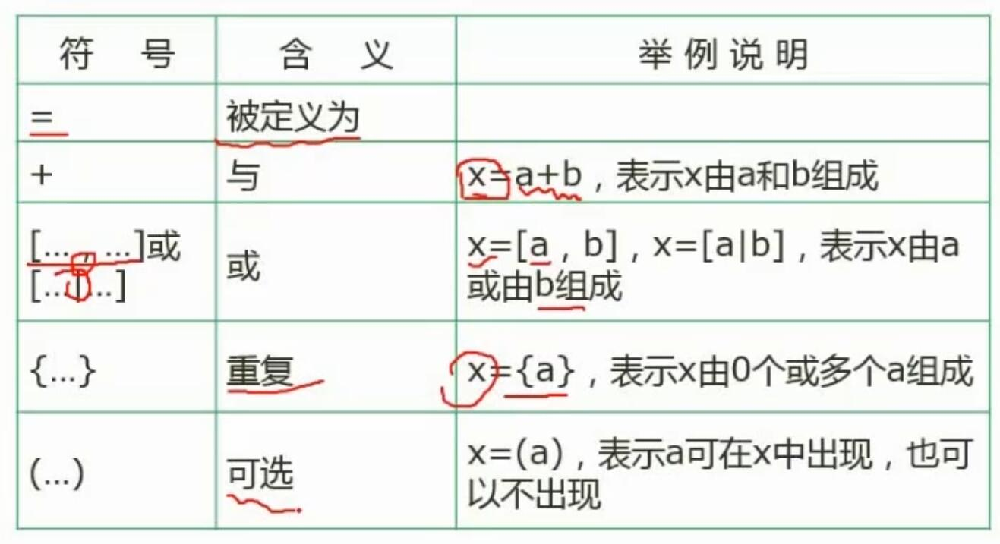
- 意义不明，不必深究
- 与正则表达式类似

## 4. 数据流图的平衡原则

- 作用
	- 可以用于找出数据流中错误、丢失的部分
- 父图与子图之间的平衡
	- 父图和子图中，系统内部和外部实体间的数据流关系应该是对应的
- 子图内平衡
	- 一个加工节点，应该既有输入，也有输出
	- 黑洞：只有输入，没有输出
	- 奇迹：只有输出，没有输入

## 5. 数据流图实例

### 5.1 答题技巧

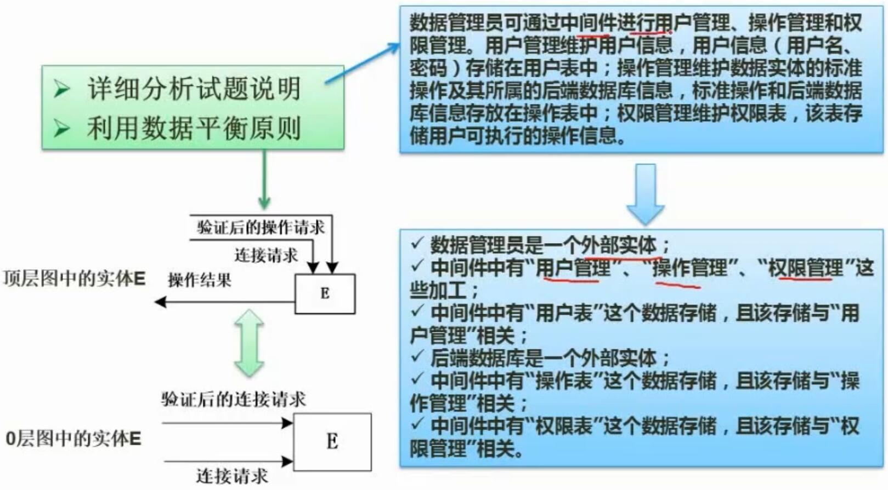
- 详细分析试题说明
	- 从中理清有哪些：
		- 外部实体
		- 任务操作
		- 数据库
		- 数据流
- 利用数据平衡原则
	- 对比各层图，对比它们与外部实体的数据流，可以发现可能存在的问题

### 5.1 案例1

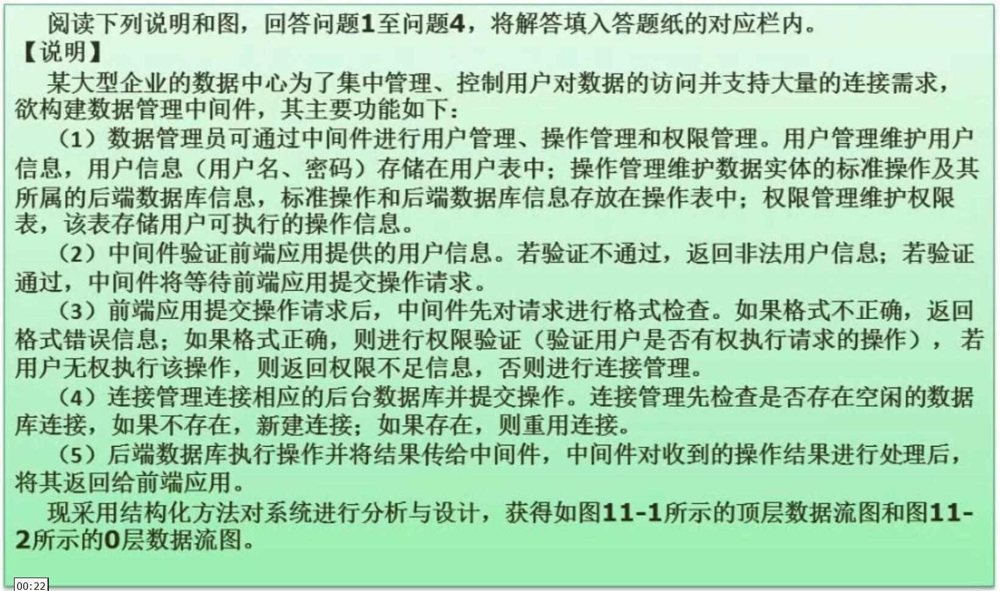
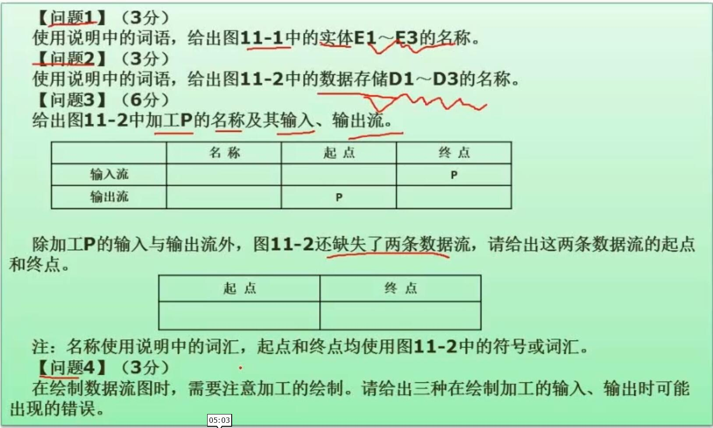
- 解题
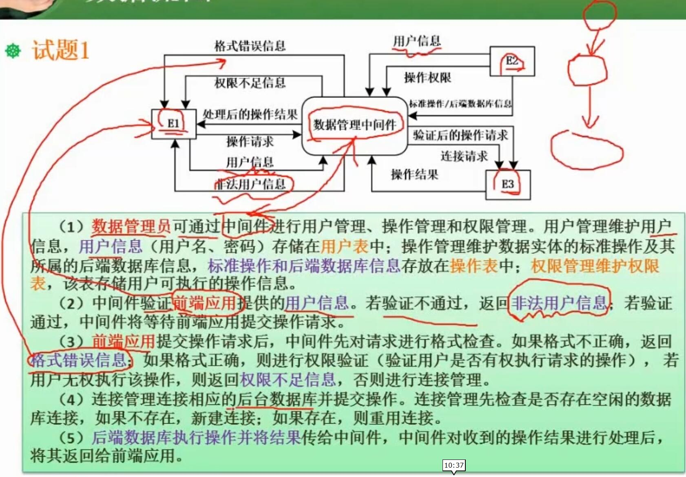
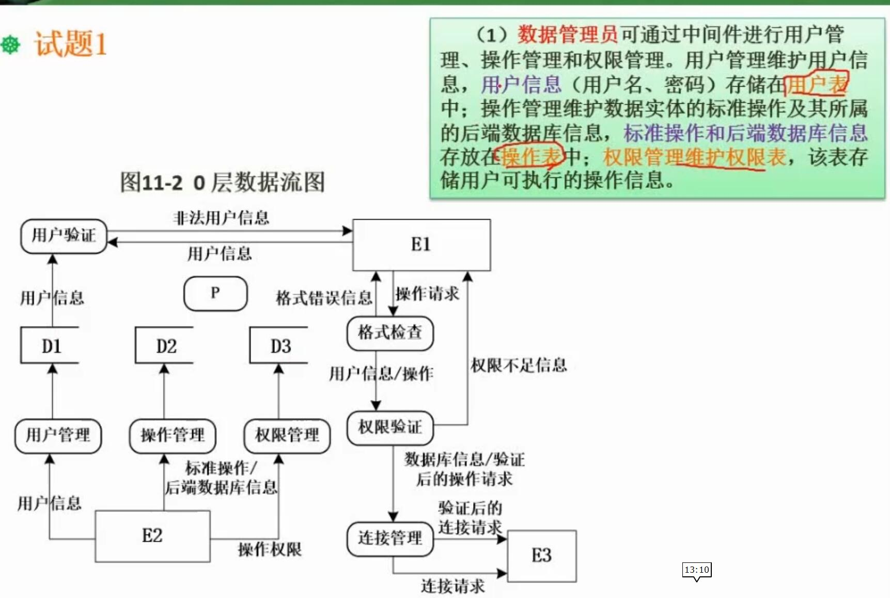
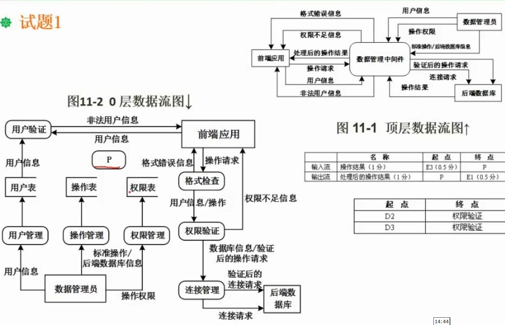

### 5.2 案例2

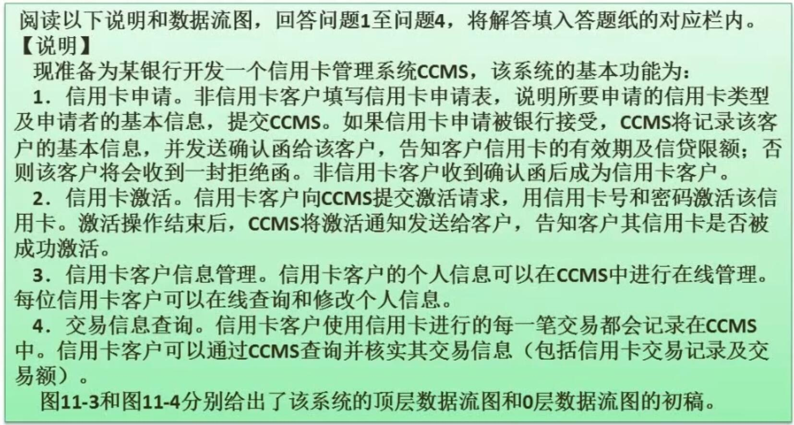
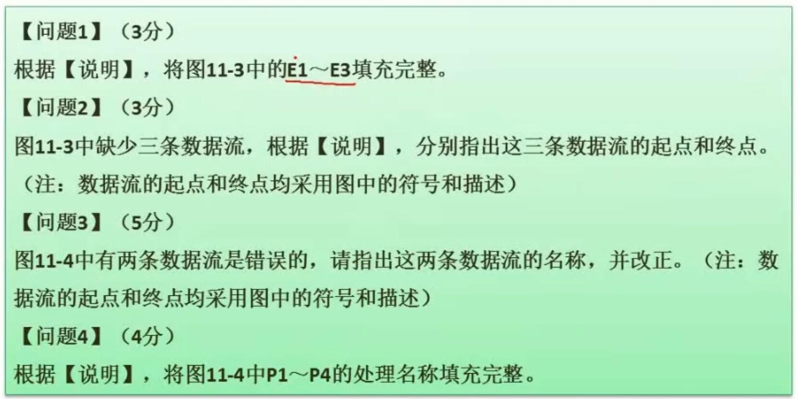
- 解题
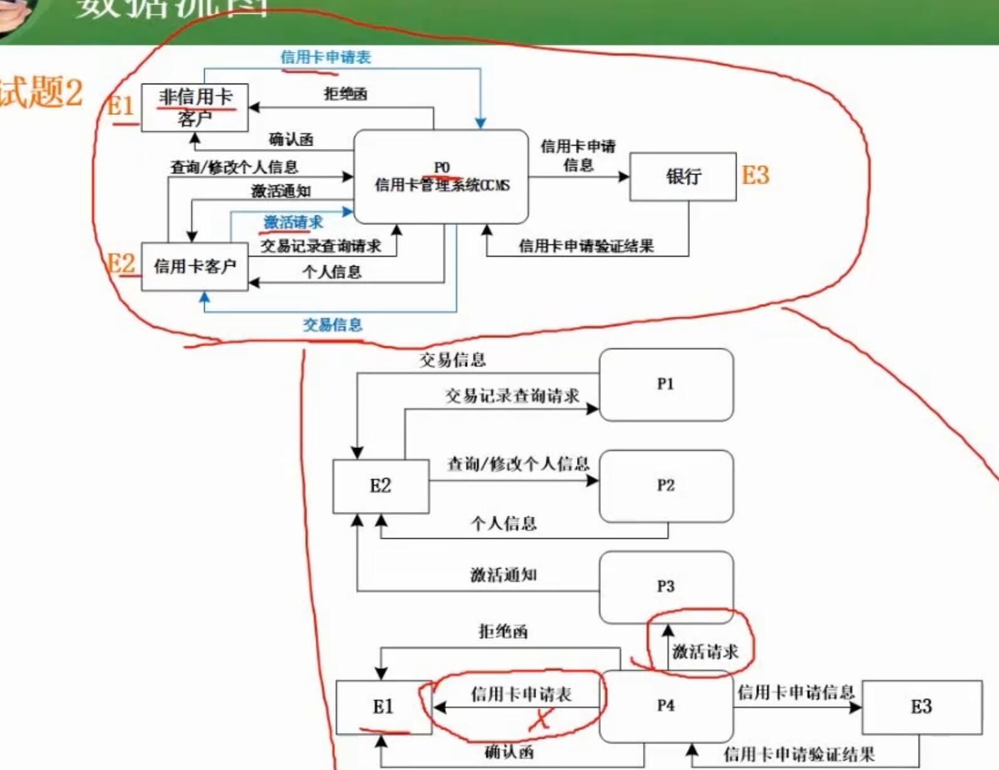