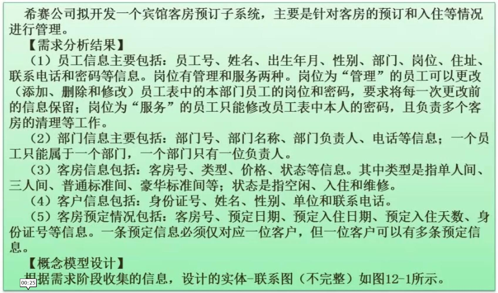
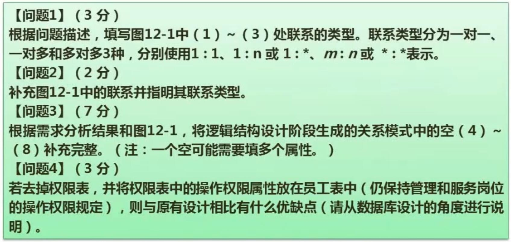
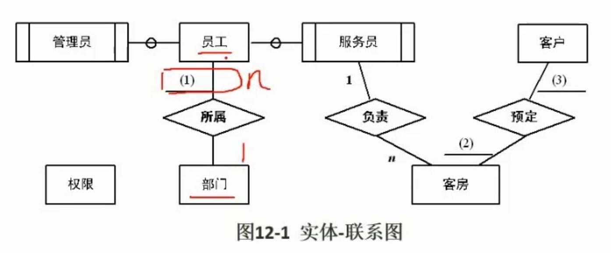
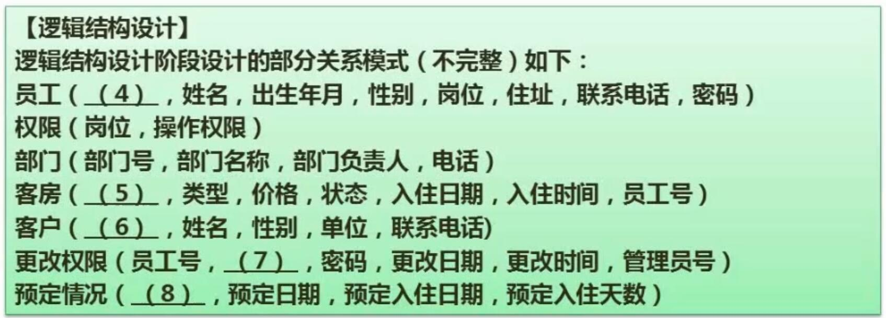
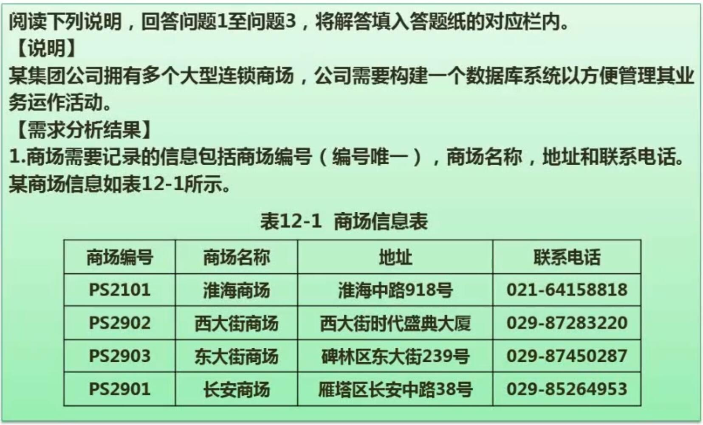
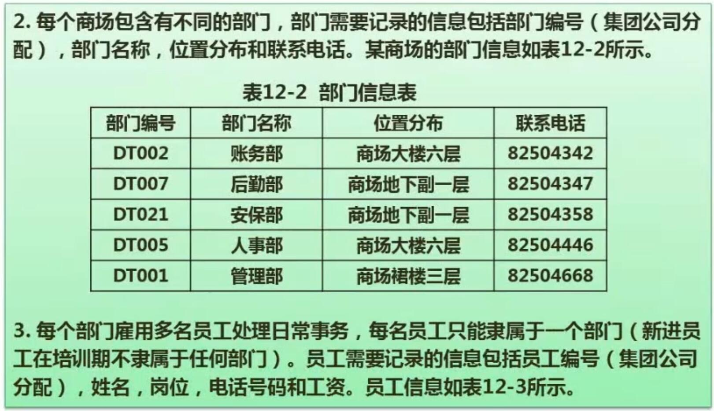
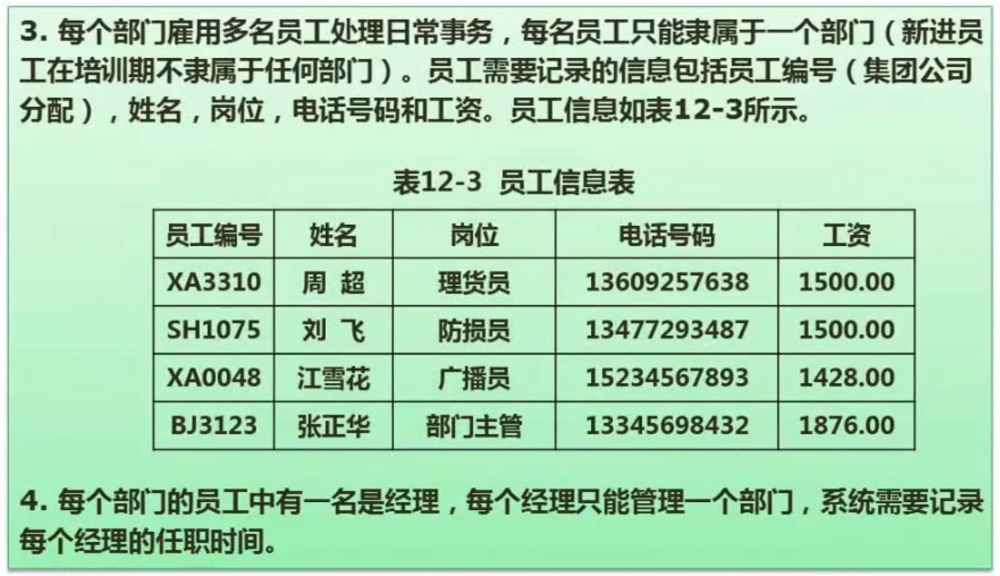
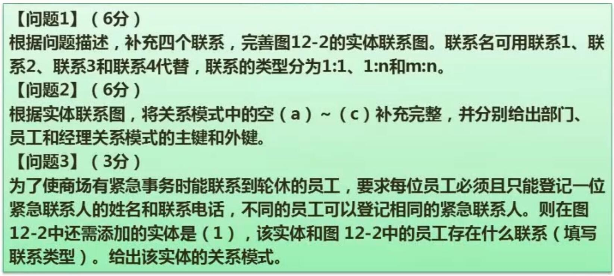
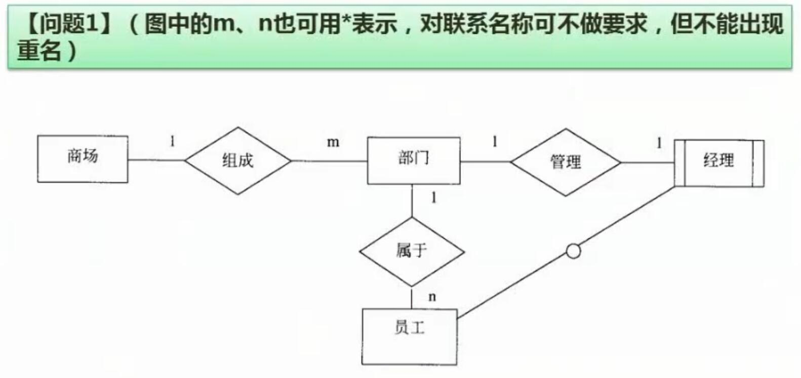

# 十三、下午题-数据库设计*

## 1. 数据库设计过程及ER模型概念

- 参考第三章

## 2. 答题技巧

- 常见题型
	- ER模型的补充
	- ER模型转关系模式
	- 关系模式补充
	- 数据库系统设计相关概念问题
- 如何判断两个实体间的关系
	- 从两个方向各自判断是几对几的关系
	- 综合两方向的关系，综合得到最终关系
	- 例如：员工和紧急联系人
		- 一个员工只能有一个紧急联系人，得到 1 对 1 关系
		- 一个紧急联系人可以对应多个员工，得到 1 对 n 关系
		- 综合，最终关系为 1 对 n
- 答题技巧
	- 详细分析试题说明
	- 熟练掌握基本知识

## 3. 案例分析1

- 要点
	- ER图中的实体，有些是两侧多一条竖线的，这种表示一个实体中的特殊个体。其和对应实体间用直线+圈的方式表示联系，如图所示
	- 补充逻辑结构的题（补充字段），先从题目中找是否有缺失的字段，再判断有没有缺失的和其他实体间的联系
	- 第三题中答出范式化和反范式化的优缺点即可

## 4. 案例分析2

- 解题

还需添加的实体是 员工 和 紧急联系人，n 对 1