# 十四、下午题-UML图*

## 1. 常见的各种UML图*

### 1.1 用例图

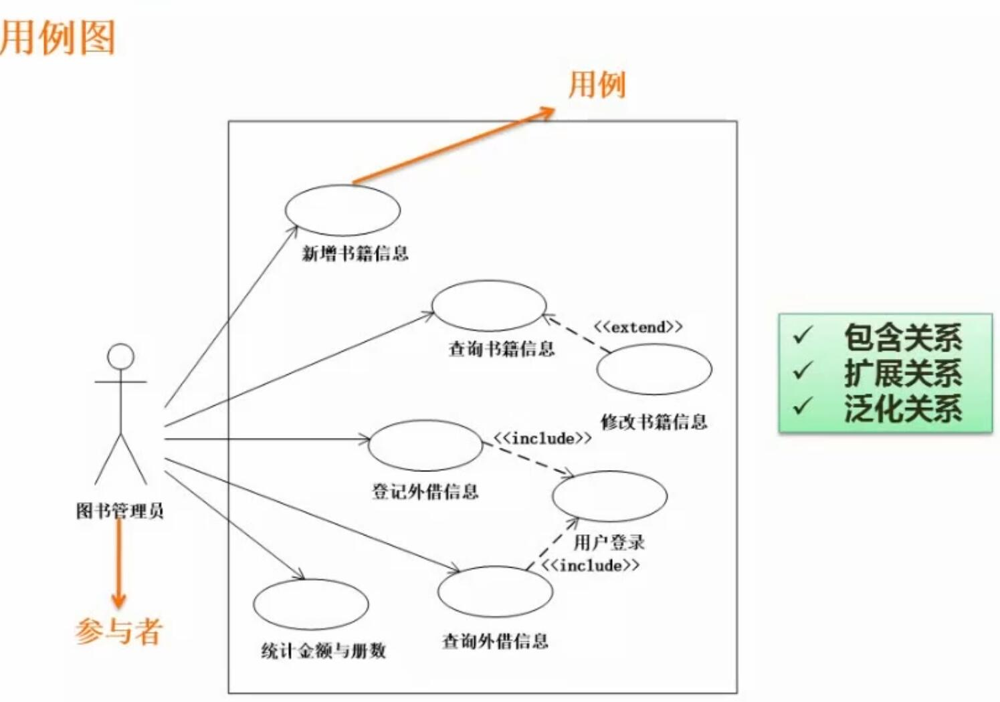
- 概念
	- 展示不同用户对系统的各种交互用例
	- 不同用例之间，可能有
		- 包含关系 include
		- 扩展关系 extend
		- 泛化关系

### 1.2 类图与对象图

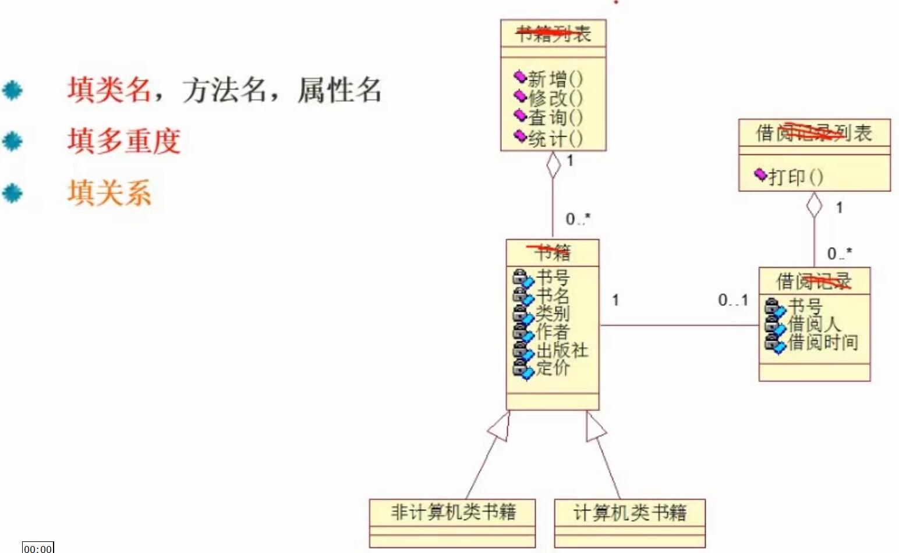
- 概念
	- 类图
		- 描述了类的名称、属性、方法，及类之间的关系
	- 多重度
		- 表示一个集合中的一个对象对应另一个集合中的几个对象
		- 多重度的数字，当前集合中的1个对象对应另一集合中的几个对象，需要写在另一集合那一方
		- 多重度举例：
			- 1：表示1个对象对应另一个集合中的1个对象
			- 0..$*$：1个对象对应0个或多个对象
			- $*$：与上面的等价
			- 1..$*$：1个对象对应1个或多个对象
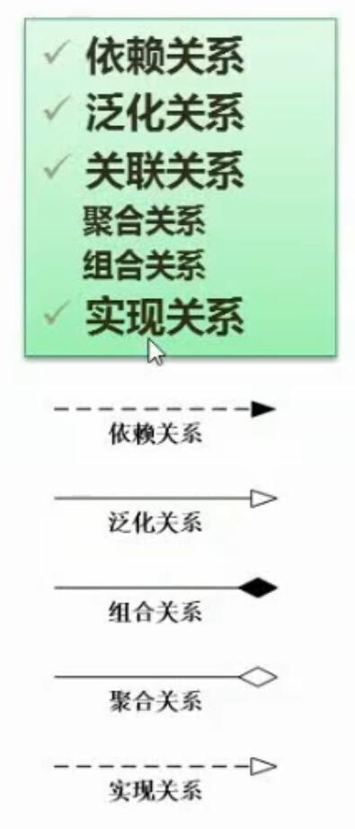
- 类图中的常见关系
	- 依赖关系（被依赖方指向依赖方）
		- 虚线+实心箭头
	- 泛化关系（指向抽象）
		- 实线+空心箭头
	- 实现关系（指向接口）
		- 虚线+空心箭头
	- 组合关系（部件指向整体）
		- 多个部件组合成一个整体（部件离不开整体，例如鸟和翅膀）
		- 实线+实心菱形
	- 聚合关系（部件指向整体）
		- 多个部件聚合成一个整体（部件可以离开整体独立存在，例如书架和书）
		- 实线+空心菱形
- 常见考点
	- 填类名/对象名
	- 填多重度
	- 填关系

### 1.3 顺序图

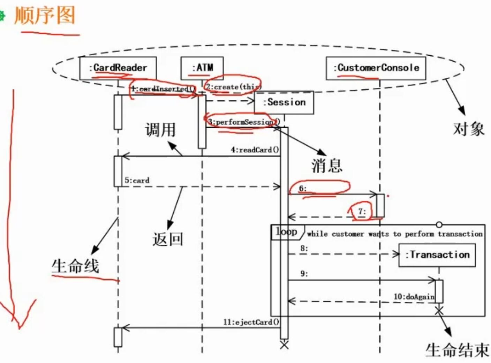
- 概念
	- 表示任务在各个对象间的处理过程
	- 包含了多个对象，和一个执行方向
	- 对象之间会有交互关系，和消息传递

### 1.4 活动图

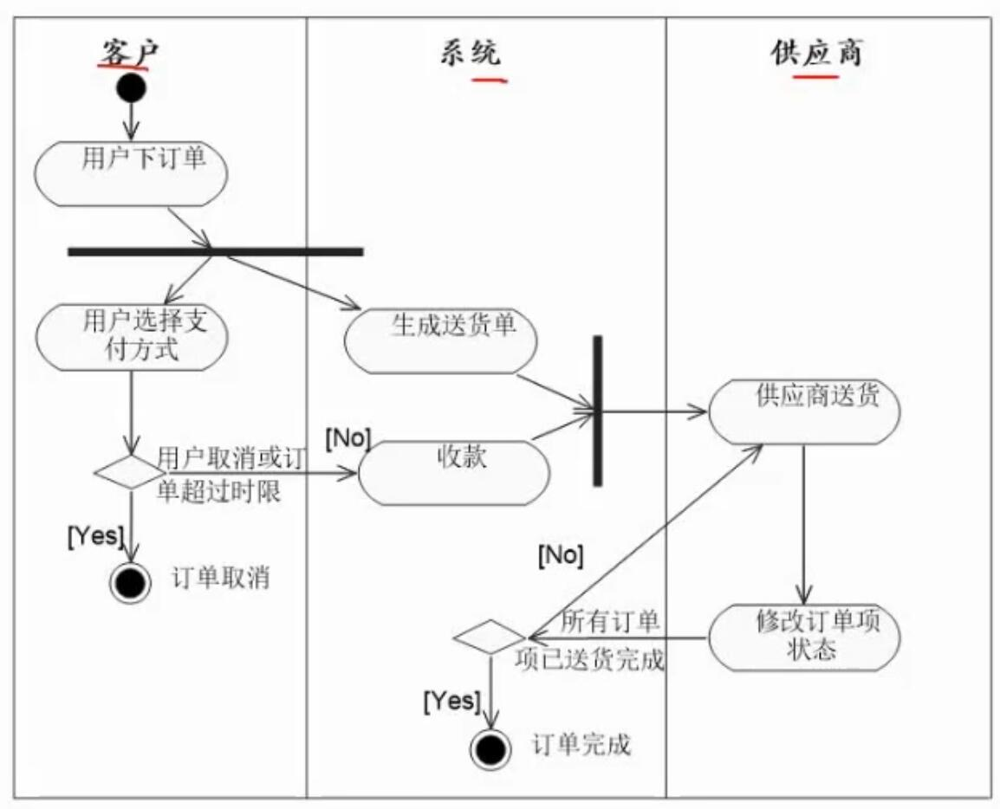
- 概念
	- 描述活动的顺序
	- 描述活动到其他活动之间的控制流
	- 类似流程图
- 常见要素
	- 分叉与汇合
		- 用长黑实现表示
		- 分叉后的活动可以并行执行
		- 汇合处的活动需全部完成后才能继续执行

### 1.5 状态图

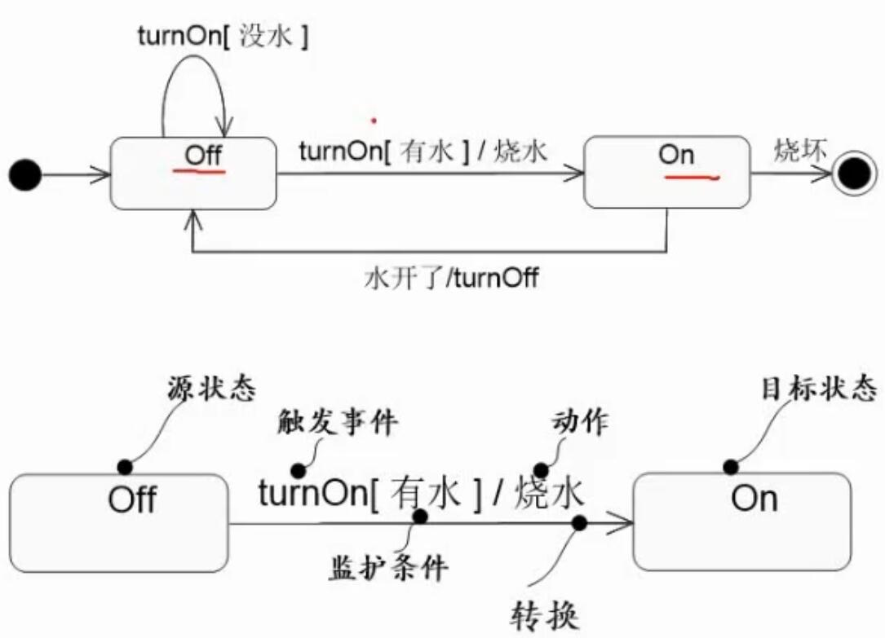
- 概念
	- 表现状态的变迁（动态）
- 技巧
	- 分析有哪些状态
	- 分析状态间转换的条件

### 1.6 通信图（协作图）

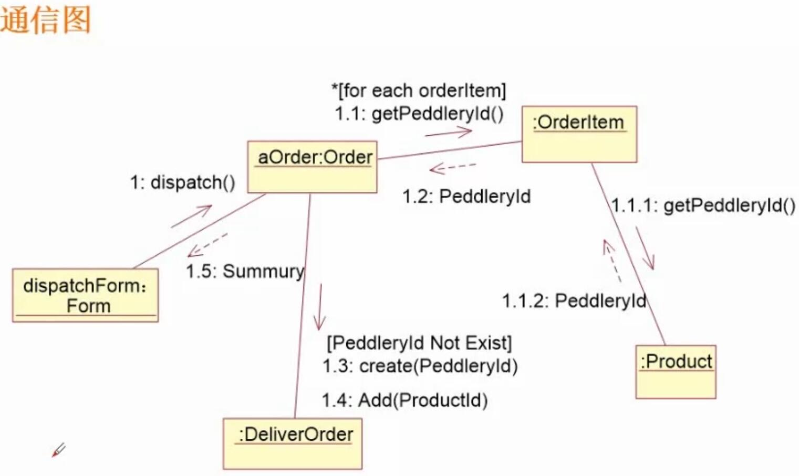
- 概念
	- 展现各对象间的调用关系及数据交换关系
	- 与顺序图类似，但是不强调时间顺序

## 2. 案例1

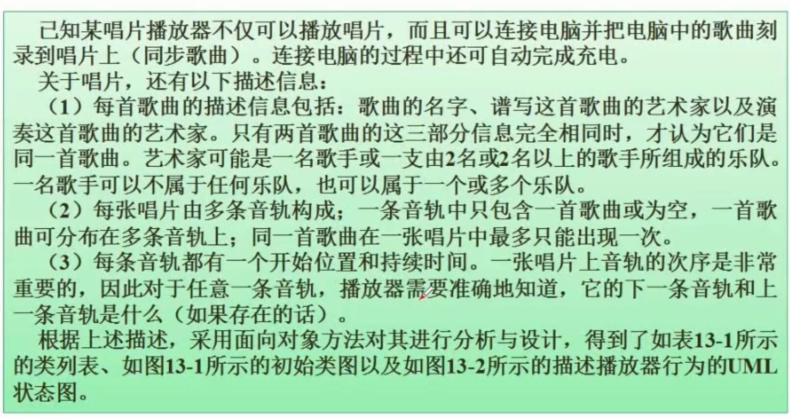

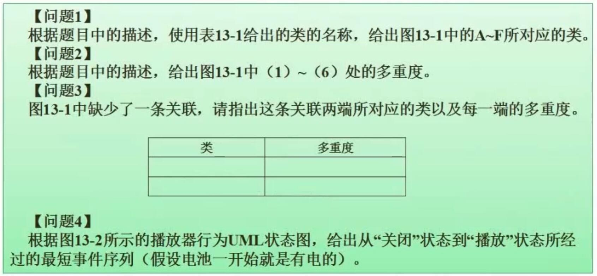
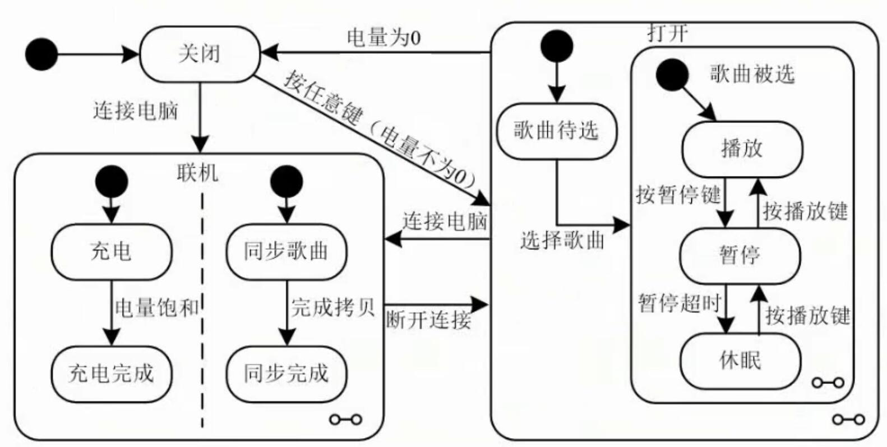
- 解题
	- 缺少的关联是音轨到音轨（上/下一曲），多重度是 0..1
	- 最短事件序列为：按任意键（电量不为0）- 选择歌曲
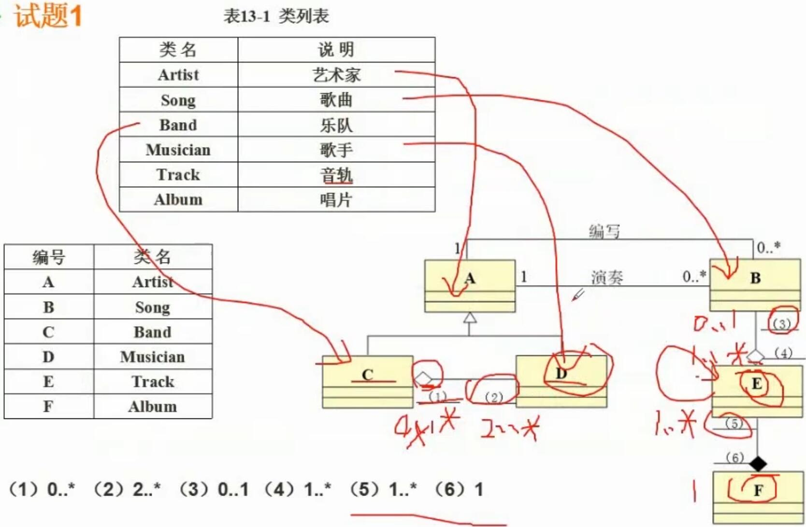

## 3. 案例2

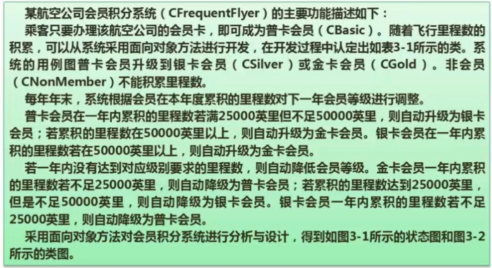
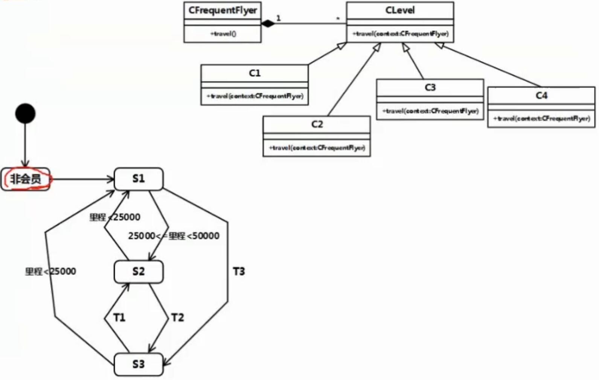
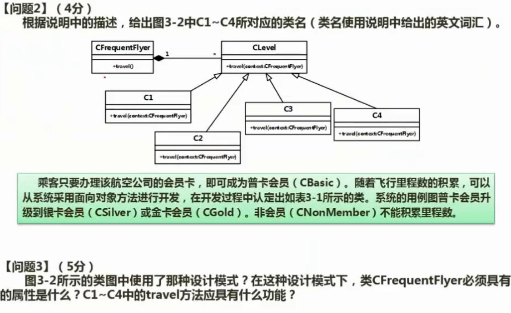
- 解题
	- 问题3
		- 使用了状态模式
		- CFrequentFlyer必须具有 CLevel 属性
		- travel需要具有计算里程的功能，用以根据里程来调整用户级别
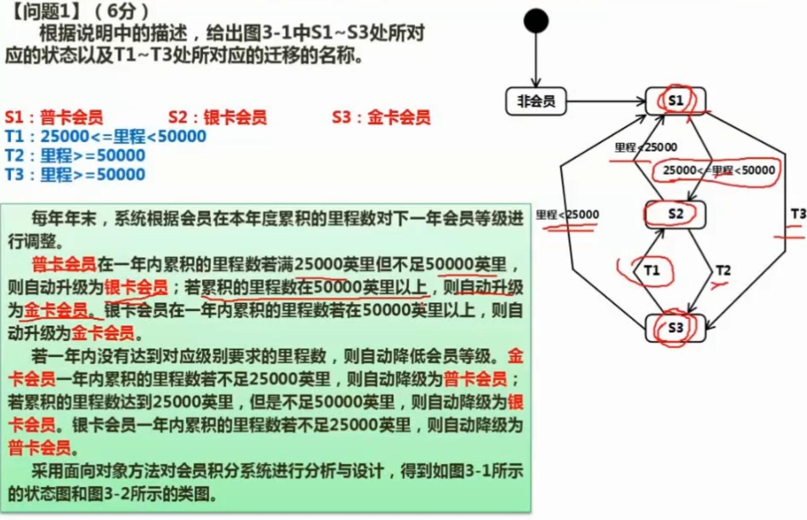
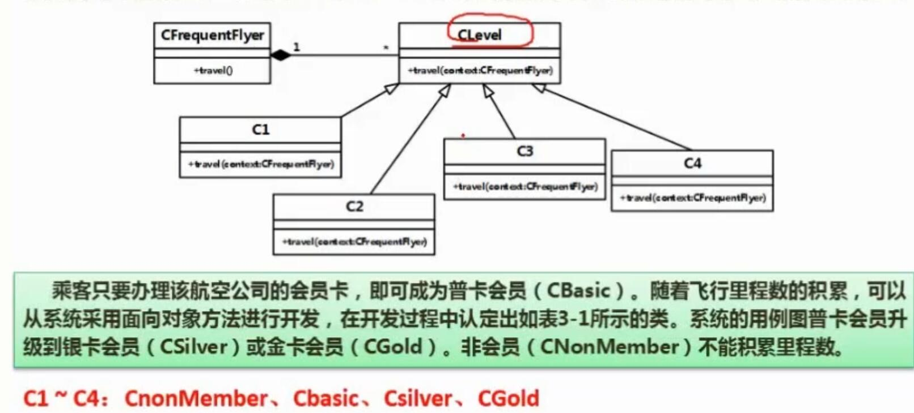
