# 十五、下午题-数据结构与算法应用*

## 1. 常用算法设计策略

### 1.1 分治法

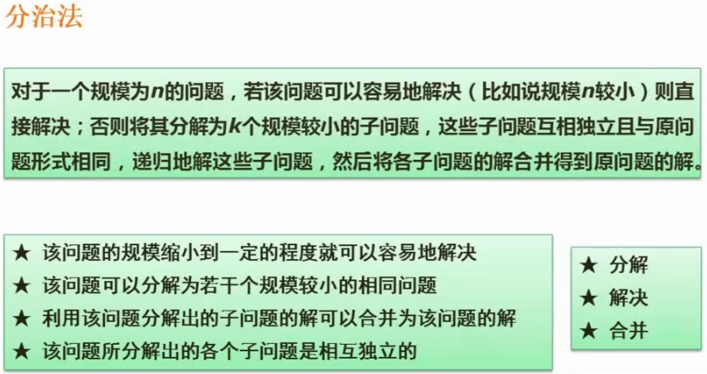
- 基本思想
	- 将大的问题分解成多个更容易解决的更小的问题，分解成的小问题要与原问题的结构相同。这样递归地处理，就能解决大的问题
- 实现要求
	- 大的问题可以分解成若干个较小的相同问题
	- 问题分解到一定程度就很容易解决（递归要有出口）
	- 分解出的小问题的解，要可以合并为大问题的解
	- 分解出的各个子问题是相互独立的
- 实现方法
	- 递归
- 递归式的编写
	- 一般用 $T(n)=$ 起始
	- 括号里写问题的规模
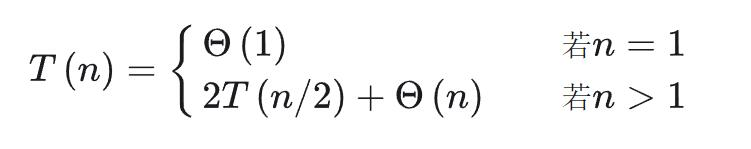
- 递归实例：求斐波那契数列位置n的值
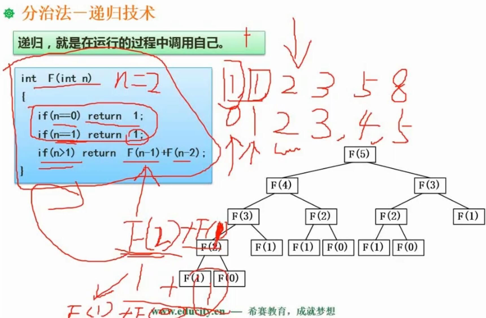
- 递归实例：二分查找
	- L：线性表
	- a：查找起始索引
	- b：查找末尾索引
	- x：要查找的值
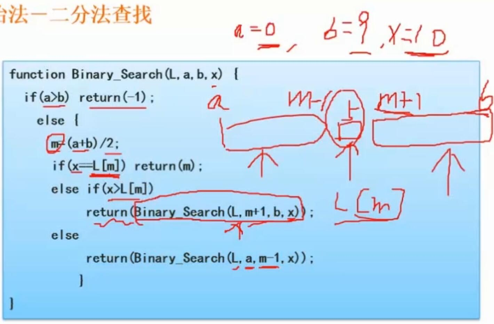

### 1.2 回溯法

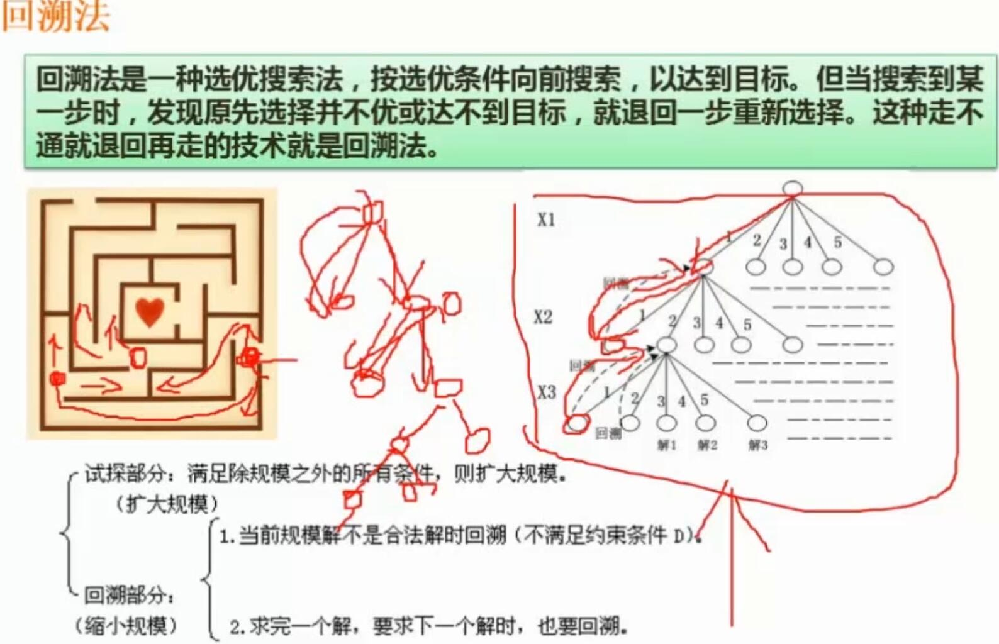
- 概念
	- 是一种选优搜索法
	- 向前搜索，以达到目标
	- 搜索到某一步时，若发现达不到目标，就退回一步重新选择
- 举例
	- 走迷宫

### 1.3 贪心法

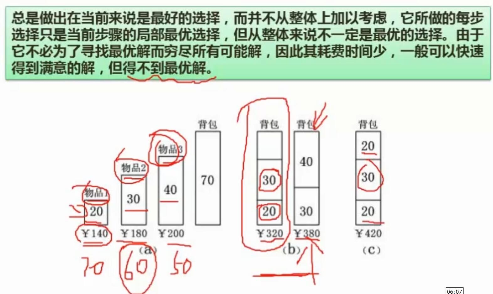
- 概念
	- 总是做出当前来说最好的选择
	- 并不从整体上加以考虑
	- 可以快速得到较为满意的解
	- 不一定能得到全局上的最优解
- 举例
	- 背包装高价值物品

### 1.4 动态规划法

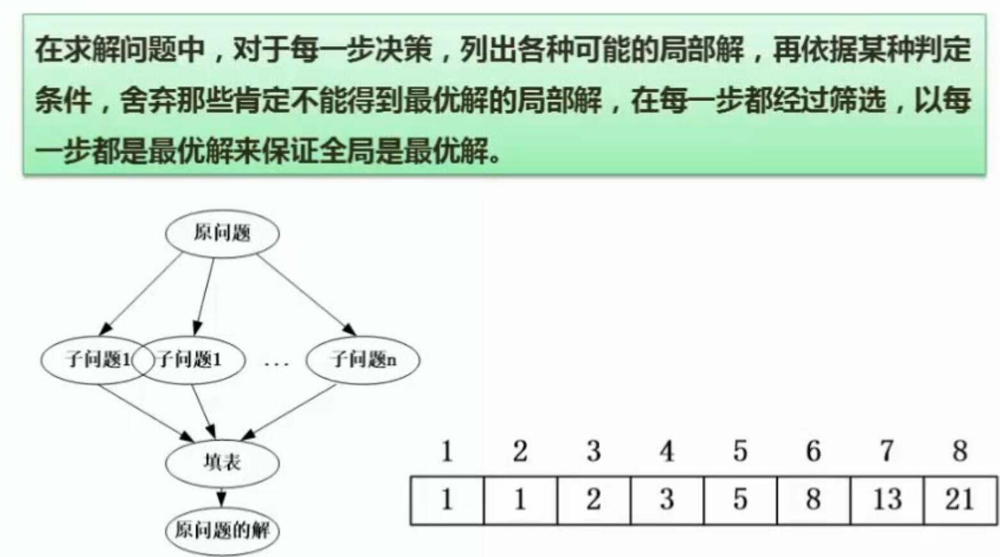
- 概念
	- 类似分治法，会将问题拆分成子问题
	- 会在局部列出子问题的各种解
	- 通过筛选（查表），得到原问题的解
- 举例
	- 斐波那契数列求n位置的值
		- 列出n位置附近的各个值
		- 直接查表得解

## 2. 案例1

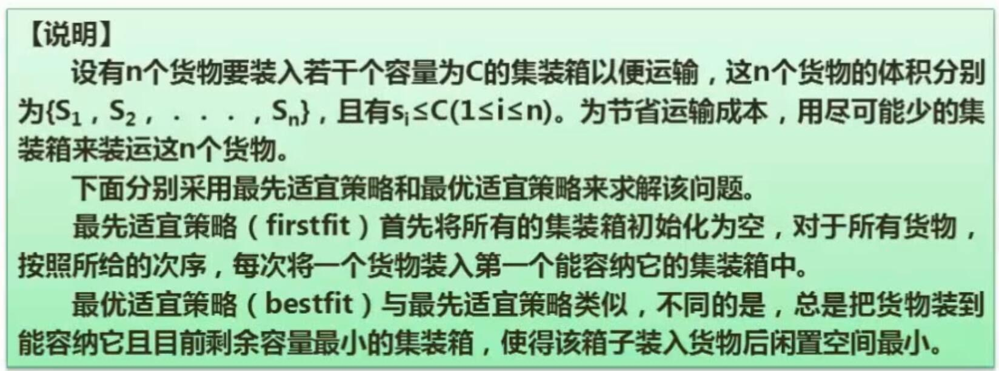
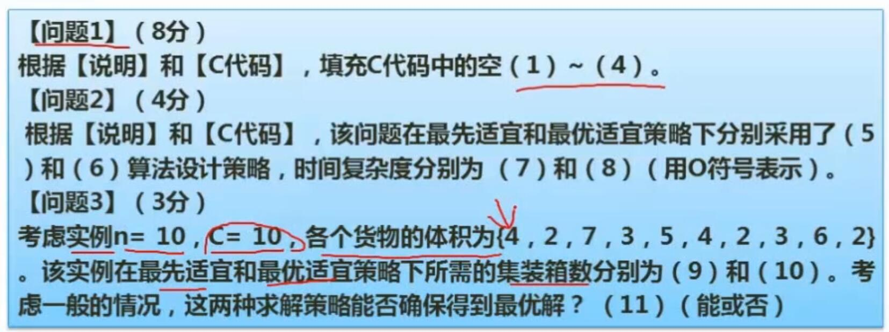
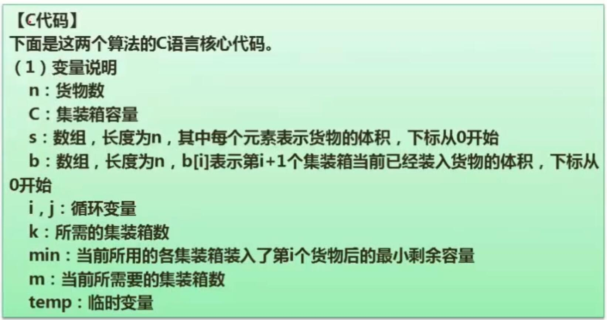
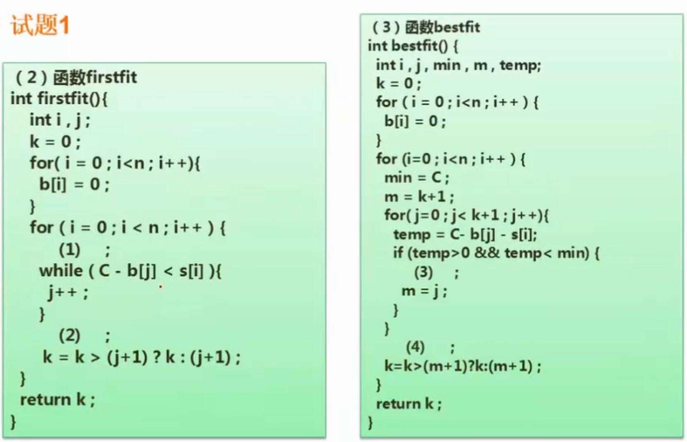
- 解题
	- 先看后面两题，可方便理解算法思路，再做程序填空题
	- 问题2：贪心法 贪心法 $O(n^2)$ $O(n^2)$
	- 问题3：均不一定能得到最优解
	- 问题3、问题1：见下图
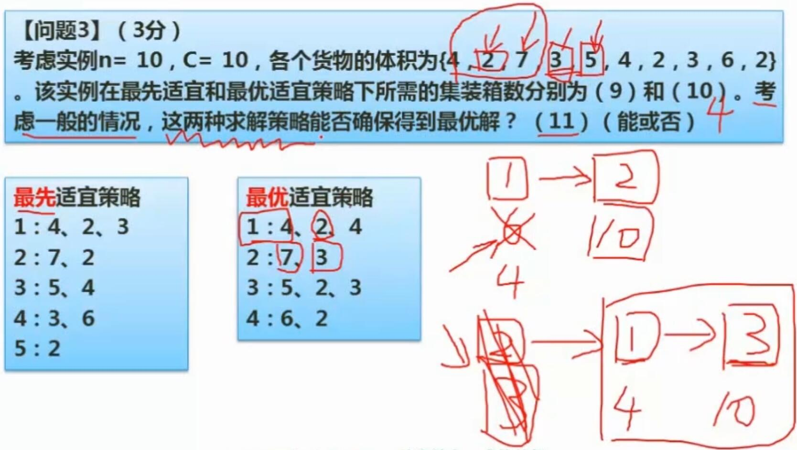
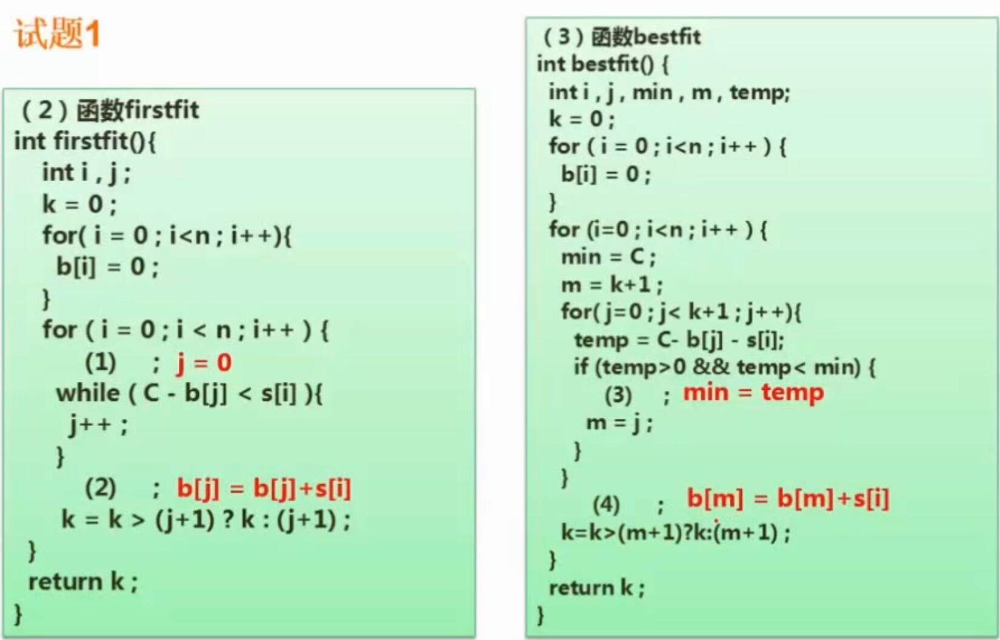

## 3. 案例2

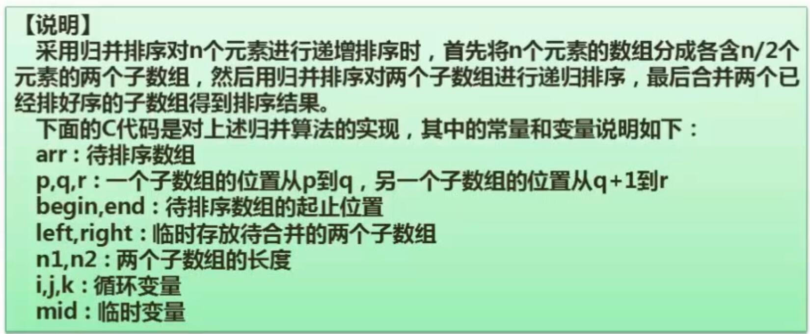
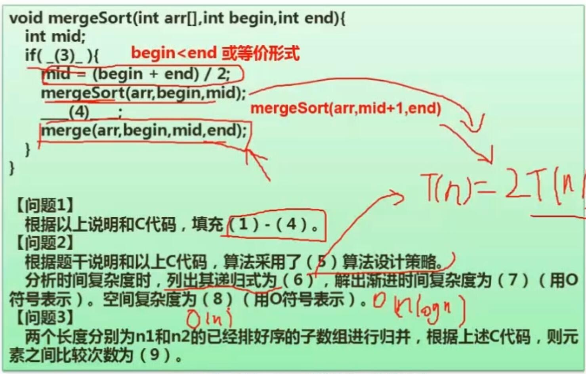
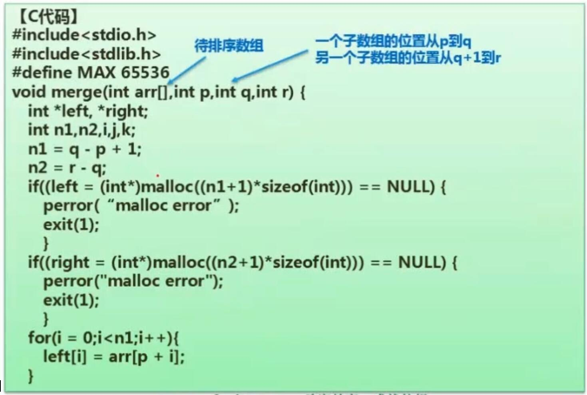
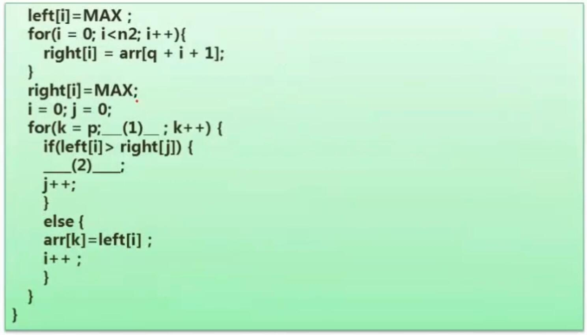
- 解题
	- 题目要将一个数组递归地分成均等的两部分，分别进行归并排序。因此4空处需要递归调用当前函数，归并排序数组右半部分
	- 3空：条件为：begin < end，即还可以继续分
	- 1空和2空：merge 函数的最后部分是在执行归并排序
		- 1：k <= r
		- 2：$arr[k]=right[j]$
	- 5空：采用了分治法
	- 6空：程序 mergeSort 中，将程序分为两个规模小一半的相同问题，外加一个 merge 函数。其中前者记为 $T(n)=2T(n/2)$，后者翻看代码可知，其复杂度为 $O(n)$ 。因此可写出该算法的递归式为：
		- $T(n)=2T(n/2)+O(n)$
	- 7空：根据以上递归式得
		- $O(nlog_n)$
	- 8空：空间复杂度即使用了多少个交换空间，mergeSort 函数中没有临时变量，因此看 merge 函数。merge 函数中分配了常数个普通变量（$O(1)$），以及总共大小为 n1 + n2 = n 的两个数组（$O(n)$），没有再分配其他临时变量。因此空间复杂度为：
		- $O(n)$
	- 9空：归并排序每次比较能得出一个元素的位置，因此比较次数为
		- n1 + n2