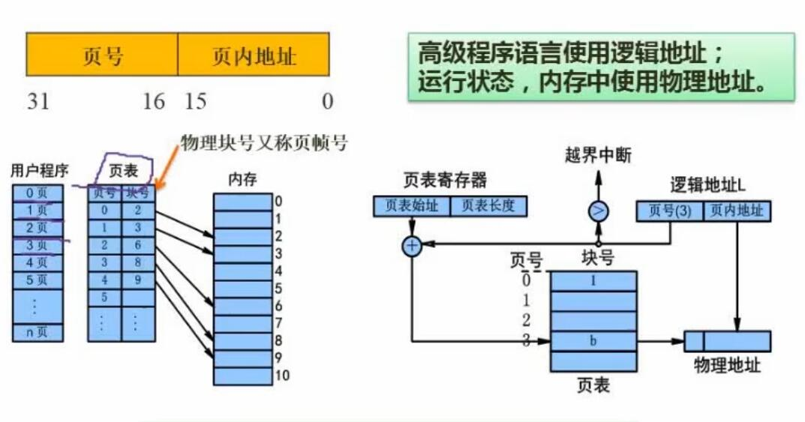
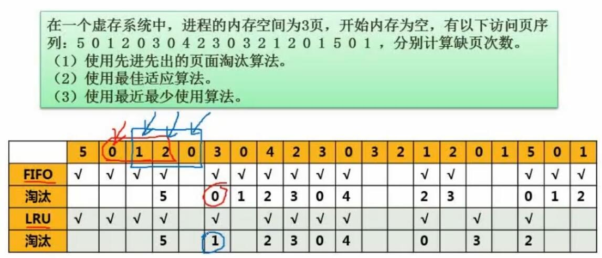

# 二、操作系统

## 1. 进程的状态转换

在经典进程 **等待-就绪-运行** 三态的基础上，加上进程的**挂起**，就成为了以上的五态模型。  
进程**挂起**后成为进程状态转换带挂起，需要**恢复或激活**才能成为**活跃态**。  
挂起的存在，是因为有些时候系统资源不够，需要把某些进程对换到磁盘区中，暂时不参与进程调度。  

## 2. 进程的同步与互斥

### 2.1 进程的同步

- 概念
	> 指控制多个进程之间的执行顺序，协调它们的行为，确保按照预定的流程执行任务。

### 2.2 进程的互斥

- 概念
	> 指在同一时刻，只有一个进程可以访问共享资源。
	
- 相关术语
	- 临界资源
		- 指各进程需要以互斥方式进行访问的**资源**
	- 临界区
		- 指进程中访问临界资源的**代码（操作）**
	

## 3. PV操作

### 3.1 概念

PV操作是荷兰人E．W．Dijkstra提出的一种实现**进程同步与互斥**的方法。  
该方法通过控制一个**信号量S**，协调多个进程对临界资源的占用及多个进程的执行顺序。  

- P(S)操作（获取信号量）：
	1. 将S自减1（S=S-1）
	2. 判断是否S<0。若S<0，说明当前进程不可继续，将当前进程阻塞并放入待执行的进程队列；若S>=0，则当前进程继续执行。
	- 简述：减到负数就阻塞
- V(S)操作（释放信号量）：
	1. 将S自加1（S=S+1）
	2. 判断是否S<=0。若S<=0，说明已可以释放资源，从进程队列中取出一个阻塞的进程并唤醒；若S>0，说明资源还不能释放，不做唤醒操作，当前进程继续执行。
	- 简述：每次都加，正数就不管，加完是0或负数说明有塞着的，那就唤醒

### 3.2 PV操作与实际问题

总结：
- 分析具体操作之间的逻辑关系，判断哪些地方需要等待，哪些地方需要释放
- 例如上题，收费之前收银员需要等待顾客前来付款（第一对PV）；付款后顾客需要等待收银员收费后放行（第二对PV）

### 3.3 PV操作与前趋图问题

总结：
- 一般一个操作之前会跟P操作（等待），之后会跟V操作（释放下一步的等待）
- 前面有多个操作的，操作前会需要有多个P操作；同理后跟多个操作的，操作后会需要有多个V操作

## 4. 进程的死锁

### 4.1 死锁概述

- 概述
	- 如果一个进程在等待一件不可能发生的事，就发生死锁了。
- 死锁发生的前提
	- 互斥
		- 各个进程需要互斥访问资源
	- 保持和等待
		- 进程保持当前控制的资源，并等待其他进程释放所需资源
	- 不剥夺
		- 系统不剥夺进程占有的资源
	- 环路等待
		- 多个进程之间环路等待释放所需资源，这些进程之间形成等待闭环
- 死锁的预防
	- 打破上述四大条件
	- 有序资源分配（银行家算法）

### 4.2 死锁与资源分配例题

总结：
- 至少有13个资源，就不会死锁
- **即至少要有 每个进程所需资源数-1 之和，再加1 个资源**
- 因为这样每个进程执行完都至少会剩余一个资源供其他进程使用，不会发生循环等待

### 4.3 银行家算法例题

银行家算法概述：  
保证系统进行动态资源分配后不进入不安全状态，不发生死锁。  

题目：

解题：

总结：
1. 计算分配资源后，还剩下的资源数，例如R1共有9个，已分配1+2+2+1+1=7个，即还剩2个。因此分别还剩2 1 0个
2. 计算各个进程的还需资源数。还需资源数就是 最大需求量-已分配资源数。得上图右侧表
3. 根据 还剩资源数 和各进程的还需资源数，判断可以从哪个进程开始执行。例题中只能从P2开始执行（已可以筛选出部分选项）
4. 计算P2（可以第一个执行的进程）执行完后释放的资源数（现有资源+已分配资源），得 4 2 1
5. 判断释放后的现有资源（4 2 1）满足哪条进程的还需资源（P4）（以此筛选选项）

## 5. 存储管理

### 5.1 常见存储适应算法

- 首次适应法
	- 依次查找，使用首先找到的可用存储空间
- 最佳适应法
	- 将可用空间按大小排序（10k-25k-28k），从最小的空间开始尝试能否使用
	- 缺点：可能产生小空间碎片
- 最差适应法
	- 与最佳适应法相反，从最大的空间开始尝试使用
	- 优点：不容易产生小空间碎片
- 循环首次适应法
	- 将可用空间串联，循环使用

### 5.2 页式存储

- 概念
	- 将各进程的虚拟空间划分为多个长度相等的页，内存空间也按页的大小划分为片/页面，然后把页式虚拟地址与内存地址建立一一对应的页表，使用相应的硬件地址转换机构来解决离散地址变换问题。
- 优点
	- 内存利用率高，碎片小，分配及管理简单
- 缺点
	- 增加了系统开销，可能产生抖动现象
- 页式存储结构
	
- 逻辑地址与物理地址
	
	- 均包含**页号**（前部）和**页内地址**（后部）
	- **页号**可以通过查**页表**转换
	- 两者的**页内地址相同**
	- 通过**页面大小**可以获知**页内地址的位数**，因为页内地址的每一个数值都可以对应页面中的一个地址
- 例题
	
- 例题总结
	- 要将逻辑地址5A29H转换为物理地址，需要先拆分获取页号和页内地址
	- 通过页大小来确定页内地址的位数，以此区分逻辑地址中的哪些位是页号，哪些位是页内地址。$4K=2^{12}$，说明逻辑地址的后12位是页内地址（A29），前4位是页号（5）
	- 使用页号（5）查表获取物理地址的页帧号（段号），得到6
	- 拼接页帧号6和页内地址A29，得到6A29H
	- 淘汰访问位为0的1号页

### 5.3 段式存储

- 概念
	- 与页式存储类似，使用分段的方式进行存储。但是段的长度可以不同，每个段是按照逻辑结构来划分的（例如各个不同的函数）。
	- 逻辑地址和物理地址与页式存储类似，有**段号**和**段内地址**
	- 段表包含**段号**、**段长**、**基址**，段长就是段的长度，基址是段在内存中开始的地址
- 段式存储结构
	
- 优点
	- 多道程序共享内存，各段程序修改影响不大（便于共享）
- 缺点
	- 内存利用率低，内存碎片浪费大

### 5.4 段页式存储与快表

- 段页式存储
	
	- 结合了段式存储和页式存储
	- 先分段，再分页
	- 优点
		- 空间浪费小，存储共享容易
		- 存储保护容易，能动态连接
	- 缺点
		- 复杂度和系统开销增加，执行速度下降
- 快表
	- 一块小容量的相联存储器
	- 由高速缓存区组成，速度快
	- 可以从硬件上保证按内容并行查找
	- 一般用来存放当前访问最频繁的少数活动页面的页号
	- 一般放在cache里
### 5.5 页面淘汰算法

- 常见算法
	- 先进先出算法（FIFO）
		- 淘汰进入时间最早的页
	- 最近最少使用算法（LRU）
		- 淘汰最近未被使用时间最长的页
- 例题
	
- 例题总结
	- 先按题目要求载入3页，所以前三次访问都缺页
	- 从第四次访问开始，查看内存空间加载的三页中有没有需要访问页，如果没有，按照算法淘汰相应页。例如第六列处访问3，内存中有0 1 2，按照先进先出算法要淘汰0；按照最近最少使用算法要淘汰1。依次计算
- 奇怪的练习题
	
- 练习题总结
	- 计算机按字节编址，指令为16位，A和B都为16位说明他们都占两个字节
	- 第1023单元是第1页的最后一个字节，而swap指令占2字节，所以swap指令跨了0和1号页。同理A和B也分别跨了2 3号页（3071-1023=2048）、4 5号页（5119-3071=2048）
	- 要访问内存，需要先在内存上查表获取内存地址，再读取相应的内存。因此访问每个块需要访问两次内存。共有6块需要访问，所以需要访问12此内存
	- 读取指令只会产生1次缺页中断，读取操作数则看操作数需要访问多少个页（2个）。因此产生5次缺页中断

## 6. 文件管理

### 6.1 索引文件结构

- 概述
	- 一种文件系统技术，通过索引节点来管理文件的物理存储
	- 索引节点通常包含多个直接索引，直接指向文件的物理盘块
	- 文件大小超过了直接索引能够指向的数据块的数量时，会使用间接索引，间接索引有一级、二级、三级等
- 例题
	
- 例题总结
	- 逻辑块号从0开始，0-4是直接索引，5是间接索引，便是addr[5]指向的一级间接索引表中的第一个。得到5对应的物理地址58
	- 索引块大小为1kb，每个地址项大小为4字节，说明一个索引块中有256个索引。逻辑块号5对应addr[5]间接索引的第1个索引，261-5=256，即逻辑索引261和5相差256个索引，正好一整个索引块。所以查表得知逻辑块号261对应addr[6]的第一个索引187
	- 101号物理块存放的是二级间接地址索引表，送分题

### 6.2 文件和树形目录结构

- 要点
	- 绝对路径写法
		- /D1/W2/F2
	- 相对路径写法
		- W2/F2

### 6.3 空闲存储空间管理-位示图法

- 常用方法
	- 空闲区表法（空闲文件目录）
		- 用一个表来记录哪些地方是空闲的
	- 空闲链表法
		- 把空闲区使用链表连接
	- 位示图法
		- 画一个位示图，1表示已占用，0表示空闲
	- 成组链接法
		- 成组，也成链
- 位示图法例题
	
- 例题总结
	- 每个字长为32位可以描述32个物理块
	- 4195号物理块，即为第4196个物理块，因为号数从0开始
	- 4196/32=131...4，说明4195号物理块落在位示图的第132个字中的第4个位进行描述占用情况，第4个位就是第3位置
	- 将该物理块分配给某文件，就是占用、
	- 选D和B