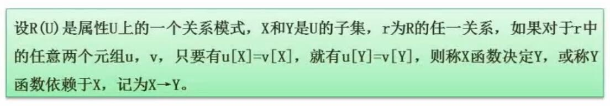

# 三、数据库系统

## 1. 数据库三级模式两级映射

- 内模式
	- 物理级数据库，对应内部视图，
	- 数据库物理层面的存储
- 概念模式
	- 概念级数据库，对应DBA视图
	- 数据库表
- 外模式
	- 用户级数据库，对应用户视图
	- 针对具体业务的视图，例如用户登录需要暴露包含密码的视图，用户信息查询则不需暴露包含密码的视图

## 2. 数据库设计过程

- 总结
	- 概念结构设计是与DBMS无关的，即ER模型
	- 概念结构模型转换为逻辑结构模型时，会考虑DBMS的特性，进行针对性的调整

## 3. E-R模型

- 概念
	- 即为实体关系模型，是一种概念数据模型。
- 画图规则
	- 用方框表示实体
	- 用圆圈表示属性
	- 用菱形表示联系
- 多个ER模型集成的方法
	- 多个ER模型图一次集成（有可能出现问题）
	- 逐步集成，用累加的方式一次集成两个局部E-R（比较耗时，但简单不容易出错）
- ER图集成常产生的问题
	- 属性冲突：属性域冲突和属性取值冲突
	- 命名冲突：同名异义和异名同义
	- 结构冲突：同一对象在不同应用中具有不同的抽象；同一实体在不同局部ER图中所包含的属性个数和属性排列次序不完全相同
- ER图转换为关系模式
	- 1：1联系、1：n联系，两个实体各转为一个关系模式即可
	- M : N多对多联系，至少要转成三个关系模式（两个实体各一个，其联系再加一个）
	- 三个以上实体间的一个多元联系，需要转为n+1个联系（其联系只占一个关系模式）
	

## 4. 关系代数

关系代数就是表示数据库两个结果集之间的某种操作。  
需要记住各种操作的符号，和效果。
- 原始集

- 并
	- 取并集（去重）
	
- 交
	- 取交集
	
- 差
	- 取差集（S1有但S2没有的）
	
- 笛卡尔积
	- 两两互相结合
	- 不去除重复的列
	- 结果数为原始条数的乘积
	
- 投影
	- 选择一部分列
	- 有时会用数字代表列，从1开始。比如1表示第一个列Sno，3表示第三个列Sdept
	
- 选择
	- 选择一部分行
	- 同样可能会用数字代表列，例如1=No0003就和下图中的意思相同
	- **有时会对笛卡尔积或连接操作的结果进行选择操作，此时务必注意编号与列的对应关系**
	
	
- 连接
	- 对符合条件的行进行连接
	- 重复的列会合并
	- 有时下方会带有条件
	- 不带有条件的，为自然连接。一般就是指对id列进行连接
	

## 5. 规范化理论

### 5.1 函数依赖

- 定义
	- 若某个属性集决定另一个属性集时，称另一属性集依赖于该属性集
	- 例如函数 $y=x^2$，x可以决定y，而y不能决定x。称x函数决定y，y函数依赖于x。
- 部分函数依赖与传递函数依赖
	
	- 传递函数依赖中的B不能回头去决定A

### 5.2 规范化理论的价值与用途

非规范化的关系模式，可能存在的问题包括：
- 数据冗余（如图，存在部分函数依赖）
- 更新异常（更新会需要更新很多值）
- 插入异常
- 删除异常

### 5.3 键

- 关键术语
	- 超键
		- 唯一标识元组（人为定义的用于标识关系的元组，可能有多余属性）
	- 候选键
		- 候选键可以函数决定关系中的一切
		- 由超键消除多余属性而来
		- 例如学号和身份证号，都可以决定“学生”的其他一切属性，都是候选键
	- 主键
		- 从所有候选键中任选一个，即得主键
	- 外键
		- 其他关系的主键
		- 一般用于表示与其他关系的关联
- **求候选键的方法**
	1. 将关系模式的函数依赖关系用“**有向图**”表示
	2. 找**入度为0的属性**（没有箭头指向的点），以该属性为起始点，尝试遍历整个有向图。若能完全遍历图中所有结点，则该属性就是该关系模式的候选键
	3. 若无入度为0的属性，则寻找图中**既有入度也有出度的结点**。将其加入入度为0的属性形成集合。其若能遍历所有结点，则形成的集合为候选键
- 候选键例题

- 例题总结
	- 根据给定关系中的结点和依赖关系，画有向图
	- 例1送分题，选A1
	- 类似例2中的ABD->E，不能画成分别指向E，要画成合并指向E
	- 例2的候选码为ABCD
	- 例3根据上述第三条，A和B都是候选码