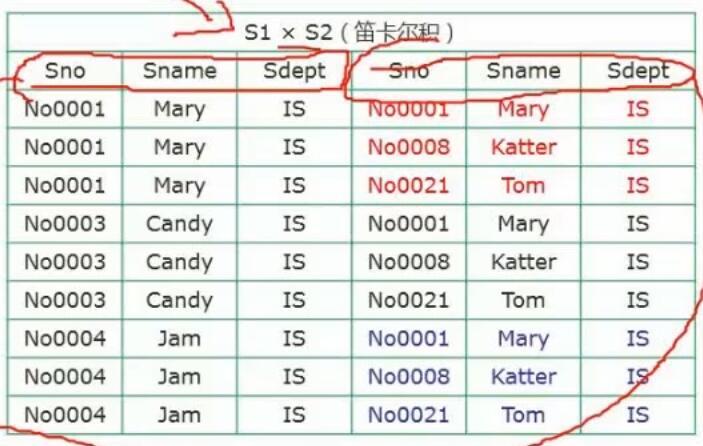
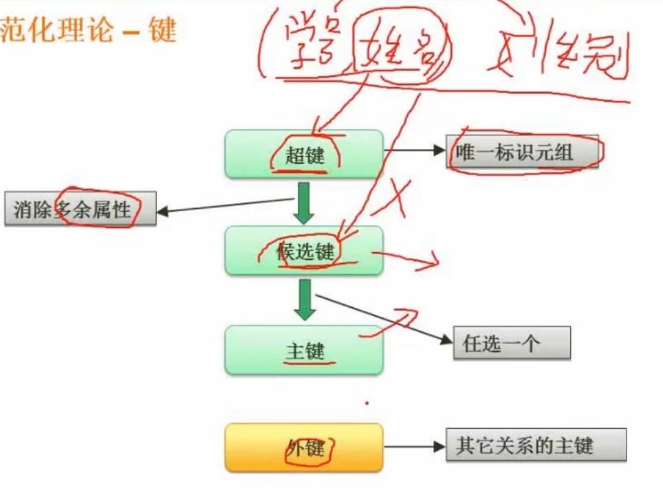
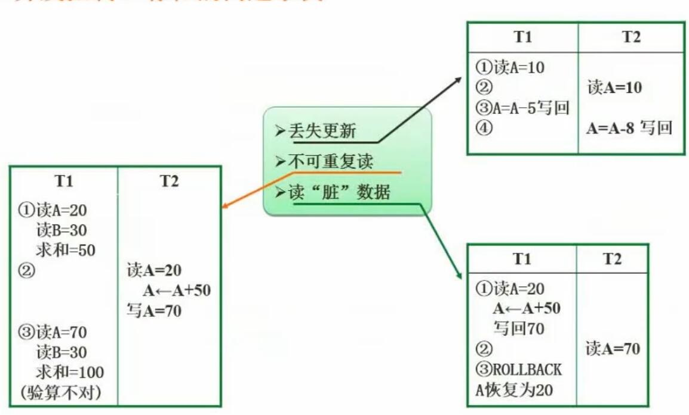
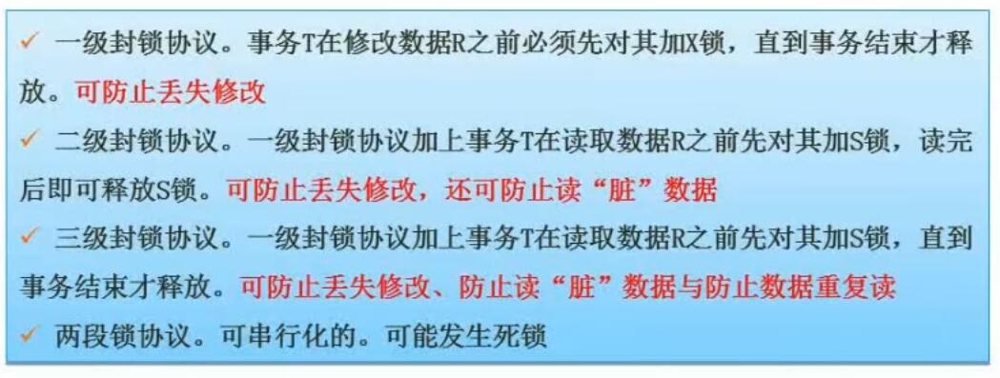

# 三、数据库系统

## 1. 数据库三级模式两级映射

- 内模式
	- 物理级数据库，对应内部视图，
	- 数据库物理层面的存储
- 概念模式
	- 概念级数据库，对应DBA视图
	- 数据库表
- 外模式
	- 用户级数据库，对应用户视图
	- 针对具体业务的视图，例如用户登录需要暴露包含密码的视图，用户信息查询则不需暴露包含密码的视图

## 2. 数据库设计过程

- 总结
	- 概念结构设计是与DBMS无关的，即ER模型
	- 概念结构模型转换为逻辑结构模型时，会考虑DBMS的特性，进行针对性的调整

## 3. E-R模型

- 概念
	- 即为实体关系模型，是一种概念数据模型。
- 画图规则
	- 用方框表示实体
	- 用圆圈表示属性
	- 用菱形表示联系
- 多个ER模型集成的方法
	- 多个ER模型图一次集成（有可能出现问题）
	- 逐步集成，用累加的方式一次集成两个局部E-R（比较耗时，但简单不容易出错）
- ER图集成常产生的问题
	- 属性冲突：属性域冲突和属性取值冲突
	- 命名冲突：同名异义和异名同义
	- 结构冲突：同一对象在不同应用中具有不同的抽象；同一实体在不同局部ER图中所包含的属性个数和属性排列次序不完全相同
- ER图转换为关系模式
	- 1：1联系、1：n联系，两个实体各转为一个关系模式即可
	- M : N多对多联系，至少要转成三个关系模式（两个实体各一个，其联系再加一个）
	- 三个以上实体间的一个多元联系，需要转为n+1个联系（其联系只占一个关系模式）
	

## 4. 关系代数

关系代数就是表示数据库两个结果集之间的某种操作。  
需要记住各种操作的符号，和效果。
- 原始集

- 并
	- 取并集（去重）
	
- 交
	- 取交集
	
- 差
	- 取差集（S1有但S2没有的）
	
- 笛卡尔积
	- 两两互相结合
	- 不去除重复的列
	- 结果数为原始条数的乘积
	
- 投影
	- 选择一部分列
	- 有时会用数字代表列，从1开始。比如1表示第一个列Sno，3表示第三个列Sdept
	
- 选择
	- 选择一部分行
	- 同样可能会用数字代表列，例如1=No0003就和下图中的意思相同
	- **有时会对笛卡尔积或连接操作的结果进行选择操作，此时务必注意编号与列的对应关系**
	
	
- 连接
	- 对符合条件的行进行连接
	- 重复的列会合并
	- 有时下方会带有条件
	- 不带有条件的，为自然连接。一般就是指对id列进行连接
	

## 5. 规范化理论

### 5.1 函数依赖

- 定义
	- 若某个属性集决定另一个属性集时，称另一属性集依赖于该属性集
	- 例如函数 $y=x^2$，x可以决定y，而y不能决定x。称x函数决定y，y函数依赖于x。
- 部分函数依赖与传递函数依赖
	
	- 传递函数依赖中的B不能回头去决定A

### 5.2 规范化理论的价值与用途

非规范化的关系模式，可能存在的问题包括：
- 数据冗余（如图，存在部分函数依赖）
- 更新异常（更新会需要更新很多值）
- 插入异常
- 删除异常

### 5.3 键

- 关键术语
	- 超键
		- 唯一标识元组（人为定义的用于标识关系的元组，可能有多余属性）
	- 候选键
		- 候选键可以函数决定关系中的一切
		- 由超键消除多余属性而来
		- 例如学号和身份证号，都可以决定“学生”的其他一切属性，都是候选键
	- 主键
		- 从所有候选键中任选一个，即得主键
	- 外键
		- 其他关系的主键
		- 一般用于表示与其他关系的关联
- **求候选键的方法**
	1. 将关系模式的函数依赖关系用“**有向图**”表示
	2. 找**入度为0的属性**（没有箭头指向的点），以该属性为起始点，尝试遍历整个有向图。若能完全遍历图中所有结点，则该属性就是该关系模式的候选键
	3. 若无入度为0的属性，则寻找图中**既有入度也有出度的结点**。将其加入入度为0的属性形成集合。其若能遍历所有结点，则形成的集合为候选键
- 候选键例题

- 例题总结
	- 根据给定关系中的结点和依赖关系，画有向图
	- 例1送分题，选A1
	- 类似例2中的ABD->E，不能画成分别指向E，要画成合并指向E
	- 例2的候选码为ABCD
	- 例3根据上述第三条，A和B都是候选码

## 6. 范式

- 范式说明
	1. 1NF：**属性值都是不可分的原子值**
		- 即一个属性不能拆分成多个属性
	
	2. 2NF：**达成1NF，且消除非主属性对候选键的部分依赖**
		- 即，有些属性只依赖于主键中的一部分。例如某个属性只依赖联合主键的其中一个键
		- 例如以下：学号SNO和课程号CNO能决定分数GRADE，但学分CREDIT只要课程号CNO就能决定了
		- **数据冗余**
		- **更新异常**：要更新就得更新全量，否则就会出问题
		- **插入异常**：比如要插入一个新课程但没学生选，就没法插入
		- **删除异常**：一不小心就把一门课的学分信息删没了
		- 解决方法：把课程号CNO和学分CREDIT提取出来组成新的关系
	
	3. 3NF：**达成1NF、2NF，且消除非主属性对候选键的传递依赖**
		- 非主属性院系号DNO函数依赖于学生号SNO，系名DNAME和系地址LOCATION又函数依赖于DNO
		- 解决方案也是提取出新的关系
	
	4.  BCNF：对于关系模式R（S,T,J），F是它的依赖集（SJ -> T，T -> J），依赖集F中的每个决定因素（箭头左边的）必定包含关系R的某个候选码
		- 如何判断：
			- 首先判断是否属于3NF
			- 求出R中所有候选码
			- 判断依赖集：是否其中的每个依赖关系，其箭头左边的内容都是候选码中的一个
		- 举例总结：
			- 把候选键列出来，其中任何一个出现过的属性，都是主属性。候选关键字为SJ和ST，所以没有非主属性，所以符合3NF
			- 依赖集箭头左边的内容是SJ和T。其中T不是候选键，所以不符合BCNF
	
- 范式例题

- 例题总结
	- 有时候题目不严谨，只需要判断各个选项，选出相对最正确的即可（例如空1就**不严谨**）
	- 不属于第三范式可能的原因有：不满足1NF或2NF。显然满足1NF，按照描述使用部门号作主属性的话也满足2NF（只有一个主键），所以只能是存在传递依赖。故空1选C
	- 表4看出需要把职工和部门（以获取部门名），以及商品（以获取单价计算销售额）建立联系。
	- 部门和职工是一对多的关系，其关联可以存储在“多”的那一侧
	- 商品和职工是多对多的关系，其关联需要新建关系
	- 故空2选D，空3选A

## 7. 模式分解（疑惑）

- 保持函数依赖分解

- 保持函数依赖分解总结：
	- 分解前的依赖关系，与分解后的依赖关系，若能互相蕴含（互相推导），即称分解保持了函数依赖
	- 例如原函数依赖为 A->B，B->C，隐含了A->C。若分解为R1（A,B）和R2（B,C），则是保持了函数依赖
- 无损分解与有损分解
	- 定义
		- 有损：不能还原
		- 无损：可以还原
	- 判断能否还原的方法
		- 自行思考
		- 表格法（按图画表，若有一行能全部替换为a，则表示可以还原）
		
		- 求交集和差集法（只分解为两个关系时有效）（疑惑）
		

## 8. 并发控制

### 8.1 事务的隔离级别

- 原子性
	- 事务中各个操作不可分割
- 一致性
	- 事务前后，数据一致不出错
- 隔离性
	- 各个事务相互隔离，互不影响
- 持续性
	- 事务完成后产生的影响持续有效

### 8.2 并发产生的问题

- 丢失更新
	- 事务**回滚**时丢失其他事务的提交
	- 事务**提交**时丢失其他事务的提交
- 不可重复读
	- 同一个事务中两次读取到不同的数据
- 读脏数据
	- 读取到其他事务未提交的数据

### 8.3 封锁协议

- 两种锁
	- S锁：共享读锁，可以多个S锁同时加上，S锁释放前阻止X锁
	- X锁：独占写锁，释放前阻止其他S锁和X锁
- 一级封锁协议
	- 官方说明：事务T在修改数据之前加X锁，事务结束时释放
	- 备注：其实是整个事务开始时加X锁
	- 效果：可防止丢失修改
- 二级封锁协议
	- 官方说明：在一级封锁协议之上，读取数据之前先对其加S锁，**读完后释放S锁**
	- 备注：有的事务写，有的事务读。读的事务读之前加S锁，就可以阻止期间其他事务进来写。但是事务中两次读的间隙被其他事务写入了，就会发生不可重复读
	- 效果：可防止丢失修改、读脏数据
- 三级封锁协议
	- 官方说明：在一级封锁协议之上，读取数据之前先对其加S锁，**直到事务结束才释放S锁**
	- 备注：这样读取的事务结束前，写入的事务就会一直等待
	- 效果：可防止丢失修改、读脏数据、不可重复读
- 两段锁协议
	- 官方说明：可串行化的，可能发生死锁

## 9. 数据库完整性约束

- **实体完整性约束**
	- 主键不能重复，不能为空
- **参照完整性约束**
	- 例如外键的值只能为目标表中的主键的值
- **用户自定义完整性约束**
	- 可以自定义规定字段的数值范围
- 完整性约束的作用
	- 提高数据的可靠性
- 其他
	- 复杂情况可以使用触发器来约束数据

## 10. 数据库安全

安全控制总结：
- 用户标识和鉴定
	- 使用账密等手段约束用户登录
- 存取控制
	- 对用户进行不同授权，可控制的有操作类型（查找、插入、删除、修改等）和数据对象范围等
- 密码存储和传输
	- 看不懂
- 视图的保护
	- 对不同用户授权不同的视图
- 审计
	- 用专用文件或数据库记录用户的操作

## 11. 数据备份、故障与恢复

### 11.1 冷备份与热备份

- 冷备份
	- 定义
		- 数据库停止状态下将数据库文件全部备份
	- 优点
		- 备份快速，容易归档
		- 容易做“最佳状态”恢复
		- 低度维护，高度安全
	- 缺点
		- 只能恢复到某一时间点上
		- 备份中数据库不能做其他工作
		- 速度慢
		- 不能按表或用户恢复
- 热备份
	- 定义
		- 利用备份软件，在数据库正常运行状态下，备份数据库中的文件
	- 优点
		- 可表级、数据库文件级备份
		- 备份时间短
		- 备份时数据库仍可用
		- 可恢复到某一时间点上，达到秒级
		- 恢复快速
	- 缺点
		- 不能出错，否则后果严重
		- 备份不成功的结果不可用于时间点恢复
		- 难于维护

### 11.2 增量与差量备份

- 完全备份
	- 备份所有数据
- **增量备份**
	- 备份上一次备份（任何一种备份）之后变化的数据
- **差量备份**
	- 备份上一次完全备份之后变化的所有数据
- 数据库日志文件
	- 记录针对数据库的任何操作，将记录结果保存在独立文件中

### 11.3 数据库故障与恢复

总结：
- 事务本身可预期故障
	- 程序中根据可预期的错误设置rollback
- 事务本身不可预期故障
	- 原因是未预见到运行过程中发生算数溢出等
	- 由dbms恢复子系统操作，通过日志撤销相关修改
- 系统故障
	- 使用检查点法（？）
- 介质故障
	- 使用日志重做业务（？）

## 12. 数据仓库与数据挖掘

### 12.1 数据仓库

- 定义
	- 数据仓库就是历史数据的归档。其不像应用数据库需要很高的增删改查性能。
- 特性
	- 面向主题
		- 面向具体关注领域
	- 集成的
		- 记录集成的数据，例如各种报表
	- 相对稳定性（非易失的）
		- 不再增删改
	- 反映历史变化（随着时间变化）
		- 会周期性导入新数据
- 加入数据仓库的过程
	- 抽取、清理、装载、刷新

### 12.2 数据挖掘

总结：
- 看看就行

## 13. 反规范化

- 规范化的缺点
	- 表被不断拆分，数据表过多
	- 增加了查询工作量
	- 查询时连接次数多，系统效率大大下降
- 反规范化原理
	- 牺牲空间换时间
- 反范式化常用手段
	- 增加冗余列
	- 重新组表
	- 分割表

## 14. 大数据

总结：
- 看看就行