# 四、计算机网络

## 1. OSI/RM七层模型

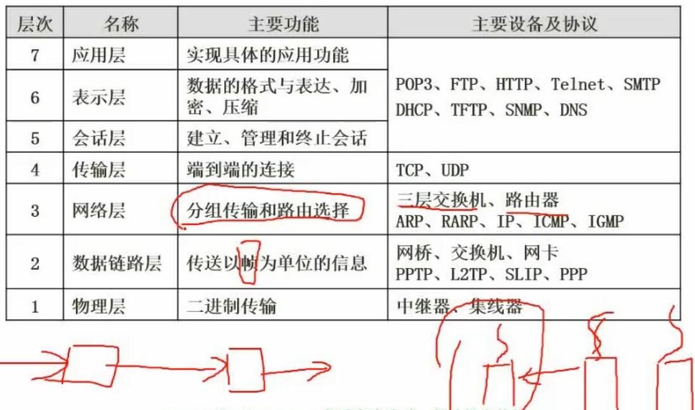
1. 应用层
	- 功能
		- 实现具体的应用功能
2. 表示层
	- 功能
		- 数据的格式与表达、加密、压缩
3. 会话层
	- 功能
		- 建立、管理和终止会话
4. 传输层
	- 功能
		- 端到端的连接
5. 网络层
	- 功能
		- 分组传输和路由选择
	- 主要设备
		- 三层交换机
		- 路由器
	- 特点
		- IP全局广播无法通过此层的设备
6. 数据链路层
	- 功能
		- 传送以帧为单位的信息
	- 主要设备
		- 网桥（连接两个同类型网络）
		- 交换机（多端口网桥，可以连接多个设备）
		- 网卡
7. 物理层
	- 功能
		- 二进制传输
	- 主要设备
		- 中继器（应对信号衰减）
		- 集线器（多线路的中继器）

例题
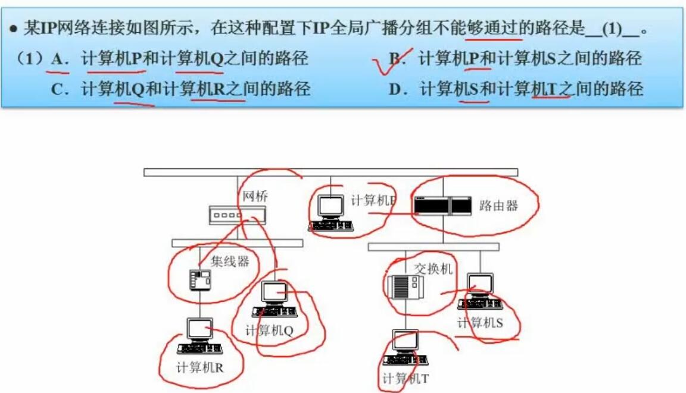
- 总结
	- 四个选项一个一个看
	- 同一个局域网下IP全局广播才能通过
	- 跨越3网络层IP全局网络就不能通过了
	- 网桥、交换机是2层数据链路层设备
	- 集线器是1层物理层设备
	- 路由器是3层网络层设备。选B

## 2.  网络技术标准与协议

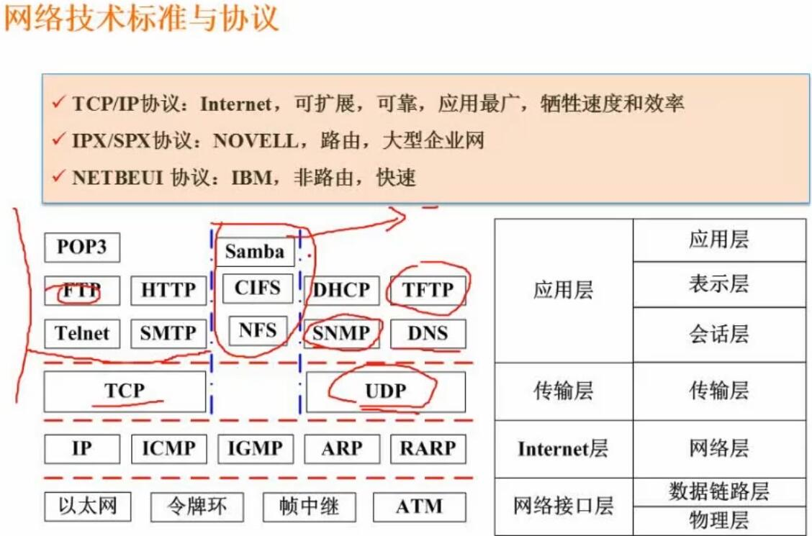

### 2.1 部分协议说明

- TCP/IP协议
	- Internet，可扩展，可靠，应用最广，牺牲速度和效率
- IPX/SPX协议
	- NOVELL，路由，大型企业网（？）
- NETBEUI协议
	- IBM，非路由，快速
- SNTP
	- 简单网络管理
- TFTP
	- 和FTP区别，不可靠的FTP
- Samba、CIFS、NFS
	- 既可以用TCP，也可以用UDP实现
	- 文件共享协议

### 2.2 DHCP协议

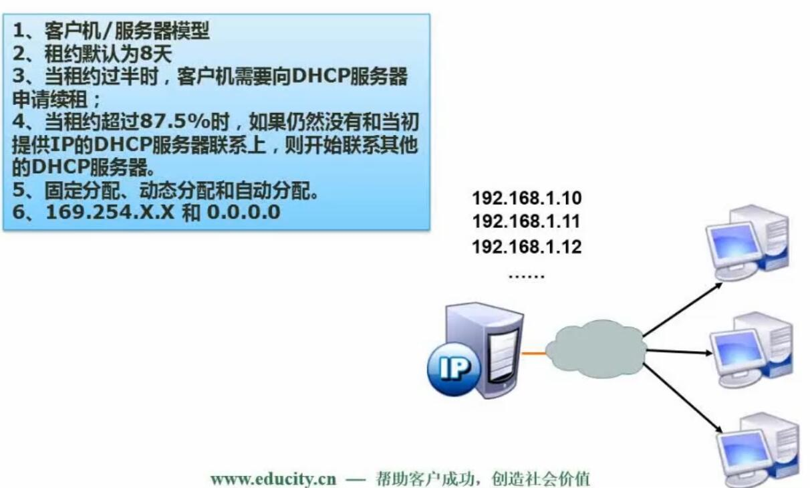
- 总结
	- DHCP协议是做IP地址动态分配的
	- 169.254.X.X（windows）和0.0.0.0（linux）是假地址，说明没有连上DHCP服务器
	- 其他看图

### 2.3 DNS协议

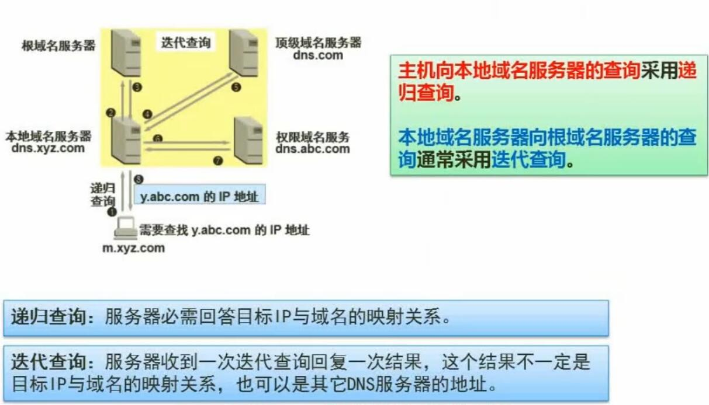
- 递归查询
	- 服务器必须回答结果（IP与域名的映射关系）
	- 刨根究底，找到答案，返回结果
	- 负担重，效率低，根域名服务器很少采用
- 迭代查询
	- 服务器收到一次迭代查询回复一次结果，可以不直接回答映射关系结果，可以回答其他DNS服务器地址
	- 提供线索
- 例题
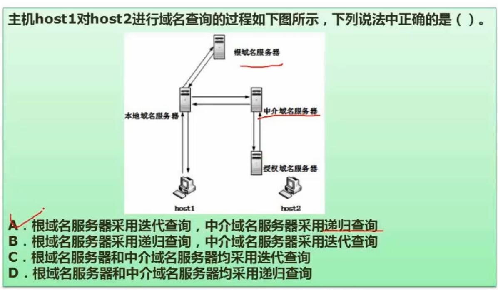
- 例题总结
	- 看哪个刨根究底了，哪个直接返回了就行

## 3. 计算机网络的分类

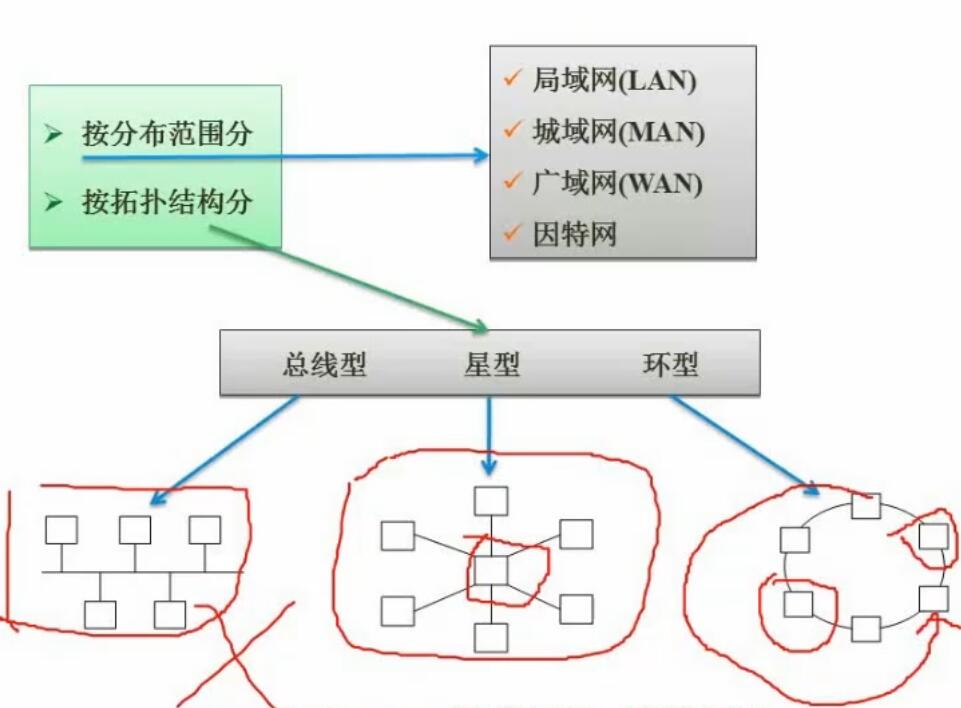

- 按分布范围分
	- 局域网（LAN）
	- 城域网（MAN）
	- 广域网（WAN）
	- 因特网
- 按拓扑结构
	- 总线型
	- 星型
		- 由中间节点连接其他节点
		- 存在单点故障的问题
	- 环型
		- 可靠性有优势

## 4. 网络规划与设计

### 4.1 网络规划与设计

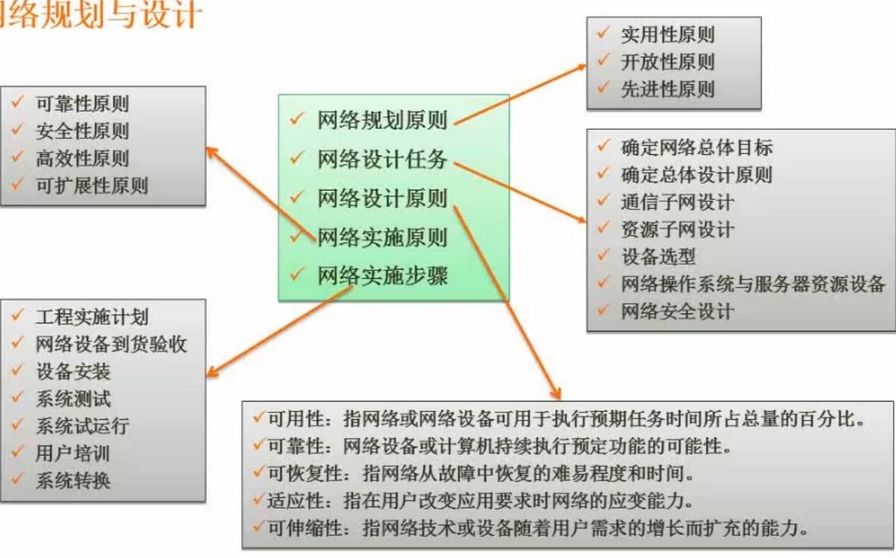
总结：
- 看看就行

### 4.2 逻辑网络设计

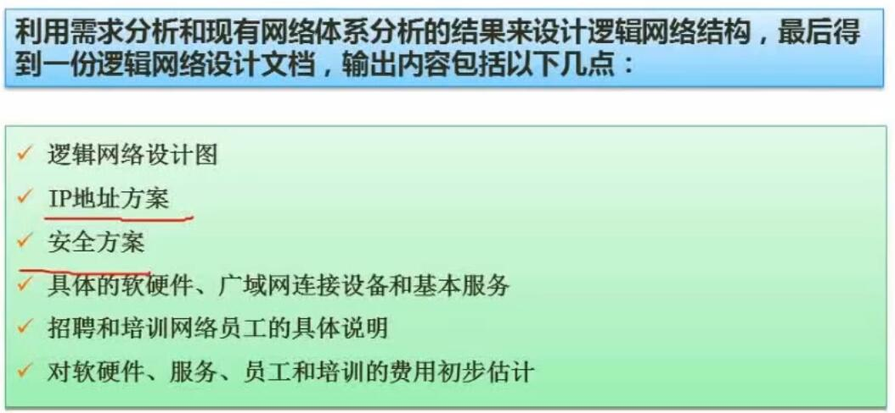
总结：
- 看看就行

### 4.3 物理网络设计

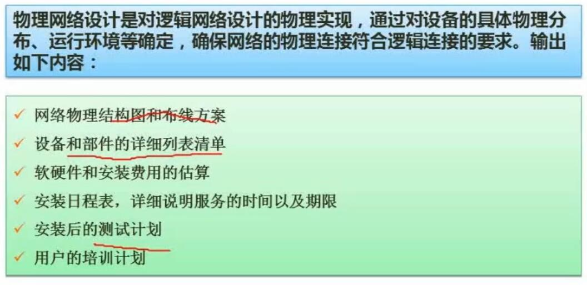
总结：
- 看看就行

### 4.4 分层设计

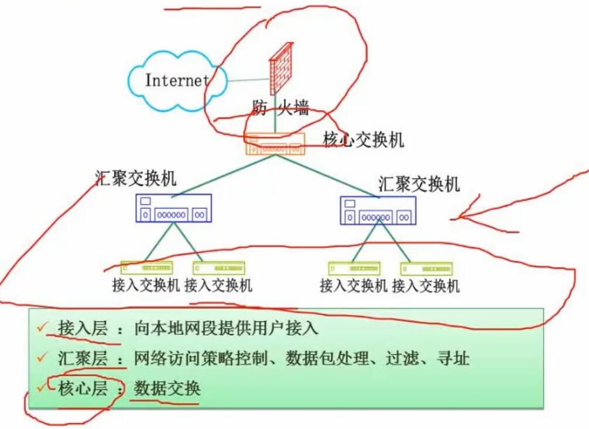
总结：
- 会考到，重点关注

## 5. IP地址

### 5.1 IP地址分类

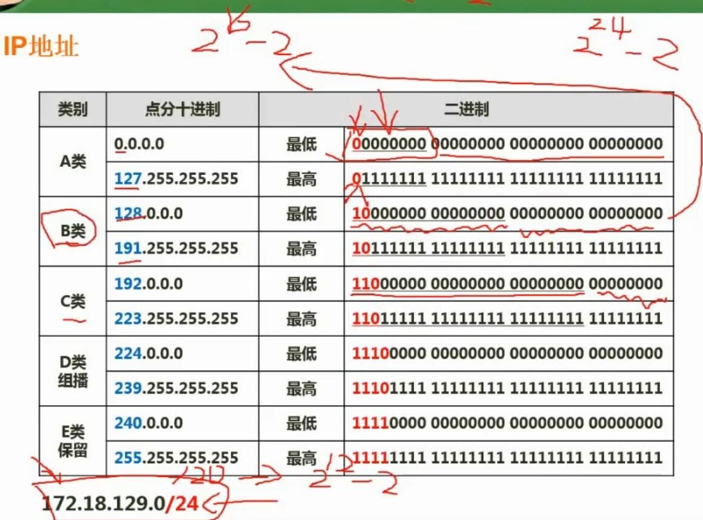
- 共通特性
	- 主机号全0，一般表示网络地址（该网络的地址）
	- 主机号全1，一般表示广播地址
	- 因此计算网络中可容纳的主机数时，需要减2
- A类地址
	- 前8个位是网络号，后24个位是主机号
	- 首位为0，所以第一段的范围为0-127
	- 同一个网络，可容纳 $2^{24}-2$ 个主机
- B类地址
	- 前16个位时网络号，后16个位是主机号
	- 前两位为10，第一段的范围为128-191
	- 同一个网络，可容纳 $2^{16}-2$ 个主机
- C类地址
	- 前24个位时网络号，后8个位是主机号
	- 前两位为110，第一段的范围为192-223
	- 同一个网络，可容纳 $2^{24}-2$ 个主机
- 无分类地址
	- 网络地址后面会跟斜杠加上一个数字（网络号范围）
	- 例如172.18.129.0/20，指前20位是网络号，后12位是主机号

### 5.2 子网划分

- 子网掩码
	- 概念
		- 用来标明一个IP地址哪些位是主机所在子网（网络号），哪些位是主机号
		- 化为二进制后，为1的部分是网络号，为0的部分是主机号
		- 必须和IP地址一起使用
		- 例如ip地址192.168.2.34 和子网掩码 255.255.255.0，标识网络号是192.168.2.0，后8位是主机号
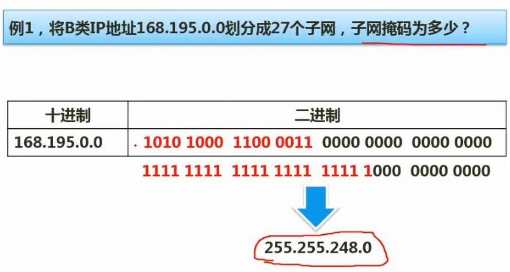
- 例题1：划分子网（部分主机号划为网络号）
	- 例题1总结
		- B类地址，即后16位为主机号。要划分多个子网，说明需要在主机号的左边拿出几位来做子网号
		- $2^4 < 27 < 2^5$，$2^5$ 就是5个1，因此主机号左边要划5位数作为子网号
		- 将得到的结果化为十进制，即得子网掩码
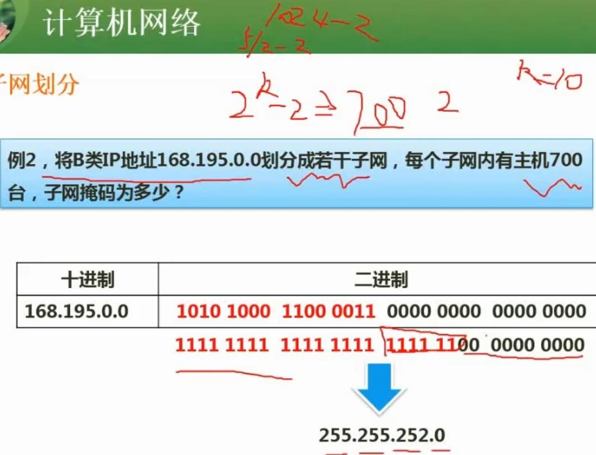
- 例题2：划分子网2
	- 例题2总结
		- $2^{10} > 700 - 2 > 2^9$，因此存储700个主机号需要右边有10位的主机号
		- 700 - 2 是因为最低位和最高位一般不用
		- 将得到的结果化为十进制，即得子网掩码
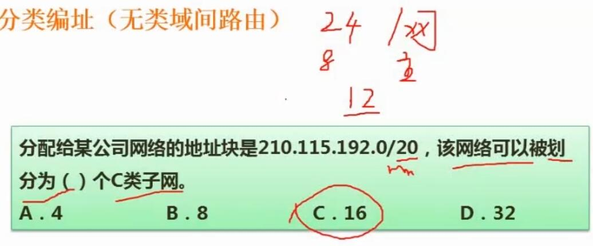
- 例题3：无分类编址（无类域间路由）
	- 例题3总结
		- 无分类编址给了20位网络号，C类子网网络号有24位
		- 因此那4位可表达的数就是可划分为C类子网的数量
		- $1111 - 0000 = 2^4 = 16$

## 6. 特殊含义IP地址

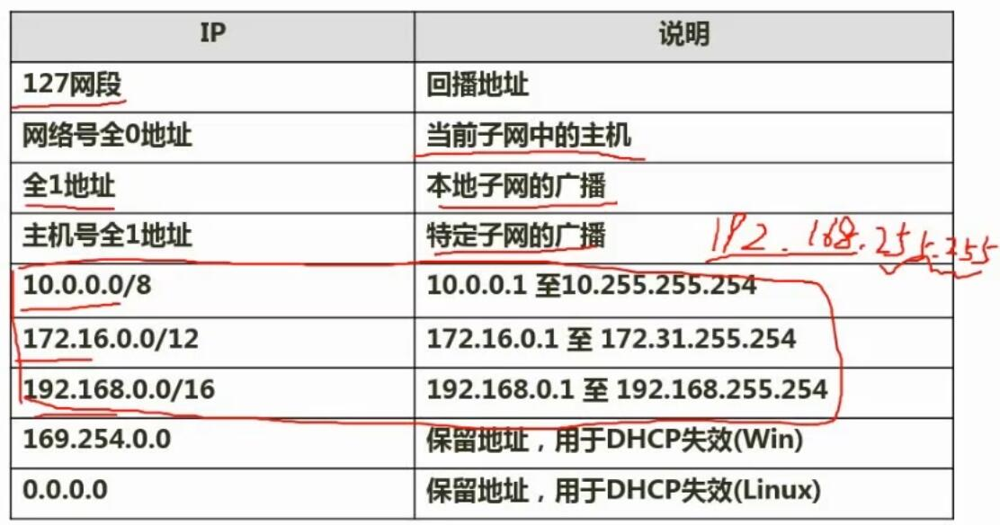
- 127网段
	- 回播地址
- 网络号全0地址
	- 当前子网中的主机（？）
- 全1地址
	- 本地子网的广播
- 主机号全1地址
	- 特定子网的广播
	- 192.168.1.255

## 7. HTML

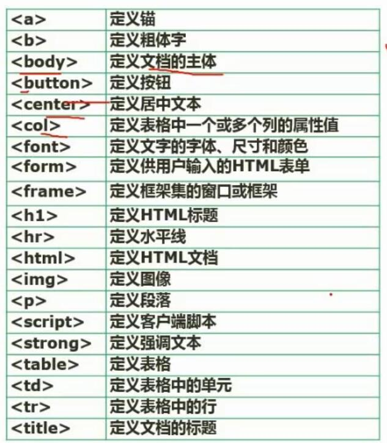
- 很少考

## 8. 无线网

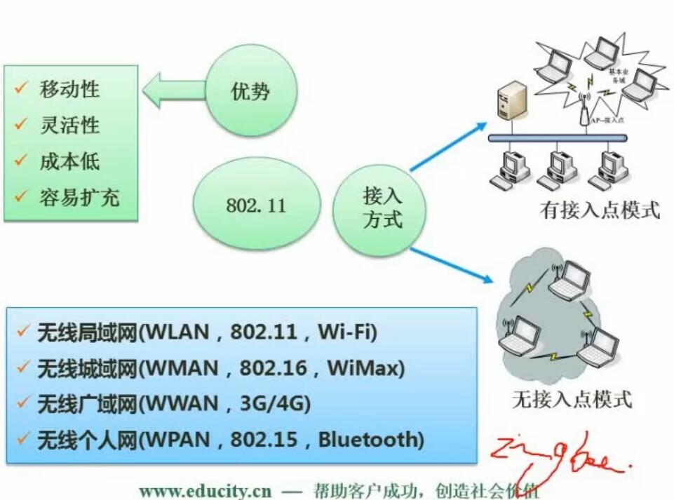
- 看看就行
- 相关协议和应用稍微记一下

