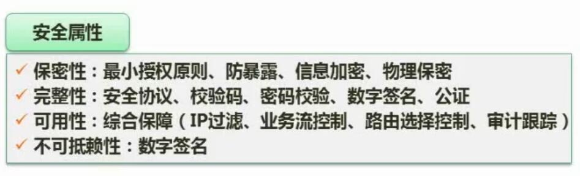
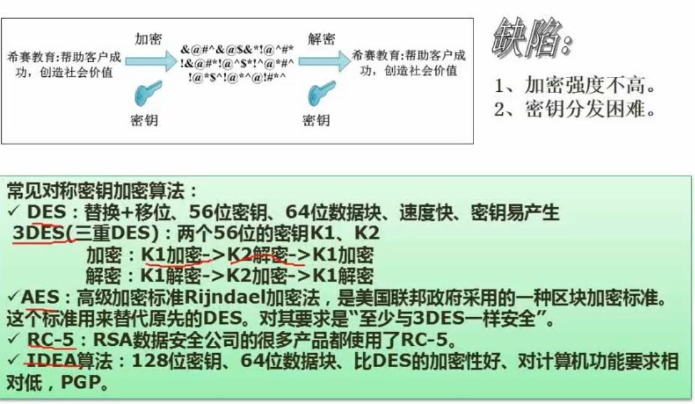
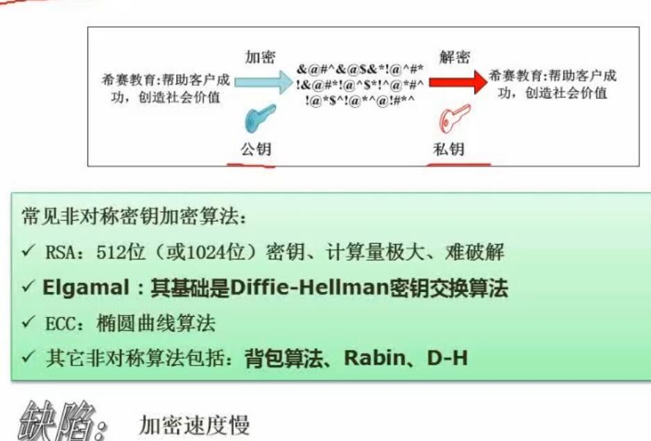
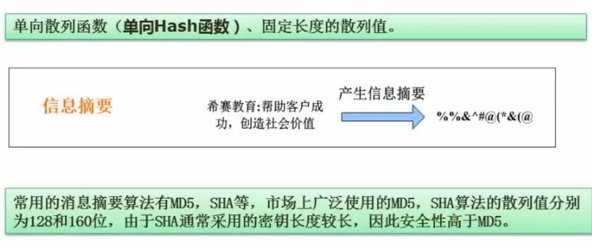
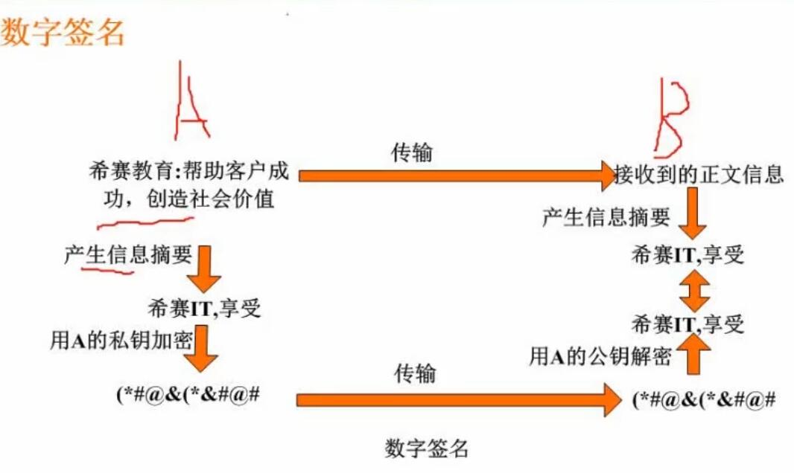

# 五、信息安全与加密

## 1. 信息系统安全属性

- 看看了解一下

## 2. 对称加密与非对称加密

### 2.1 对称加密

- 概念
	- 加密和解密使用相同的密钥
	- 因为效率高，一般用来传输主要内容
- 优点
	- 加密速度快，传输效率高
- 缺点
	- 密钥短，加密强度不高
	- 密钥分发困难
- 常见算法
	- DES
		- 替换+移位、56位密钥、64位数据块、速度快
	- 3DES
		- 三重DES，使用两个密钥K1、K2
	- AES
	- RC-5
	- IDEA算法

### 2.2 非对称加密

- 概念
	- 每端持有各自的公钥和私钥
	- 用公钥加密的，只能用对应私钥解密；用私钥加密的，只能用对应公钥解密
	- 由于效率低，不适合传输大量内容，所以一般用于传输对称密钥，然后使用对称密钥进行对称加密通信
- 优点
	- 密钥长度长，很难破解
- 缺点
	- 效率低，传输速率慢
- 常见算法
	- RSA
		- 512位（或1024位）密钥，计算量极大，难破解
	- Elgamal
	- ECC 椭圆曲线算法
	- 其他非对称算法：背包算法、Rabin、D-H

## 3. 信息摘要

- 概念
	- 信息摘要是一段信息的特征值
	- 原始信息改变，摘要会跟着变
	- 摘要没法还原成原文
- 常用摘要算法
	- MD5，散列值128位
	- SHA，散列值160位
- 算法实现
	- 单向散列函数（单向Hash函数）、固定长度的散列值

## 4. 数字签名

- 概念
	- 用于验证信息是否是由发送者发出的
- 流程
	- 发送者发送原始信息给接收者
	- 接收者收到信息，对信息产生摘要
	- 接收者向发送者请求数字签名
	- 数字签名由发送者根据原文生成摘要再使用发送者的私钥加密后得到
	- 接收者若判断原文的摘要与 使用发送者公钥解密出来的数字签名相同，则信息发送者验证通过