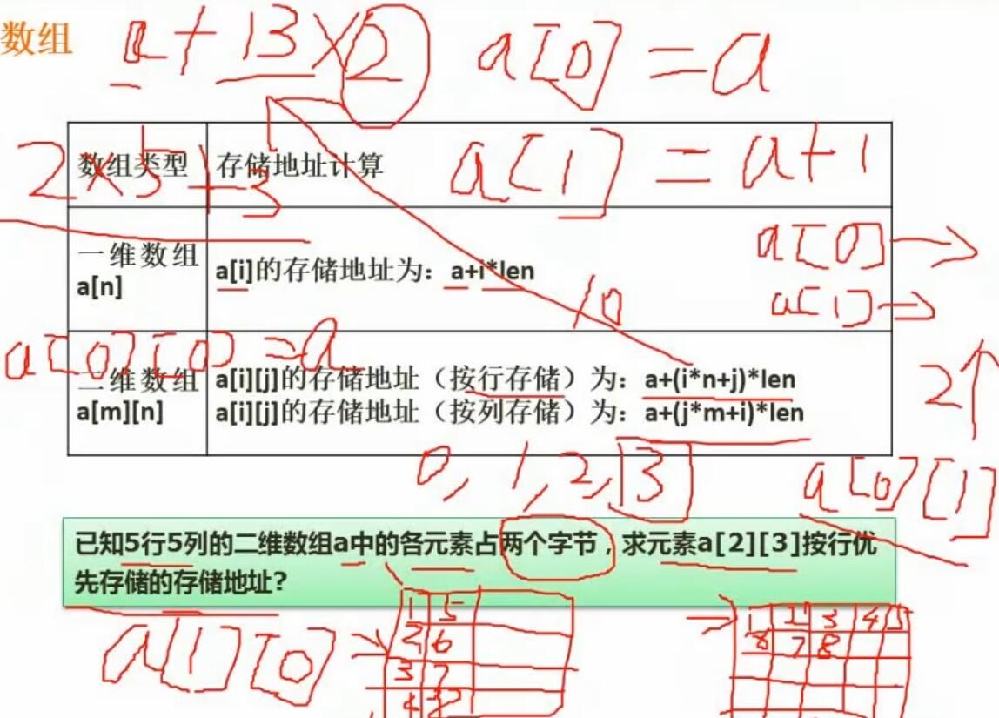

# 六、数据结构与算法基础

## 1. 数组

- 一维数组的存储地址计算
	- 一维数组$a[n]$，其第i位（$a[i]$）的存储地址为：$a+i\times len$
	- a是数组首位元素存储的位置，i是目标位的索引，len是数组中一个元素所占的长度
- 二维数组的存储地址计算
	- 二维数组$a[m][n]$，m为外层数组长度，n为内层数组长度
	- 按行存储
		- 一条条存内层数组
		- $a[i][j]$的存储地址为$a+(i\times n+j)\times len$
	- 按列存储
		- 一条条存外层数组
		- $a[i][j]$的存储地址为$a+(j\times n+i)\times len$
- 练习题总结
	- 对于$a[2][3]$按列存储，其前2个内层数组存满了（共10条，$i\times n=2\times 5=10$），第3个内层数组存了4个，目标元素的起始位置是3（j = 3）
	- 因此偏移量为 10 + 3 = 13

## 2. 稀疏矩阵

