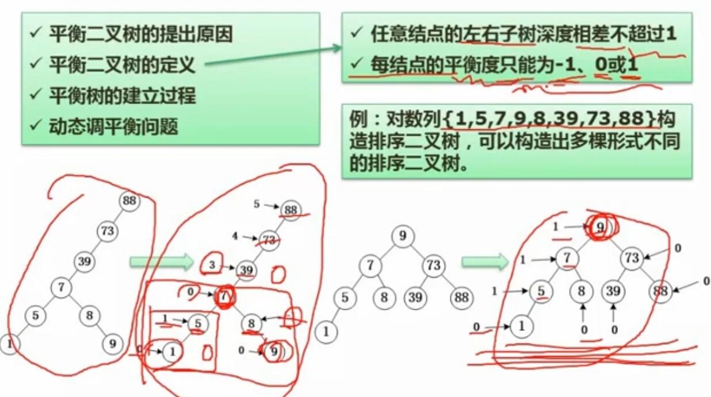
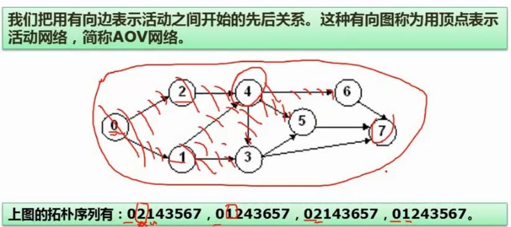
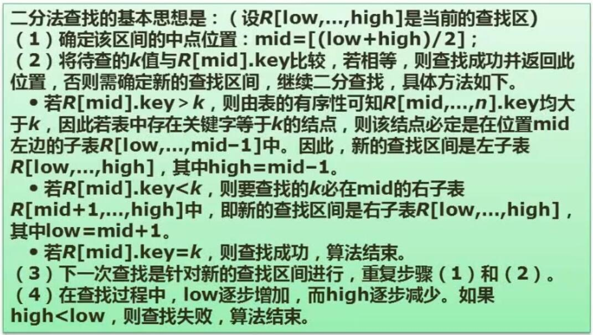
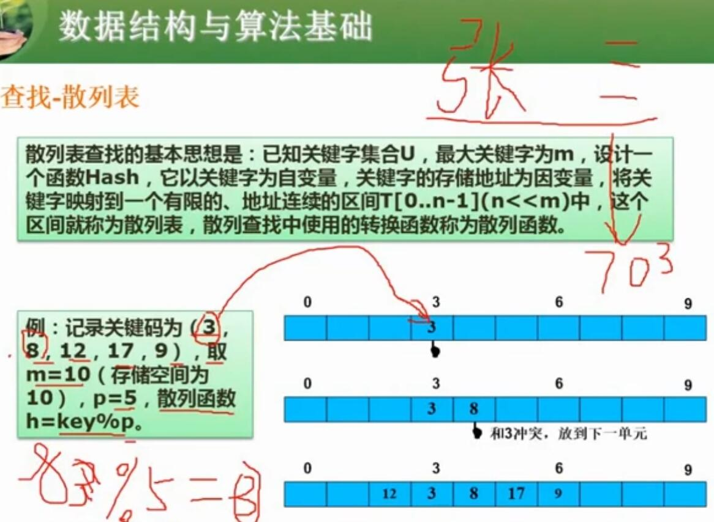

# 六、数据结构与算法基础

## 1. 数组

- 一维数组的存储地址计算
	- 一维数组$a[n]$，其第i位（$a[i]$）的存储地址为：$a+i\times len$
	- a是数组首位元素存储的位置，i是目标位的索引，len是数组中一个元素所占的长度
- 二维数组的存储地址计算
	- 二维数组$a[m][n]$，m为外层数组长度，n为内层数组长度
	- 按行存储
		- 一条条存内层数组
		- $a[i][j]$的存储地址为$a+(i\times n+j)\times len$
	- 按列存储
		- 一条条存外层数组
		- $a[i][j]$的存储地址为$a+(j\times n+i)\times len$
- 练习题总结
	- 对于$a[2][3]$按列存储，其前2个内层数组存满了（共10条，$i\times n=2\times 5=10$），第3个内层数组存了4个，目标元素的起始位置是3（j = 3）
	- 因此偏移量为 10 + 3 = 13

## 2. 稀疏矩阵

- 定义
	- 稀疏矩阵是大部分元素为0的矩阵
	- 三角矩阵，即其有效元素都存储在对应的三角区内，元素的顺序按从左到右、从上到下排列
- 要点
	- 了解一下上三角矩阵与下三角矩阵的区别
	- 常考问题：对于三角矩阵中给定两个下标i、j的元素，求出其一维数组下标（矩阵中有效存储范围中的位置，从1开始）
	- 对于以上问题，公式无需记忆。可以根据题目给定的公式选几个数进行计算，排除错误选项即可；也可以根据三角矩阵的概念自行想办法计算其位置
- 例题

- 例题总结
	- 题目可以看出是下三角矩阵
	- $A_{0,0}$的位置就是$M[1]$，以此类推
	- 分别拿几个数带入公式，就能排除错误答案

## 3. 数据逻辑结构分类

- 逻辑结构分类
	- 线性结构
	- 非线性结构
		- 树（可以只有一个分支）
		- 图（可能会形成回路）
- 要点
	- 图可以包含树，树也可以包含线性结构

## 4. 线性表

### 4.1 顺序表

- 特点
	- 需要使用物理上连续的存储空间

### 4.2 链表

- 特点
	- 可以使用物理上离散的物理空间
	- 对于单向链表，每个结点包含**数据区**和**指针区**，指针指向下一个结点
	- 对于双向链表，每个结点包含数据区和两个指针区，分别指向前后的结点
- 常见分类
	- 单链表
	- 循环链表
		- 首尾相连
		- 可避免每次查找重新定位到头部
	- 双向链表
		- 包含前后两个指针区

- 常见操作
	- 单链表删除结点
		- 上一结点的指针指向下一结点
		- p.next = q.next
	- 单链表插入结点
		- 新结点的指针指向下一结点
		- 上一结点的指针指向当前结点
		- s.next = p.next
		- p.next = s
	- 双向链表删除结点
		- 一般不考
	- 双向链表插入结点
		- 一般不考

## 5. 顺序存储与链式存储对比

- 顺序存储
	- 存储密度更优
		- 因为不用存额外信息
	- 事先确定容量分配
	- 查找运算效率大体与链表相当
		- 排序之后查找效率更高
	- 读运算更快
	- 插入运算较慢
		- 需要扩容+后移大量元素+插入
	- 删除运算较慢
		- 与插入类似
- 链式存储
	- 存储密度较差
		- 因为要存指针
	- 可以动态分配存储
	- 查找运算效率大体与顺序存储相当
	- 读运算较慢
	- 插入运算快
		- 只需要做两次指针操作
	- 删除运算快
		- 只需要做一次指针操作

## 6. 队列与栈

- 概念
	- 队列
		- 先进先出
	- 栈
		- 先进后出
	- 循环队列
		- 首尾相连的队列
		- 有head与tail指针
		- 指针 head = tail 时，认为队空
		- 指针 (tail + 1) % size = head 时，认为队满
			- 因为循环队列把一个结点留空（否则队空与队满均是 head = tail）
			- 对于 head 不为0时，留意公式的使用（尾+1对结点总数取余为head）
- 下方习题总结
	- 前面的元素可能先入栈并在后面元素入栈前就出栈了
	- 按照各元素入栈后是否出栈，进行排列组合即可
- 练习题

- 练习题总结
	- 各元素可能从左或者右入栈，但顺序不会变
	- 看各个选项，按照选项给的出栈顺序，把元素排进栈里
	- 看看排进去的元素，能否按给定入栈顺序入栈
	- 明显D不行（e3没法塞到e2和e1中间去）

## 7. 广义表

- 要点
	- 广义表里面的元素可以是普通元素，也可以是广义表，可以循环嵌套
	- 长度：最外层广义表的元素数
	- 深度：括号的层级数
	- head（Ls）取表头操作：取第一个元素
	- tail（Ls）取表尾操作：取除第一个元素外所有元素
- 例题
	- 很简单，看图

## 8. 树

### 8.1 树与二叉树

- 重要概念
	- 结点的度
		- 一个结点的**子结点数**
	- 树的度
		- 树中子结点最多的结点的度
	- 叶子结点
		- **没有子结点**的结点
	- 分支结点
	- 内部结点
		- 既不是根结点，也不是叶子结点的所有结点
	- 父结点
	- 子结点
	- 兄弟结点
		- 同一层次下的结点
	- 层次

### 8.2 二叉树重要特性

- 二叉树分类
	- 满二叉树
		- 每一个非叶子结点，都拥有两个子结点
	- 完全二叉树
		- 对树中的结点按**从上到下、从左到右的顺序编号**，其所有结点的编号位置**与满二叉树的相同**
	- 非完全二叉树
		- 不满足完全二叉树要求的
- 二叉树的特性
	- **第 i 层上最多有 $2^{i-1}$ 个结点**
		- 因为满二叉树每层的结点数按照 $2^0$, $2^1$,  $2^2$, ... 排列
	- **深度为 k  的二叉树最多有 $2^k-1$ 个结点**
		- 就像二进制数，固定位数的最大值是一堆1（1111），等于进1位后再减 1
	- **对任何二叉树，若叶子结点数为n，度为2的结点数为m，则 n = m + 1**
		- 每有一个度2的结点，说明分了个叉，每分个叉就多个叶子结点
- 完全二叉树的特性
	- 若完全二叉树结点数为n，按顺序编号，设当前结点编号为i：
	- 若 i=1，则 i 是根，无父结点；若 i > 1，则**父结点是 i / 2（忽略余数）**
		- 结合下面两点来理解
	- 若其有子结点，则**其左子结点应为 2i，右结点应为 2i + 1**
		- 因此，若 2i > n，其无左子结点；若 2i + 1 > n，其无右子结点
### 8.3 二叉树的遍历

- 层次遍历
	- 按照编号的顺序遍历，从上到下，从左到右
		- 12345678
- 前序遍历
	- **根 -> 左 -> 右**，递归遍历
		- 12457836
- 中序遍历
	- **左 -> 根 -> 右**，递归遍历
		- 42785136
- 后序遍历
	- **左 -> 右 -> 根**，递归遍历
		- 48752631

### 8.3 反向构造二叉树

- 是一类题型，会给定遍历方式和遍历结果序列，求出原始二叉树，或直接求其他遍历方式的结果序列
- 例题总结
	- 前序序列会从根开始，所以第一个A就是根
	- 中序序列是左中右，A又是根，所以HBEDF在左侧，GC在右侧
	- 循环以上步骤，就得到了原始的二叉树

### 8.4 树转二叉树

- 定义
	- 将非二叉树转为二叉树的一种方式
- 规则
	- 将孩子结点变成左子树结点
	- 将兄弟结点变成右孩子结点
- 看图就能理解

### 8.5 查找二叉树

- 定义
	- 是排序的二叉树
	- 结点左边的所有孩子都小于当前结点，右边的所有结点都大于当前结点，以此类推
- 常见操作
	- 插入结点
		- 若插入的结点已存在，则不再插入
		- 若插入的树为空，插入的结点就是根
		- **将插入的值与父结点比较**，就能确定插入到左边还是右边
	- **删除结点**
		- 若删除的是**叶子结点，则直接删除**（51）
		- 若删除的结点**只有一个子结点，将这个子结点与当前删除结点的父结点直接连接**（56）
		- 若删除的结点有**两个子结点，则在其左子树上，遍历寻找值最大的结点s，s直接替代删除的结点，然后在原位置删除s，递归操作**（89：删除后56替上，56从原位置删除，按照上述规则51成为48右子结点）

### 8.6 最优二叉树（哈夫曼树）

- 先导概念
	- 路径长度
		- 某一个叶子结点需要从根经过几次连接到达（如结点8是3）
	- 权
		- 就是该叶子结点的值
	- 带权路径长度
		- 就是当前结点的 路径长度 x 权（如结点8是3 x 8 = 24）
	- 树的带权路径长度
		- 其所有叶子结点的带权路径长度之和
- 概念
	- 根据给定的n个叶子结点，自底部向上构建的二叉树。**若一个构建使树的带权路径长度达到最小，即该构建的树为最优二叉树**
	- 除叶子结点，其他结点的值为左右子结点值之和
- 常见应用
	- 一种应用是无损压缩。这种压缩根据不同内容在全文中出现的频率对其进行编码，出现频率高的（权高的）可以编较短的码，出现频率低的可以编较长的码。以此达到无损压缩的目的

- 构建哈夫曼树总结
	- 先找最小的两个值（5，3）作为同级叶子结点
	- 将其的和（8）作为新的结点加入原始结点（权值）列表，列表删除已列出的两个最小值（5，3）
	- 递归操作，直到只剩一个值（根节点）

### 8.7 线索二叉树

- 概念
	- 每个叶子结点添加左右两条线索，对应左右两个子分支
	- 线索的连接方式，按二叉树的三种遍历方式，可分为前序线索、中序线索和后序线索
	- **按照所属的遍历方式，左线索指向上个需要访问的结点，右线索指向下个需要访问的结点**
- 作用
	- 提高访问查找效率
- 计算连线的简便方式
	- 按照树的前序、中序或后序遍历方式直接求出遍历顺序，就好连线了

### 8.8 平衡二叉树

- 概念
	- **任意结点的左右子树深度相差不超过1（每结点的平衡度只能为-1、0或1）**
- 重要术语
	- 平衡度
		- 左右子树深度之差
- 作用
	- 查找效率更高

## 9.图

### 9.1 图的基本概念

- 概念
	- 数据结点直接的连接有形成回路，便是图
- 完全图的概念
	- 每对结点之间都有一条边相连
	- 对于有向图，需要每对结点之间都有二条有向边互相连接

### 9.2 图的存储

- 邻接矩阵
	- 概念
		- 图中有n个结点，那就用 n x n的矩阵
		- 每行每列都按结点的值标号。就像表格一样，对应的位置填两个结点之间有无连接，有就是1，无就是0。自己对自己填0
		- 矩阵会按照对角线对称，所以可以仅用三角矩阵来存储

- 邻接表
	- 概念
		- 每个结点先用数组结构存储
		- 每个结点连接一个链表，链表上的每个结点都是当前结点所连接的子结点（如1连接2、4、6）

### 9.3 图的遍历

- 深度优先
	- 先访问根结点，然后访问其任意一个没访问过的邻接点
	- 邻接点接着访问任意一个没访问过的邻接点
	- 直到当前路径再无可访问的邻接点，则回到上一个存在未访问分支的结点继续
- 广度优先
	- 先访问根结点，然后访问其各个未访问的邻接点
	- 再依次访问各个邻接点的下一级邻接点
	- 以此类推

### 9.4 拓扑排序

- 概念
	- 有向图可以表示各个活动之间开始的先后顺序关系
	- 这种活动网络称为AOV网络
	- 拓扑排序就是根据活动网络图，得出的活动执行顺序。同一个图可能得出多个拓扑排序
- 例题总结
	- 找到没有入度的结点，排在第一个（0）
	- 其下一分支结点都可以作为第二个，所以分成两种： 01 或 02
	- 下一结点有 4 和 3，但 3 必须在 4 之后，所以只有 01243 和 02143两种
	- 下一结点 5 和 6，他们之间没有关系，所以后序又分成 56 和 65 两种
	- 便得到了如图的四种结果

###  9.5 图的最小生成树

- 概念
	- 连通图的极小连通子图（树），包含原图中所有n个结点，保持图连通的最少的边（n-1条）
	- 因为一个n个结点的树，会有n-1条边

- 求最小生成树的方法
	- 普里姆算法
		- 将所有结点分为红集和蓝集
		- 选一个初始结点加入红集（A）
		- 找到最短路径能连接到的邻接结点（B），连接并将B也加入红集
		- 从红集继续找最短路径能连接到的邻接结点，连接并加入红集，循环直到所有结点加入红集
		- 若过程中形成回路，则需要选择其他路径
	- 克鲁斯卡尔算法
		- 寻找所有连线中路径最短的，将两端的结点加入红集
		- 继续寻找剩余边中最短的，进行连线。直到所有结点加入红集
		- 若形成回路，则需要选择其他连接路径

## 10. 算法概述

- 算法的特性
	- 有穷性
		- 必须在执行有穷步之后结束
	- 确定性
		- 算法中每一条指令必须有确切的含义。用同样的条件执行，必须得到同样的结果
	- 输入
		- 必须有 > 0 个输入
	- 输出
		- 必须有 > 1 个输出
	- 有效性
		- 每个步骤都能有效执行并得到确定的结果。
			- 例如步骤中不能将实数除以0

- 算法的复杂度
	- 时间复杂度
		- 指算法运行从开始到结束所需要的时间，一般用来表示时间相对于问题大小n的规模
		- 常见复杂度规模排序（从小到大）
			- $O(1)$（常数级）
			- $O(log_2n)$（对数级）
			- $O(n)$（线性级）
			- $O(nlog_2n)$
			- $O(n^2)$（幂级）
			- $O(n^3)$
			- ...
			- $O(2^n)$（指数级）
		- 若一个算法的复杂度是不同规模复杂度的累加，取最大的复杂度作为算法复杂度
			- 例如一个算法的复杂度 $T(n)=3n^3+2n^2+n$，则复杂度为$O(n^3)$
	- 空间复杂度
		- 指算法运行过程中，对临时占用存储空间大小的度量
		- 只考虑运行过程中为局部变量分配的存储空间的大小

## 11. 查找
### 11.1 顺序查找

- 从头到尾一个一个查找
- 平均查找长度为：$\frac{n+1}{2}$ （n为数组长度）
- 复杂度为$O(n)$

### 11.2 二分查找

- 过程
	- 将最低下标 low 与最高下标 high，求和除以2，得到中间下标 mid，中间下标取整
	- 与中间下标 mid 的数值比较
		- 若相等，查找完毕
		- 若小于中间数值，将最高下标high 调整为 mid - 1（没访问过的结点）
		- 若大于中间数值，将最低下标 low 调整为 mid + 1（没访问过的结点）
		- 循环上述步骤。若最终变成 low > high，则查找失败
- 最多查找次数
	- $log_2n+1$
- 时间复杂度
	- $o(log_2n)$

### 11.3 散列表（存储与查找方式）

- 概念
	- 散列表是一种存储数据的方法
	- 将数据按照某种**散列函数**得出其应存放的位置，存放在一个**连续的区间**中
- 解决散列冲突的方法
	- 线性探测法
		- 根据某种规则得到一个探测序列，例如若一个地址已经存储了元素，就探索下一位
		- 先看散列地址是否存储了元素，若未存储，称该散列地址开放，进行存储；若存储了元素，按照探测序列继续探测下一个地址，循环往复
	- 伪随机数法
		- 使用伪随机数生成器生成一个散列值

## 12. 排序

- 稳定排序与不稳定排序
	- 稳定排序
		- 对于相同的值，排序后其前后顺序不会改变
	- 不稳定排序
		- 排序后其前后顺序可能改变
- 内排序与外排序
	- 内排序：在内存中进行排序
	- 外排序：涉及到外部存储空间

