# 七、编译原理

## 1. 编译过程

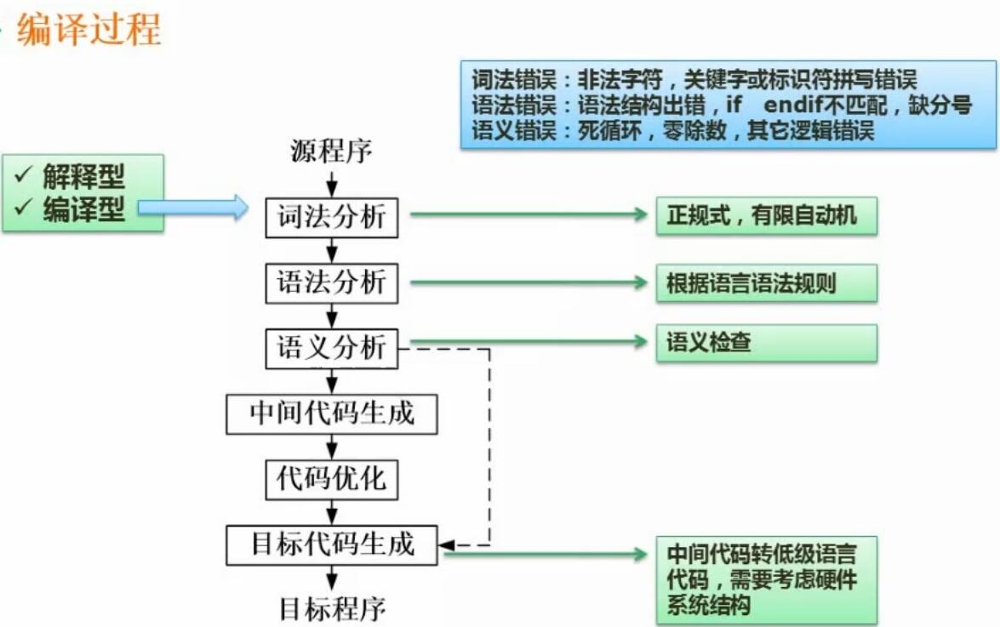
- 概念
	- 指编译型语言的编译基本流程
- 重要概念
	- 词法分析
		- 判断关键字、标识符等是否拼写错误
	- 词法分析
		- 判断语法结构是否出错。例如 if 后缺少 endif 等
	- 语义错误
		- 判断是否有逻辑错误。例如死循环、零除数等

## 2. 文法

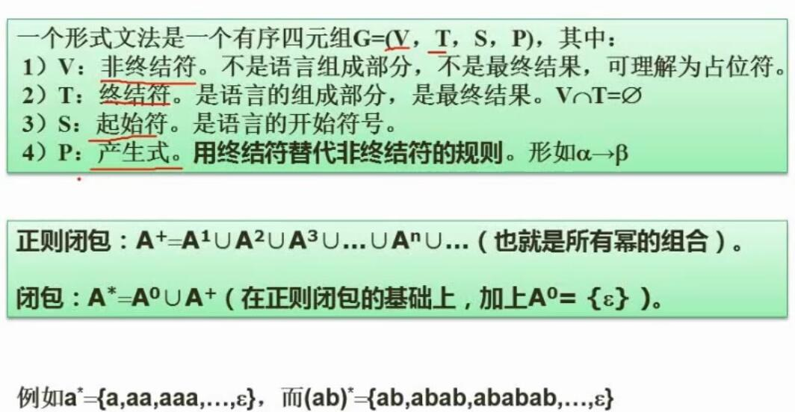
- 文法的概念
	- 是定义语言的一种形式化规则，确定了程序代码的合法结构
	- 通常包括
		- 非终结符V
			- 通常在产生式的左侧，表示可以进一步展开的部分
			- 通常用大写字母表示
		- 终结符T
			- 语言的终结部分
			- 通常用小写字母表示
		- 起始符S
			- 语言的开始符号
			- 通常用S表示
		- 产生式P
			- 表示如何将非终结符替换为终结符或其他非终结符的规则
	- 常见表示形式
		- G=(V, T, S, P)
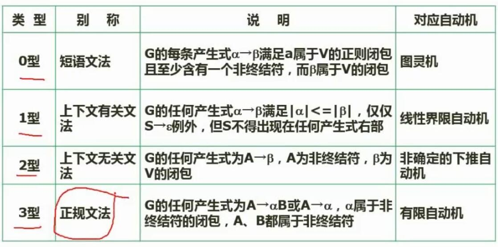
- 文法的分类
	- 0型：短语文法
	- 1型：上下文有关文法
	- 2型：上下文无关文法
	- **3型：正规文法**
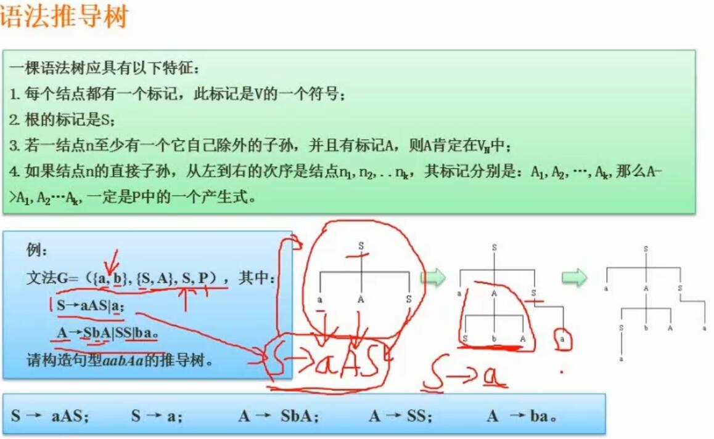
- 语法推导树
	- | 表示当前符号可以有左右两个推导式

## 3. 有限自动机*

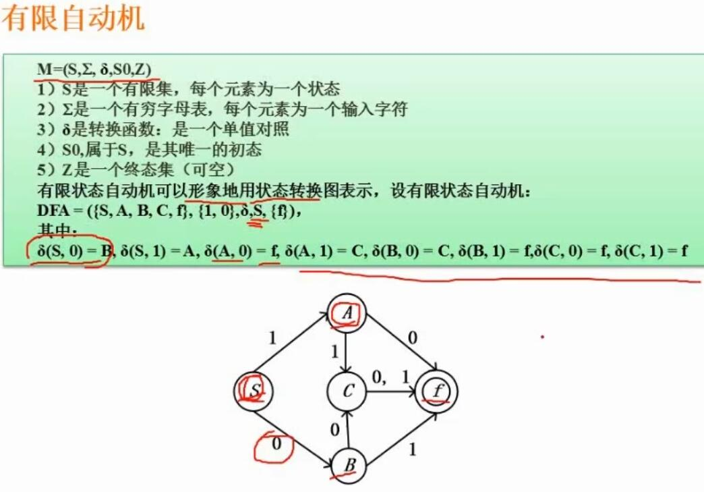
- 概念
	- 是一种抽象的计算模型
	- 由有限个状态和在这些状态之间转换的规则组成
- 要点
	- 主要会给出一个**有限的状态集合**和一组**转换规则**
	- 一般的考法是给出一个0和1的串，让判断自动机是否可以识别
	- 看箭头的指向，如果按照给的串，能从自动机的起点走到终点，就是能识别
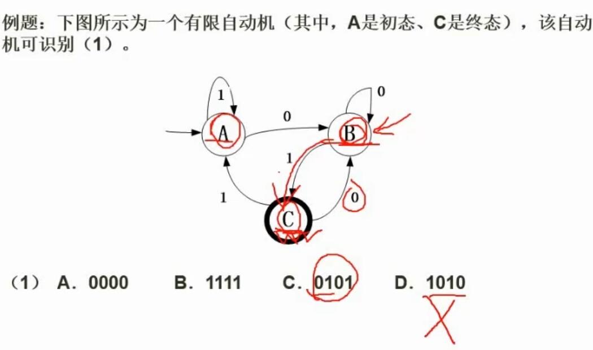
- 例题总结
	- 终点是C，只有一个1箭头指向C，所以串必须以1结尾。排除选项AD
	- 到C必须先到B，所以中间必须有0，排除选项B
## 4. 正规式*

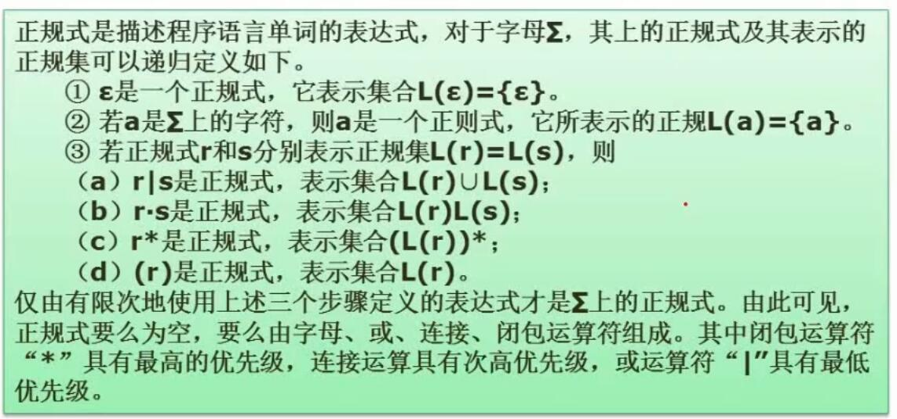
- 总结
	- 上图难以理解
	- 正规式是描述程序语言单词的表达式
	- 可以由文法中的语法推导关系（推导树）得来
	- **其语法与正则表达式类似**
	- 结合下述例题理解
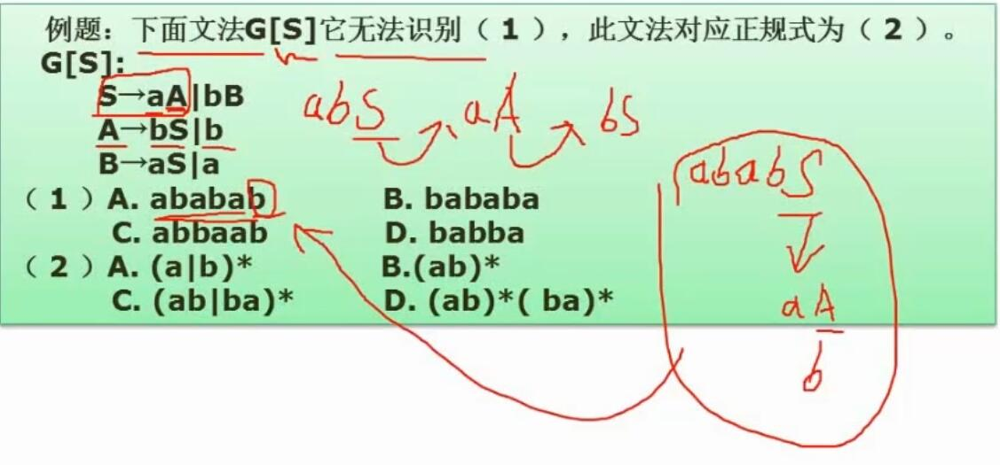
- 例题总结
	- 根据给定的文法推导关系，可以画推导树，也可以按上图中的步骤一步一步推导，看各个选项是否能推导通过
		- 可以看出，S为一组的开始，一组以a或b开头，a后面必然跟着b，b后面必然跟着a
		- 所以第二空选C
		- 第一空选D
	- 正规式的语法与正则表达式类似。可以通过总结，也可以结合上述选项来进行排除错误答案，得到正确答案

## 5. 表达式

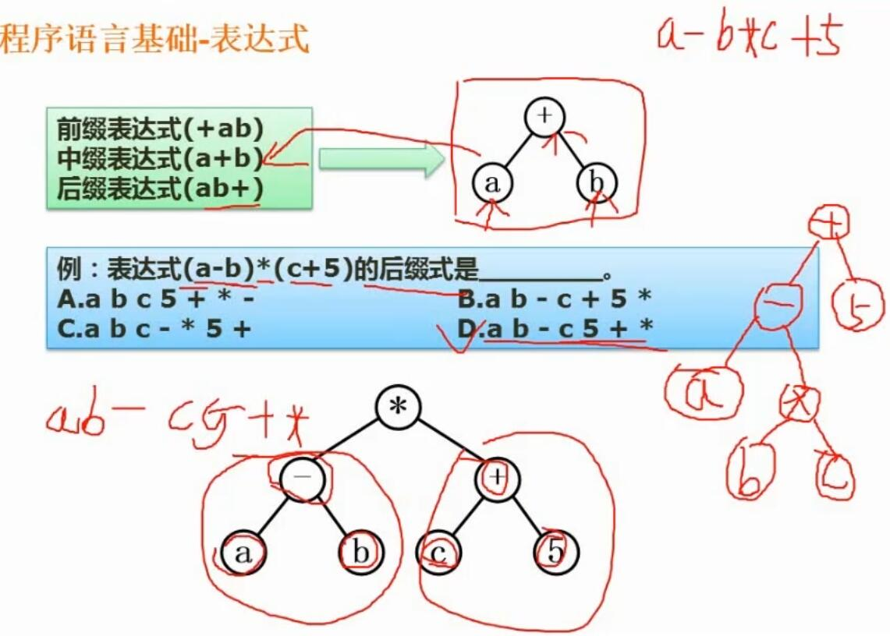
- 概念
	- 就是将一个计算式，其中的**运算数和运算符**，按照**数学上的计算优先级顺序**排列成**二叉树**，之后再根据**前序、中序、后序的方式遍历**得出的序列
	- 排列出的二叉树，其中叶子结点是运算数，其余结点是运算符
- 例题总结
	- 数学上优先运算 a-b 和 c+5，所以先将它们画成二叉树
	- 然后是 * 计算，再画一级二叉树
	- 进行遍历后得出答案
- 额外总结
	- 若表达式没有括号，即 a - b * c + 5，则表达式分成了三部分，其二叉树如上图的右侧所示

## 6. 函数调用-传值与传址*

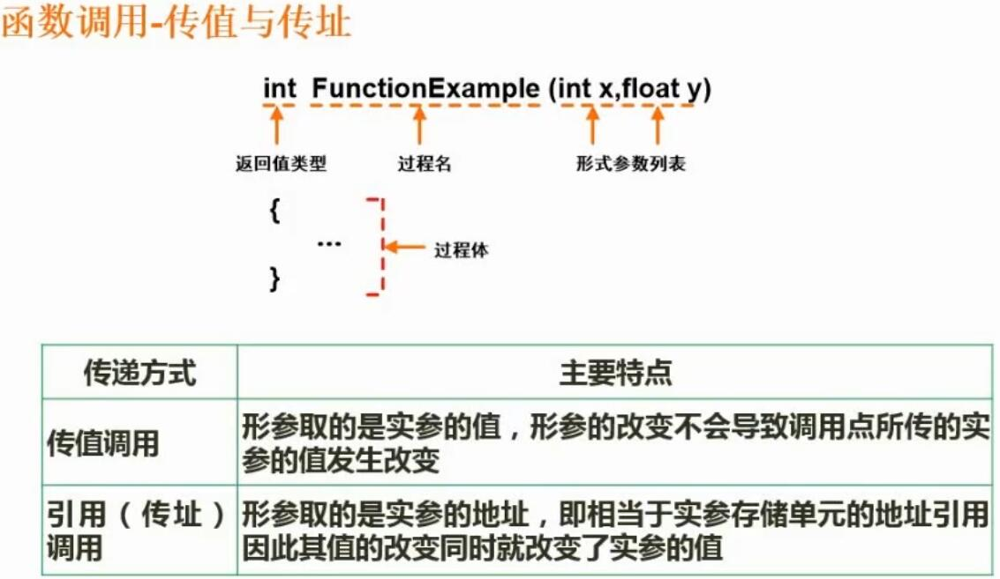
- 概念
	- 传值
		- 函数（方法）的形参取的是实参的值，形参的改变不会影响实参的值
	- 传址
		- 函数（方法）的形参取的是实参的地址，对其的改变，即是改变对其地址实际指向的存储单元中的值，因此会影响到实参
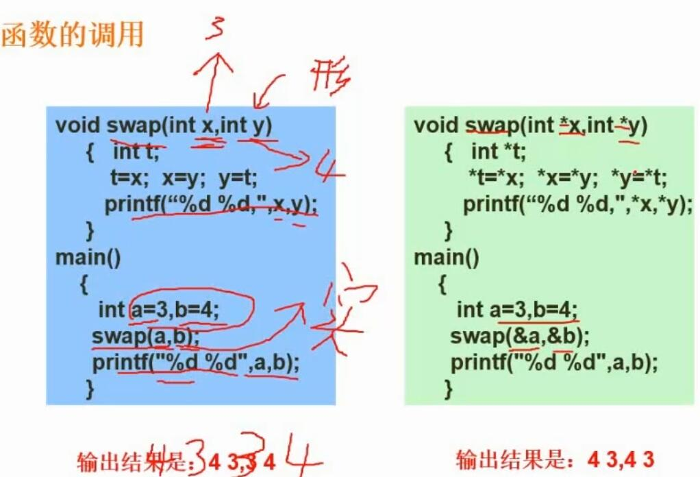

## 7. 各种程序语言的特点

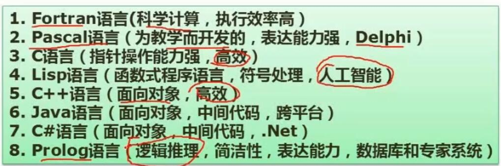
- 参考上图，要求掌握
- 重点记忆
	- Fortran
		- 科学计算，执行效率高
	- Pascal
		- 为教学而开发，表达能力强
	- Lisp
		- 函数式程序语言，符号处理，人工智能
	- Prolog
		- 逻辑推理，简洁性，表达能力，数据库和专家系统