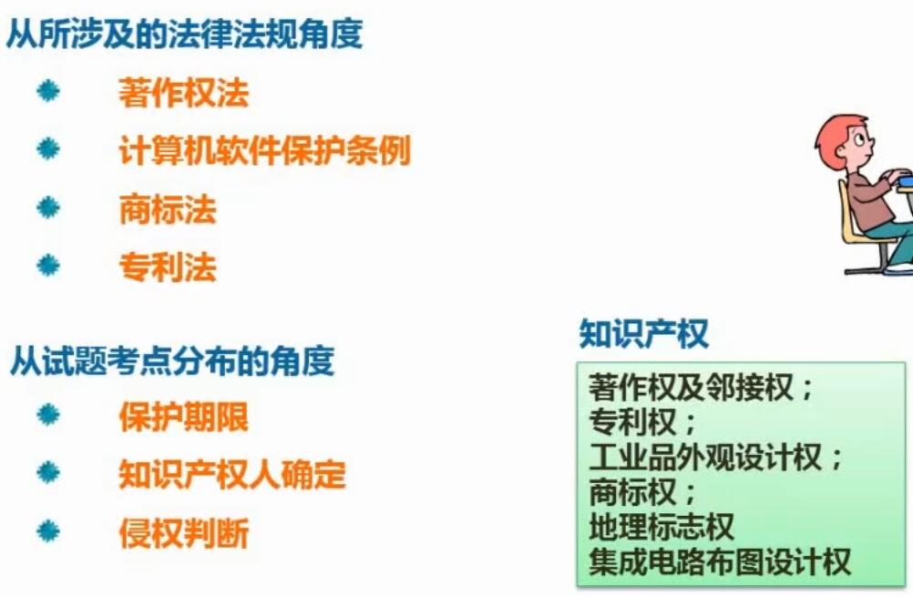
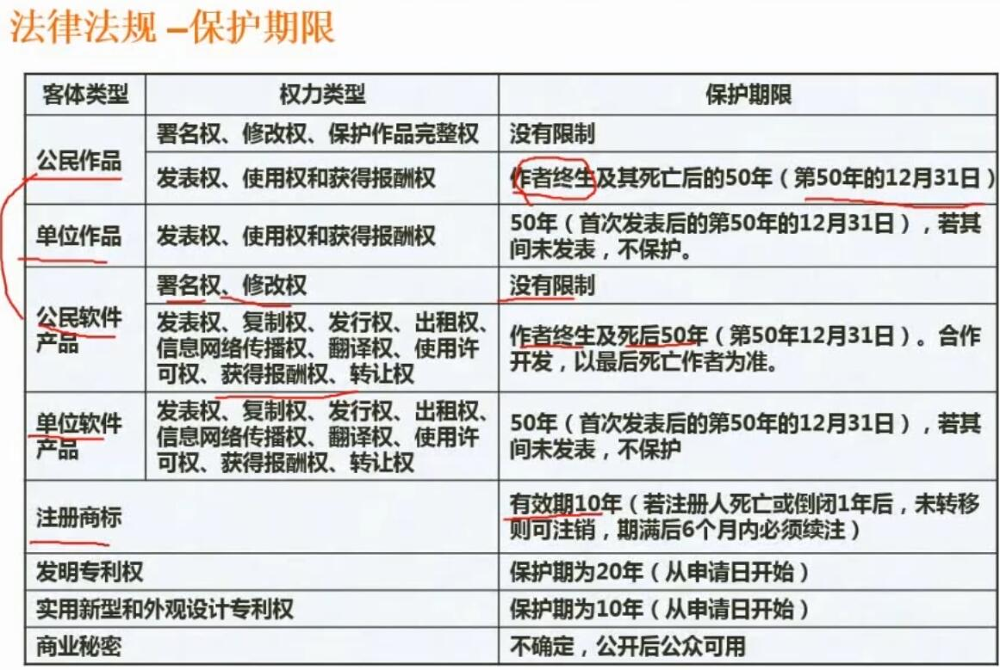
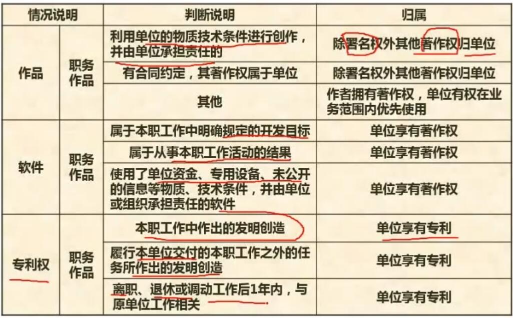
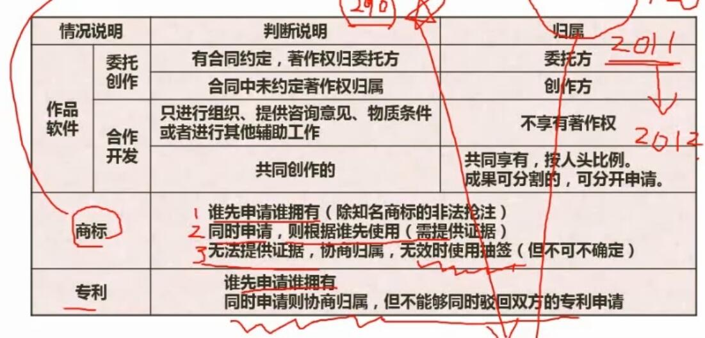
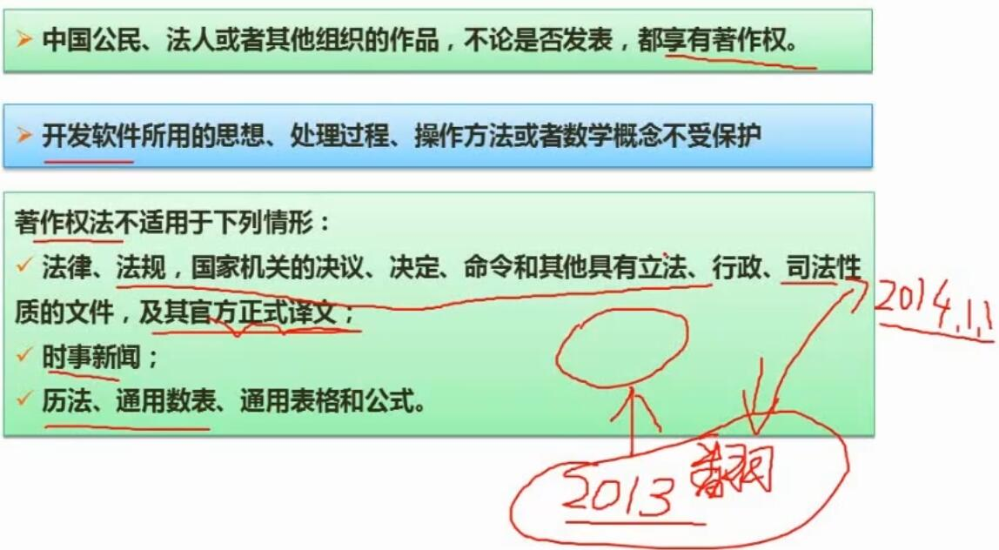
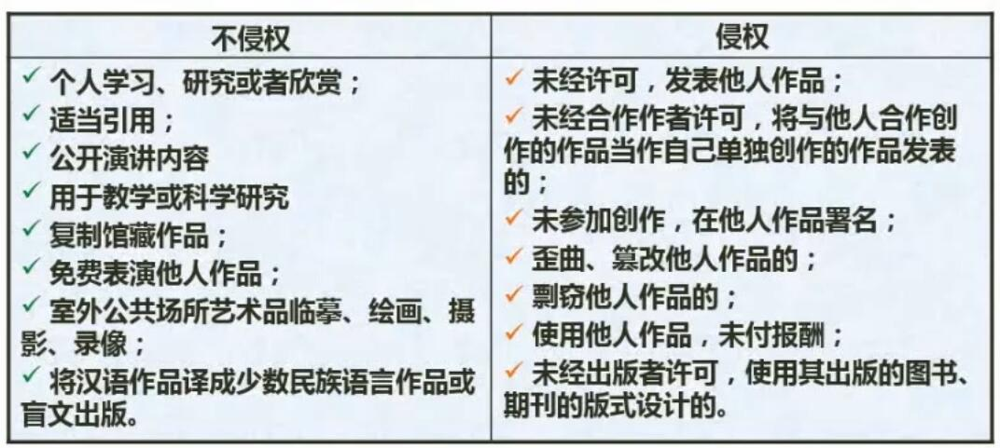
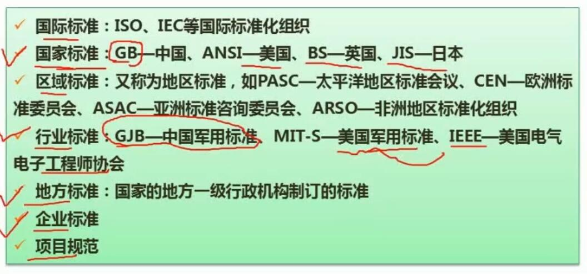
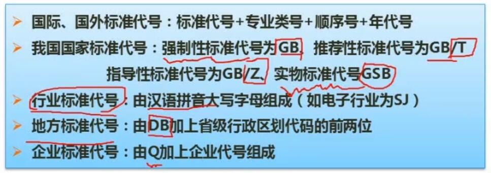

# 八、法律法规知识

## 1. 保护期限

- 总结
	- 关注图中红色标注部分
	- 公民作品，即个人作品

## 2. 知识产权人确定

- 总结
	- 大部分都是单位享有著著作权或专利，个人可能拥有署名权

- 总结
	- 著作权若没有合同约定，归属创作方，否则按照合同约定
	- 商标和专利：优先看谁先注册，其次看谁先使用

## 3. 侵权判定*

- 总结
	- 不论是否发表的作品都受著作权法保护
	- 软件中的思想之类不受保护
	- 官方确定的立法、行政等性质的文件（及官方正式确定的译文），自确定起不再适应著作权法

- 看看就行

## 4. 标准化

- 总结
	- 重点关注红色标注部分