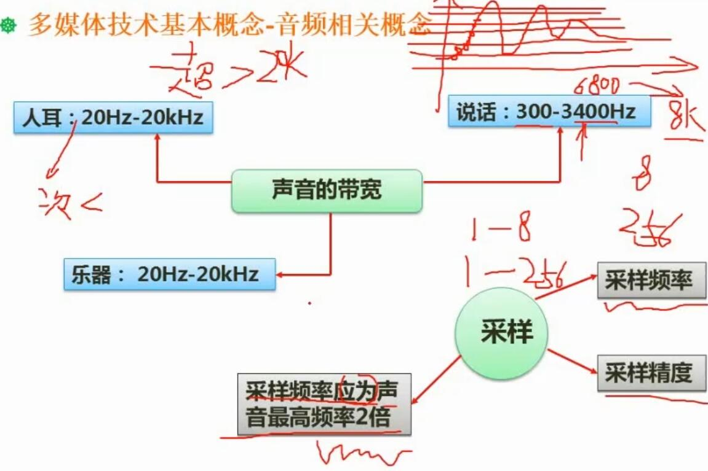
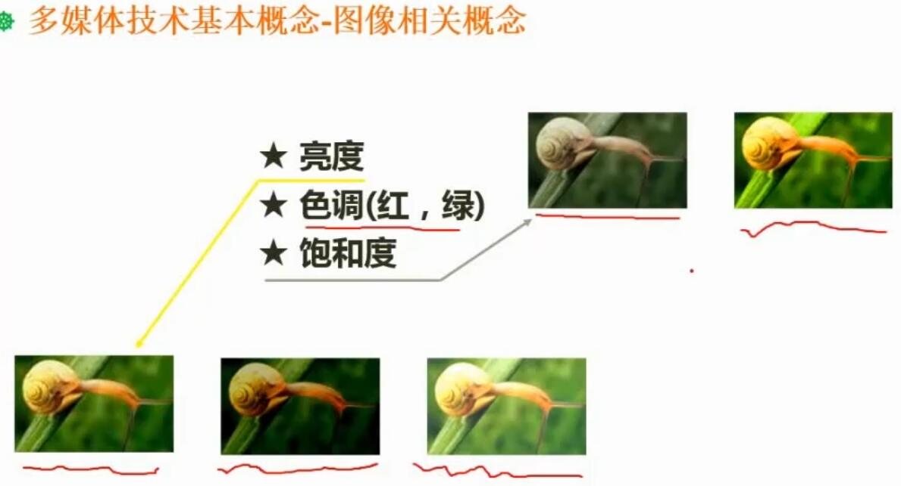
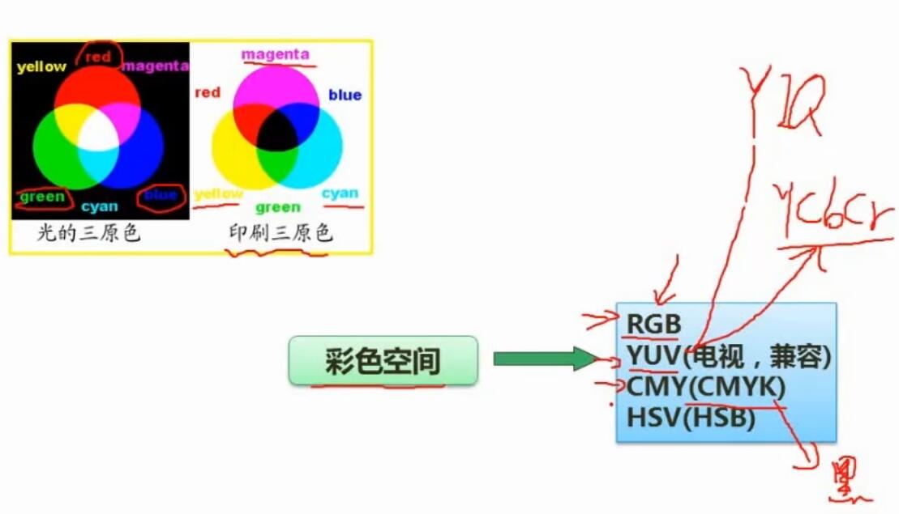
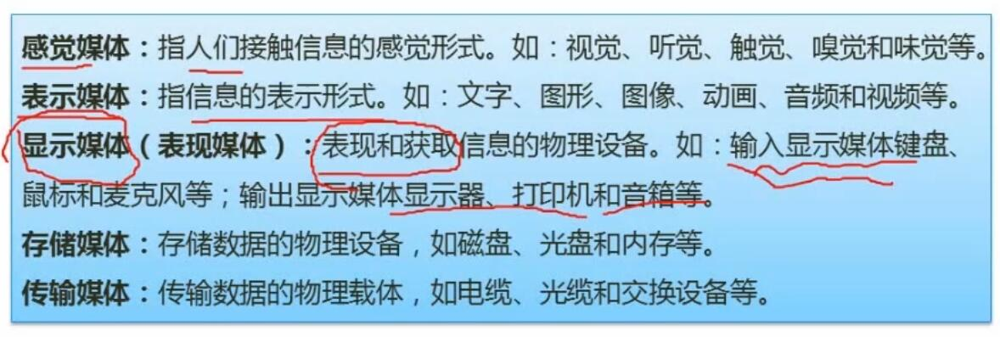
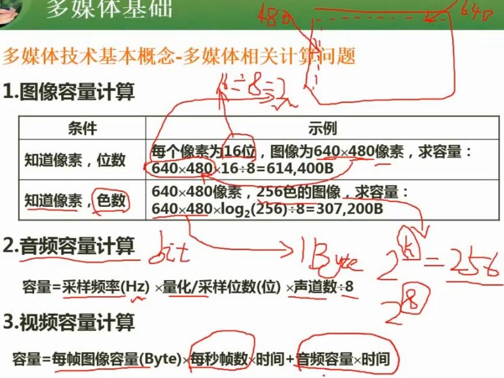
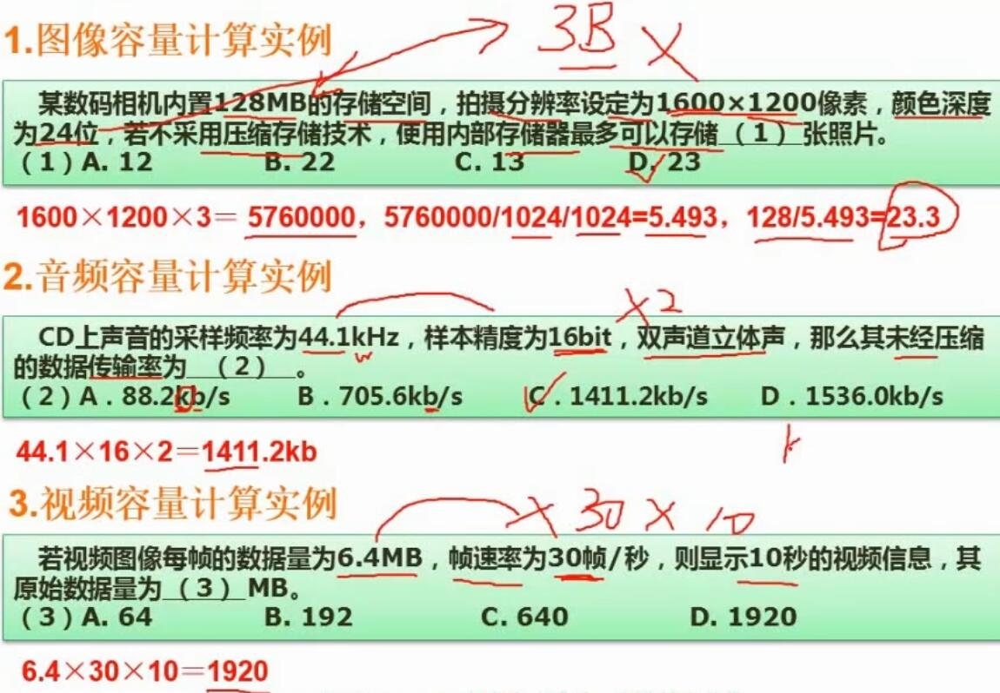
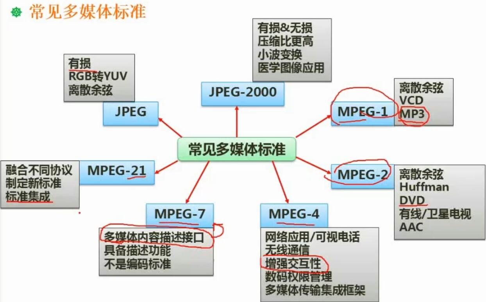
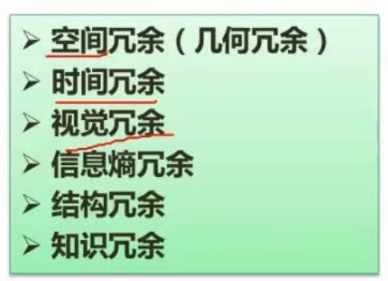
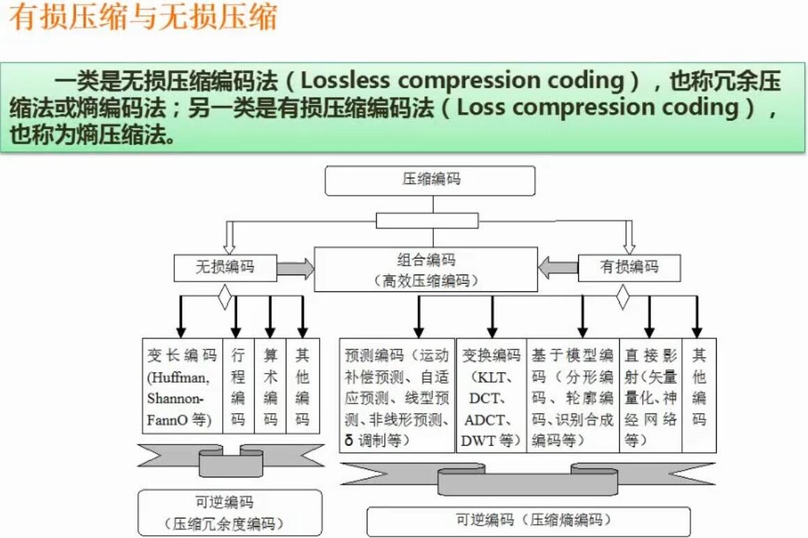

# 九、多媒体

## 1. 音频相关概念

- 总结
	- 采样频率（每隔多久采样一次）
	- 采样精度（bit深度）
	- 采样频率应为声音最高频率2倍，方可基本保证不失真

## 2. 图像相关概念

- 总结
	- 亮度
	- 色调
	- 饱和度（色彩的艳丽程度）

- 总结
	- RGB
		- 彩色显示器
	- YUV
		- 电视机，兼容
	- CMY（CMYK）
		- 印刷
	- HSV（HSB）
		- 艺术家空间

## 3. 媒体的种类

- 总结
	- 显示媒体
		- **表现**和**获取**信息的物理设备

## 4. 多媒体相关计算

- 总结
	- 图像容量计算
		- 容量 = 像素数 x 每个像素位数
	- 音频容量计算
		- 容量 = 采样频率 x 采样位数 x 声道数 / 8
	- 视频容量计算
		- 容量 = 每帧容量 x 每秒帧数 x 时间 + 音频容量 x 时间

## 5. 常见多媒体标准

- 总结
	- JPEG
		- 有损
	- JPEG-2000
		- 医学图像应用
		- 压缩比更高
		- 有损&无损
	- MPEG-1
		- VCD
		- MP3
	- MPEG-2
		- DVD
		- 有线/卫星电视
	- MPEG-4
		- 增强交互性
	- MPEG-7
		- 多媒体内容描述接口

## 6. 数据压缩

- 数据压缩基础
	- 因为原始内容存在上述冗余，因此才有压缩空间

- 有损压缩与无损压缩
	- 无损压缩可以还原，有损压缩不能还原
	- 常见无损编码
		- 哈夫曼编码